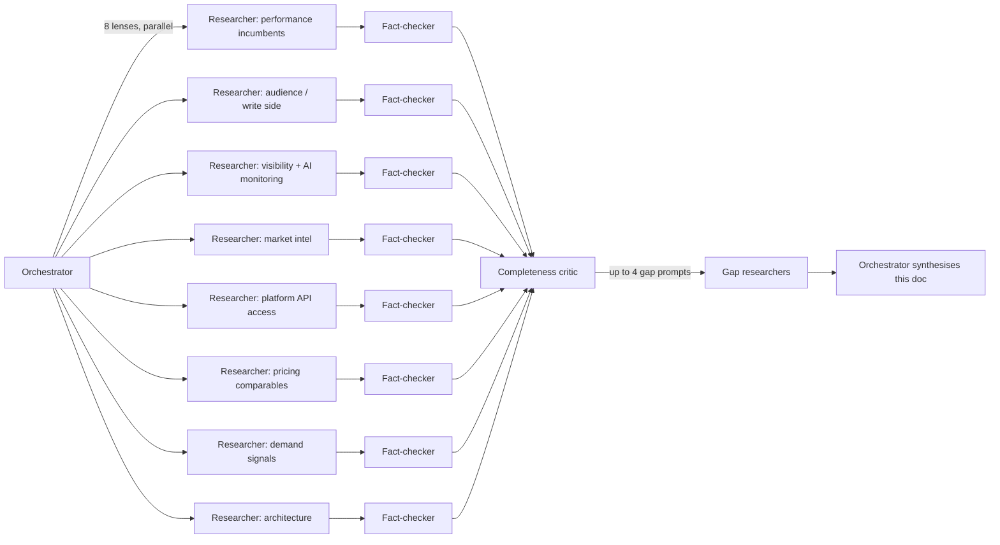
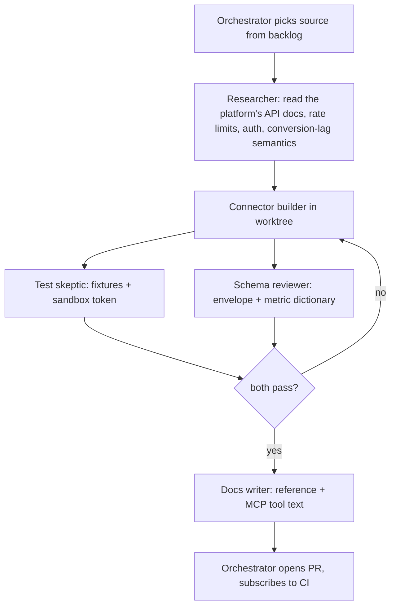

# Marketing data plane: research, positioning and build plan

> Working name: **Marketplane** (alternatives in section 12). Research date: 2026-09-07. Produced by an orchestrated research routine (section 13): eight research lenses run in parallel, each adversarially fact-checked, then a completeness critic and a gap round. Every price, policy and claim carries a source link, and anything the fact-check marked refuted or outdated is shown corrected. Paste this as a GitHub issue.

## 0. TL;DR

**Verdict: not a go in the shape first sketched. A narrow go is possible, and it is a different company.** The original pitch had four modules, "one key, one schema", MCP from day one, a flat credit per call, and cross-module joins as the moat. The research and the second-round gap analysis overturned each of those:

1. **MCP is table stakes, not a moat.** Supermetrics (on every tier from 44 dollars a month), Funnel, Windsor (every plan from 19 dollars), Adverity, Improvado ("MCP Only" at 100 dollars a month), Triple Whale, Polar, Semrush, Ahrefs, Similarweb, Peec, Profound, HubSpot, Klaviyo, Mixpanel, PostHog and Amplitude all ship MCP servers, and Meta, Google Ads and GA4 ship official ones for free. Anthropic's acquisition of Stainless makes spec-to-SDK-to-MCP a commodity pipeline.
2. **The cross-module join already ships.** Windsor's `/all` endpoint returns every connected source in one call with a `source` column at 23 dollars a month, with Search Console, Semrush and Ahrefs among its connectors. Supermetrics added programmatic Union and Join blends to its public API in June 2026. Looker Studio blends five tables for free. And the join is only well formed on the search-ads edge: Meta and TikTok have no query dimension, so three of the four MVP performance sources cannot take part in the flagship join at all (section 10.1).
3. **"Nobody bundles SERP and AI answers at API level" is false.** DataForSEO and SearchApi.io both sell it on one prepaid balance at fractions of a cent, and the AI-visibility application layer went from 7 to 248 products on G2 in 14 months.
4. **The performance read bundle is commoditised** (Windsor 99 dollars a month for Meta, Google, TikTok and GA4), **the market module should be dropped** (commodity data, contractually closed sources, an active litigant in Amazon), and **writes have no price** (Segment gives away 500,000 records a month; Meta's Conversions API is free; a 3.5 million euro fine for the exact `audience.sync` use case without consent).
5. **The maintenance treadmill decides the shape.** Roughly 20 to 25 forced platform changes across seven ad platforms in 24 months; Microsoft and Apple are both replatforming in early 2027; about 1 to 1.5 engineers per 10 connectors per year just to stay alive. At the proposed 40 to 100 dollar blended revenue per account, breakeven is 640 to 1,070 accounts for two salaried engineers, and no comparable in the evidence reached that on a marketing-ops niche (section 10.2).

What survives, and the only shape worth building:

- **The operated guarantee, not the integration.** AI has collapsed the price of writing a connector and not the price of operating one. Nango, a unified-API leader, now says coding agents write the integrations. The sellable thing is correct numbers through Meta's 28-day restatement window and Google's 90-day conversion window, attribution window as a dimension, currency and timezone semantics, an answer to "why did yesterday's number change", and being on call the week a platform sunsets an API version. Airbyte, a funded vendor, missed Meta's June 2026 cutoff by two months.
- **Verified root cause, not a blended query.** Windsor unions sources; nobody returns ranked, fact-checked causes with evidence and a plan across ads, analytics, affiliate, SERP and AI answers. `diagnose`, `reconcile` and verified `watch` are the product (section 4). Whether anyone pays for it is unproven and is the first thing the design-partner phase must settle.
- **One unoccupied cell in visibility**: query-grain paid-search spend and CTR against AI-Overview citation status. Google's free Paid and Organic report has no AI-Overview dimension, Profound and Semrush have no ad spend, and Seer's 5.47 million query study found paid CTR of 15.74 percent where the brand is cited versus 11.19 percent where it is not. That is a report and a proprietary longitudinal dataset, not a data plane, and it is the honest wedge.
- **Bring-your-own-credential is mandatory and also the pitch.** Google's developer policy forbids letting third parties avoid their own developer access; Meta requires tech providers to process data solely per client. The product sells normalisation, restatement, diagnosis and scheduling over the customer's own tokens.
- **Price by account and by answer, not by row.** Performance metered per connected account with restatement re-pulls included; credits only for SERP, AI answers and composite tools; AI-answer monitoring as an explicit LLM pass-through with `n_runs` and confidence intervals, or as a per-prompt monthly plan in the Peec and Profound band. Target 250 to 400 dollars a month per account from agencies and vertical SaaS, not 50 to 100 dollars self-serve.
- **Team and scope.** Two founders, three to four connectors held permanently (Meta, Google, GA4, and one more chosen by design partners), SERP bought from DataForSEO rather than crawled, Microsoft and Apple deferred until their 2027 replatforming settles. Survival number: 240 to 400 paying accounts. The affiliate-first flagship from the access lens does not survive the gap round: Awin gates advertiser API access behind paid plans with user-scoped tokens, Impact's master agreement bars competitors and requires written approval, and Strackr already aggregates the networks (section 10.4). Affiliate data stays as a bring-your-own-credential source, not a wedge.
- **Access, not code, is the schedule.** A demoable product with no approvals is possible in 3 to 4 weeks (Google Ads Explorer access, GA4 and Search Console under a testing OAuth client, Impact, CJ or PartnerStack on the customer's own key). Meta lands in weeks 4 to 8. Google OAuth verification is documented at 3 to 5 days and observed at 10 or more weeks.

Distribution is the other constraint: docs SEO, the channel that built SerpApi and DataForSEO, is closing under AI Overviews and 68 percent zero-click, and the "sell to the GEO tools" idea is foreclosed; the open channels are a framework-default slot, marketplace tenancy and a design-partner motion (section 10.3). The two open risks that must be answered before a pricing page exists: whether a headless API can qualify for Google Ads Standard Access at all, and whether Meta treats a pay-per-call API as a tech provider needing per-client authorisation (section 11.9).

## 1. Positioning

"One key, one schema, for everything a growth team touches" is still the right frame, but the headline must name the outcome the joins produce rather than the plumbing, because the plumbing is now sold by a dozen incumbents at 19 to 100 dollars a month. The buyer is the person who today pays Supermetrics plus Segment plus a scraper plus an SEO tool and glues them together in Sheets or dbt: performance agencies first, then MarkOps and growth engineers and data analysts inside DTC and B2B SaaS companies. Their AI agents are the second buyer, and they pay per call.

The product is the layer under dashboards and BI, not another dashboard. It sells three things no incumbent's dataset can produce: an answer to "why did this change" across ads, analytics, search, AI answers and competitors; correctness about restatement and attribution on every row; and a closed loop from a finding to an action. Everything returns the same envelope, and the cross-module joins are the product.

## 2. API surface

```
/v1/performance/*     ads + analytics + affiliate networks (read)
/v1/audience/*        contacts, events, lists, custom audiences (write, deferred)
/v1/market/*          reserved namespace, not built (see 3.4)
/v1/visibility/*      SERP, AI-answer monitoring (read)
/v1/diagnose          cross-module root cause (composite)
/v1/watch/*           scheduled fan-out with verified change webhooks (composite)
/v1/reconcile/*       conversion reconciliation across platforms and order source (composite)
```

Every response lands on one envelope. The full field specification with the restatement clocks that justify it is in section 7; the short form:

```json
{
  "ok": true,
  "module": "performance",
  "source": "google_ads",
  "entity": { "type": "ad_group", "id": "…", "native_entity_type": "ad_group", "native_id": "…" },
  "dimensions": { "date": "2026-09-01", "currency": "EUR", "attribution_window": "7d_click" },
  "metrics": { "spend": 4210.55, "impressions": 812000, "clicks": 18422, "conversions": 611, "conversions_value": 14350.2 },
  "fetched_at": "2026-09-07T06:00:00Z",
  "source_updated_at": "2026-09-07T05:45:00Z",
  "restates_until": "2026-10-05",
  "is_provisional": true,
  "fx_source": "ecb_reference_rates",
  "fx_rate_date": "2026-09-05",
  "meta": { "credits_used": 1, "schema": "v1", "request_id": "req_…" }
}
```

Design rules that fall out of the research:

- **Bitemporal by default.** `as_of` lets a caller ask for the data as the platform reported it on any earlier date, which is how "why did last month's report change" becomes a one-call diff. No surveyed incumbent exposes restatements; they overwrite silently.
- **Freshness is part of the contract, not the docs.** Four fields, because Meta, Google Ads and GA4 restate on three different clocks: `fetched_at`, `source_updated_at`, `restates_until`, `is_provisional`. Agents comparing a closed week to an open one is the most common way an agentic answer goes wrong today.
- **Attribution window is a dimension, not a setting.** The API refuses to emit an unlabelled conversion count.
- **A metric dictionary, not a per-source schema.** Names follow Fivetran's Apache-2.0 `dbt_ad_reporting` package; platform-specific fields ride in an optional `raw` passthrough, and a passthrough endpoint exists from v1 because every unified API that survived had one.
- **Currency is normalised at fetch time** with the rate source and date recorded on the row.
- **Bring your own credential** for every ad and analytics platform. This is what Google and Meta terms require, and it is also the honest pitch: your logins, our correctness.

## 3. Module-by-module research

Each subsection was written from one research lens and its adversarial fact-check. Where the two disagree, the fact-check wins and the correction is listed.

### 3.1 Performance module: the connector market

The connector market is cheaper, more crowded, and more agent-native than the idea assumes, and the fact-checker made it worse rather than better. MCP is table stakes: Windsor.ai, Supermetrics, Funnel, Improvado, Coupler.io and Polar all ship servers, and the checker adds Adverity, taking it to 7 of the 12 profiled vendors. The most damaging correction is that Improvado, which the researcher named as the softest target for transparent pricing, already publishes a self-serve rate card including a Free Limited tier at $0/mo with live API requests to all sources and 50 MCP actions per week, and an MCP Only tier at $100/mo with 2M rows/yr and 300 MCP actions per week. That is agent-metered, zero-commitment access shipped by the vendor with the deepest canonical schema, so "credit metering for agent traffic" is no longer an unoccupied position. The remaining wedges are narrow and technical: restatement and delayed-conversion finality, currency and timezone normalization, and AI-answer citation monitoring, which the checker confirms is the only part of the visibility story no profiled vendor covers.

| Vendor | Pricing (as verified) | Model | Public API / MCP | Backfill and attribution handling | Weakness we exploit | Source |
|---|---|---|---|---|---|---|
| Windsor.ai | Basic $23/mo or $19 annual (3 sources, 75 accounts); Standard $118/$99 (7 sources); Plus $299/$249 (10 sources, 200 accounts); Professional $598/$499 (14 sources, 500 accounts); Enterprise custom. Additional data $20 per 1M rows (unverified) | Subscription capped by sources and accounts, no per-call metering, API on all tiers | Yes, and it is the product. REST at connectors.windsor.ai/{connector}?fields=…&api_key=…, three auth methods, 600 req/min and 10,000 req/day. MCP at mcp.windsor.ai with 22 tools including execute_action writes | Not documented; currency conversion absent from the API field reference | Documentation quality and support, no response SLA on lower tiers, no restatement or finality metadata, no AI-answer citation source | [windsor.ai/pricing](https://windsor.ai/pricing/) |
| Supermetrics | Starter $55/mo or $44 annual (3 sources, 1 user, weekly refresh, 4,000 AI credits, Data API up to 50,000 rows/mo); Growth $222/$177 (6 sources, 250,000 rows/mo); Enterprise custom with Management API. Page states "no data volume fees" | Per-destination subscription with source, user and account add-ons; API metered by monthly rows within tier | Yes, Data API on paid tiers, Management API on Enterprise. MCP server gated on a subscription with API access; campaign create/modify confirmed, new campaigns start paused | Best-documented in the set, but manual: a user-set "refresh window" they are told to match to their attribution window; historical backfills pulled one day at a time | Backfill correctness is pushed onto the user; row caps are small against agent query patterns; sales-gated source changes (unverified reviews) | [supermetrics.com/pricing](https://supermetrics.com/pricing) |
| Improvado | Free Limited $0/mo (live API to all sources, 50 MCP actions/wk, 1 workspace); MCP Only $100/mo (2M rows/yr, daily sync, 300 MCP actions/wk); Advanced custom (600M rows/yr); Enterprise custom (1B rows/yr) | Tiered self-serve plus custom enterprise; meters MCP actions and rows per year | Yes. Discovery API plus MCP with 84 tools across 12 categories; read and write to 1,000+ platforms, but the surface is read-only and role-scoped by default | Not documented in what was verified; MCDM claims 46K+ unified metrics | Not price opacity any more. Exploit restatement, finality and cross-module joins instead; writes are governance-gated, so activation flows still need configuration | [improvado.io/pricing](https://improvado.io/pricing) |
| Funnel.io | Starter from $300/mo billed annually (117 connectors, 13 destinations); Business from $600/mo (579 connectors, 46 destinations, unlimited users and workspaces); Enterprise custom (600+ connectors). No free tier, no monthly billing shown | Tiered subscription, cost scales with accounts and destinations | Limited public REST data API; MCP via OAuth 2.0, read-only, exposes the semantic layer | Semantic layer with deterministic queries; no public restatement handling found | High floor with no free entry; no published row limits so cost is unpredictable. Cost-creep figures are unverified, so do not size churn on them | [funnel.io/pricing](https://funnel.io/pricing) |
| Adverity | No published figures; "fully customized quote". ~$200,000/yr Azure Marketplace and ~$30,000/yr floor (unverified) | Custom annual contract on users, volume, connectors, functionality | Ships API, CLI and an MCP server per its own homepage | Data Mapping plus an instance-wide Data Dictionary so "cost" means one thing everywhere; no restatement claim found | Opaque pricing and long sales cycle; harmonization is configuration work, not a default | [adverity.com](https://www.adverity.com/) |
| Fivetran | Free plan 500,000 MAR, 3,500 MAR activations, 5,000 model runs; $5 base charge per standard connection in the 1 to 1M MAR band; 14 days free per new connection. Per-connector fees of $1,200 to $2,000/mo and ~$500 per million MAR (unverified) | Monthly Active Rows (inserts and updates, updates including deletes) plus connection charges | Management and metadata APIs; data lands in a warehouse, not a read API. No MCP confirmed | Owns dbt_ad_reporting (Apache-2.0, 11 platforms, account through search-query and URL grain, ISO-3166 country names); currency absent, timezone differences flagged as unsolved | Batch-to-warehouse shape is wrong for per-call agent reads; MAR is unpredictable; currency and timezone left open | [fivetran.com/pricing](https://www.fivetran.com/pricing) |
| Coupler.io | Free $0 (1 source/account/destination, 100 rows per run); Starter $32/$24 (3 accounts, 5,000 rows/run); Active $132/$99 (15 accounts, unlimited rows and users); Pro $259/$199 (50 accounts, hourly); extra accounts +$5.99/mo (+$4.49 annual) | Subscription capped by accounts and destinations; row caps only on Free and Starter | Custom MCP listed under AI Integrations alongside Claude, ChatGPT and Cursor; no documented read REST API | None; output shape follows the source | No canonical cross-source schema, so cross-channel joins are the customer's problem | [coupler.io/pricing](https://www.coupler.io/pricing) |
| Dataddo | Free $0 (3 flows, 100,000 monthly rows); Data to Dashboards and Data Anywhere both $99/mo annual ($129 monthly) with 10,000,000 monthly rows, 5-minute sync on Data Anywhere; Enterprise custom | Flow and row-based subscription | API is Enterprise-only; no MCP found | Not documented | Programmatic access gated to Enterprise, which is the gap a metered API fills | [dataddo.com/pricing](https://www.dataddo.com/pricing) |
| Whatagraph | From EUR 699/mo billed annually for Max (from 50 credits, 1 credit per connected account); Prime custom | Credit-per-connected-account subscription | Public API is a Prime add-on only; no MCP server | Not documented | Agency ceiling is far above the assumed $15 to $40 floor, and no agent interface at all | [whatagraph.com/pricing](https://whatagraph.com/pricing) |
| Porter Metrics | Solo $14.99/mo; Teams $39.99/mo; Agencies $99.99/mo; Agencies Pro $180/mo; 17% annual discount | Priced by connected accounts | No public API; destination connectors only. No MCP confirmed | None | Not a data-plane competitor, but it anchors buyer price expectations at the bottom | [help.portermetrics.com](https://help.portermetrics.com/en/articles/150-how-porter-metrics-pricing-work) |
| Polar Analytics | Core and Custom plans priced by annual GMV with no published figures; ~$750/mo under $5M GMV, ~$2,950/mo at $20 to $25M, ~$6,500/mo at $50 to $75M (unverified) | GMV-banded subscription with add-ons; MCP priced off annual Klaviyo revenue | Polar Headless MCP sold standalone; dedicated Snowflake database with user-controlled keys gives SQL access | Not documented; 400+ pre-built ecommerce metrics in a semantic layer | GMV pricing is decoupled from data usage, which per-call metering directly attacks; Shopify-only | [polaranalytics.com/pricing](https://www.polaranalytics.com/pricing) |
| Triple Whale | Foundation from $219/mo, Automate from $749/mo, Enterprise custom; add-ons Retention $19/mo and Conversion $79/mo (all unverified; pricing page returned HTTP 403) | GMV-banded package subscription with priced add-ons | Data Warehouse Sync is a paid add-on, not a standard API. No MCP confirmed | Not documented | API access is an add-on rather than the product; all public pricing is secondhand | [signalbridgedata.com](https://www.signalbridgedata.com/blog/triple-whale-pricing-2026) |

#### Key findings

- Improvado publishes a public rate card with a Free Limited tier at $0/mo (live API requests to all sources, 50 MCP actions per week) and an MCP Only tier at $100/mo (2M rows per year, 300 MCP actions per week), and it meters MCP actions rather than rows, which is closer to agent-native pricing than anything else found ([improvado.io/pricing](https://improvado.io/pricing)). The fact-checker calls this the most consequential error in the research.
- Windsor.ai is the closest structural analog and its prices are confirmed exactly: $19 annual for 3 sources, $99 for 7, up to $499 for 14, with API access on every tier and published limits of 600 requests per minute and 10,000 per day ([windsor.ai/pricing](https://windsor.ai/pricing/)). A Meta plus Google plus TikTok plus GA4 bundle sits at roughly $99/month with no per-call metering, so there is no read-side price wedge.
- Windsor already carries Semrush, Ahrefs and Google Search Console connectors, so the performance times visibility join is partly assembled inside a $99/month product ([windsor.ai/data-sources](https://windsor.ai/data-sources/)). What it does not appear to have is AI-answer or AI Overview citation monitoring, which is the defensible narrower framing.
- Supermetrics prices are confirmed verbatim: Starter $55 monthly or $44 annual with Data API up to 50,000 rows per month, Growth $222/$177 with 250,000 rows, Enterprise custom with the Management API; the page also states there are no data volume fees ([supermetrics.com/pricing](https://supermetrics.com/pricing)).
- Backfill is the clearest technical gap. Supermetrics' documented answer puts the burden on the customer: the refresh window "determines how many days of data will be updated every time the data is refreshed" and it is "a good practice to match the refresh window with your attribution window", with historical backfills pulled one day at a time ([docs.supermetrics.com](https://docs.supermetrics.com/docs/about-refresh-settings-in-data-warehouse-transfers)). No vendor in the set publishes restatement or finality metadata.
- A free canonical schema already exists and is confirmed in full: Fivetran's Apache-2.0 dbt_ad_reporting covers exactly 11 ad platforms at account, campaign, ad group, ad, keyword, search query, URL and monthly geo grain, standardizes country names to ISO-3166, does not handle currency, and explicitly flags timezone differences across ad platforms as unsolved ([github.com/fivetran/dbt_ad_reporting](https://github.com/fivetran/dbt_ad_reporting)). Canonical field names are not IP; currency and timezone normalization are open.
- Writes are less commoditized than the research claimed but still present. Windsor's execute_action is confirmed as the one unambiguously default-on write surface, with 22 tools and verbatim Meta actions covering create, pause, enable and update of campaigns, ad sets and ads plus budgets ([mcp.windsor.ai](https://mcp.windsor.ai/)). Improvado's MCP is read-only and role-scoped by default ([improvado.io/blog/improvado-mcp-server](https://www.improvado.io/blog/improvado-mcp-server)).
- Adverity ships an MCP server: its homepage states "via API, CLI, and MCP server it becomes the foundation any AI agent or internal build runs on" ([adverity.com](https://www.adverity.com/)), while its pricing page still refuses figures, offering "a fully customized quote".
- Funnel's live page shows Starter from $300/month billed annually and Business from $600/month, with no free tier and no monthly billing ([funnel.io/pricing](https://funnel.io/pricing)). The reported March 2026 cut to $200/month is contradicted by the page.
- Fivetran publishes a free plan of 500,000 MAR, a $5 base charge per standard connection in the 1 to 1M MAR band, 14 days free per new connection, and counts deletes as updates within MAR ([fivetran.com/pricing](https://www.fivetran.com/pricing)). It publishes no flat per-connector fee and no per-million-MAR rate.
- Two vendors the research missed change the price map at both ends: Dataddo at $99/month annual for 10,000,000 monthly rows with API access gated to Enterprise ([dataddo.com/pricing](https://www.dataddo.com/pricing)), and Whatagraph from EUR 699/month for the agency tier with a public API sold only as a Prime add-on ([whatagraph.com/pricing](https://whatagraph.com/pricing)).
- A newer Meta breakage is still open: an availability notice dated August 6, 2026 affecting the frequency_value, hourly_stats_aggregated_by_audience_time_zone and impression_device breakdowns, requiring opt-in through Ads Manager ([developers.facebook.com](https://developers.facebook.com/docs/marketing-api/insights/breakdowns)).

#### Corrections from fact-check

Where the researcher and the checker disagree, the checker's values are used above.

- Refuted: "Improvado publishes no pricing at any tier" and the tier names Growth, Advanced, Enterprise. Correction: the public rate card is Free Limited $0/mo, MCP Only $100/mo (2M rows/yr, 300 MCP actions/wk), Advanced custom (600M rows/yr), Enterprise custom (1B rows/yr), and live API requests are included in every tier starting with Free Limited. The PricingSaaS Q1 2026 source is outdated.
- Refuted: "Adverity MCP server not confirmed." Correction: Adverity's homepage advertises an MCP server alongside API and CLI, which makes 7 of the 12 profiled vendors MCP-enabled.
- Refuted: Fivetran per-connector fees of $1,200, $1,800 and $2,000+/mo and the derived $2,000 to $4,000/mo mid-market stack. Correction: those figures appear only in third-party blogs. Fivetran publishes no flat per-connector fee and no per-million-MAR rate; only the free plan limits, the $5 base charge and the 14-day free connection period are published. Do not size a price wedge on the derived numbers.
- Outdated: "The Jan 12 2026 Meta attribution change is a dated go-to-market wedge." Correction: the substance is only vendor-sourced and could not be found in any Meta primary source, and a newer August 6, 2026 breakdowns notice supersedes it. The wedge is eight months stale.
- Outdated: Supermetrics "Pro 500,000 rows" MCP tier. Correction: unverifiable and apparently non-existent; the live page shows only Starter, Growth and Enterprise, and the per-package MCP row limits are absent from the MCP documentation. The page's "no data volume fees" statement also undercuts reading the caps as a clean $0.001 per row meter.
- Unverifiable: Supermetrics MCP "v1.0, April 2026" and the five-platform campaign write list. Writes and subscription gating are confirmed; the version, date and platform list are unsourced.
- Correction of shape, not price: Coupler.io's Custom MCP is listed under AI Integrations, not as a data destination, and additional accounts cost +$5.99/mo (+$4.49 annual).
- Correction: Windsor's 30-day trial also carries a 30-day history limit, so it is not effectively full-featured.
- Correction of framing: "three incumbents already do agent-driven writes" softens to one clearly default-on write surface (Windsor), with Improvado's writes governance-gated.
- Unverified throughout: Funnel cost-creep figures, Polar and Triple Whale GMV bands, the Adverity ~$200k Azure figure, Windsor's $20 per 1M rows, and all Supermetrics and Windsor user complaints. The checker's WebSearch budget was exhausted, so these were checked against no primary source at all; note that whatagraph.com, cited for Supermetrics complaints, is itself a competitor.

#### Implications for the build

- Drop MCP from the positioning entirely. Seven of twelve profiled vendors ship one, and leading with it reads as late.
- Drop "transparent metering versus opaque enterprise pricing" as the wedge against Improvado specifically. Its $100/mo MCP Only plan with 300 MCP actions per week already occupies that position, and it meters actions rather than rows.
- Re-scope the Meta plus Google plus TikTok plus GA4 read MVP. Windsor sells that set at $99/month with a unified schema and 10,000 requests per day, and Supermetrics bundles API access from $44/month.
- Make restatement the technical claim. No verified vendor publishes an is_final or restated_at equivalent, and the best documented incumbent behaviour is a manual refresh window the user must tune.
- Add timezone normalization next to currency as a second spec'd guarantee. Fivetran's package explicitly names both as unsolved, and currency is undocumented across Windsor and the dbt package.
- Narrow the visibility claim to AI-answer and AI Overview citation monitoring. Windsor already ships Semrush, Ahrefs and Search Console connectors, so plain SERP data is not an empty field.
- Adopt or align to dbt_ad_reporting rather than claiming a canonical schema. It is Apache-2.0, covers 11 platforms at the exact grain proposed, and doubles as a migration on-ramp.
- Do not size a Funnel churn opportunity yet. The live page contradicts the reported $200/month floor, and the cost-creep numbers have no primary corroboration.
- Keep Meta app review as a hard MVP dependency for multi-tenant access, and plan for the still-open August 2026 breakdowns opt-in rather than the January 2026 story.

#### Open questions

- What does an Improvado MCP action actually cost in practice, and how many does one exploratory agent conversation burn against 300 per week? This determines whether their metering is a real competitor or a demo allowance.
- Is Windsor's "no row limits" at $99/month backed by an undocumented fair-use cap, and what happens to a customer pulling millions of rows per day through connectors.windsor.ai under agent traffic?
- Does every vendor require each customer to OAuth their own ad accounts, or does anyone resell data under their own platform app? If the former, a unified API confers a schema advantage only, not a data-access advantage.
- What are Meta's, Google's and TikTok's per-app rate limits under a shared multi-tenant application, and do they aggregate across customers?
- Does any vendor model restatement or finality today, including inside Improvado's MCDM or Adverity's Data Dictionary? If so, the strongest remaining differentiator is already taken.
- Do the profiled MCP servers expose genuine cross-source joins in a single tool call, or per-connector queries the model must stitch? This needs hands-on testing rather than marketing pages.
- What is the true competitive picture at the enterprise end, given that Salesforce Marketing Cloud Intelligence (Datorama) and Adobe are absent from the set entirely?
- Do NinjaCat, AgencyAnalytics, Adriel and Catchr confirm or break the "price war at $15 to $40 per month" reading, which currently rests on two vendors?
- What is Airbyte Cloud's actual per-GB or per-row rate for ad-platform sources, given the pricing page publishes only "starting at $10/month"?
- Is the Meta January 12 2026 attribution change documented anywhere in a Meta primary source, or does it exist only in vendor documentation?

### 3.2 Audience module: the write side and its compliance bar

The write side is the weakest leg of the marketing data plane thesis, and the evidence supports deferring `/v1/audience` past the MVP. Writes do have near-zero marginal cost, but incumbents already give them away: Twilio Segment's free Connections tier includes 500,000 reverse-ETL records per month at $0 and its $120/month Team tier includes 1,000,000, while RudderStack's free tier carries 250,000 events per month with 200+ cloud destinations and reverse ETL included. So "writes cheap, reads expensive" is a sound cost observation and a partly sound wedge, but not in the form the researcher argued. The researcher concluded that per-write metering is economically incoherent and writes should be bundled at zero; the fact-checker refuted that, and we follow the checker. CustomerLabs already sells exactly this as a per-unit consumption credit at SMB prices (Growth $129/month, 500,000 Usage Units included, $27.25 per additional 500,000 pack, roughly $0.0000545 per unit), and Zapier, the closest pay-per-write comparable, responded to heterogeneous work by splitting its unit (Agents bill in "activities", independent of the task economy) rather than abandoning metering. The defensible conclusion is therefore separate write credits from read credits, priced near the floor, and monetize the compliance envelope rather than the transport.

| Vendor | Pricing (as verified) | Model | Public API / MCP | Destinations pricing | Weakness we exploit | Source |
|---|---|---|---|---|---|---|
| Twilio Segment (Connections) | Free $0/mo, 1,000 MTUs, 500,000 reverse-ETL records/mo; Team from $120/mo, 10,000 MTUs, 1,000,000 records; MTU overage +$12/+$11/+$10 per 1,000 | MTU subscription with bundled record allowance | Public API on Team and above; MCP not verified | Bundled, 700+ destinations; no reverse-ETL overage rate published anywhere | No reverse-ETL overage rate is disclosed, so above-allowance cost is unknown; Consent Management is Business tier only | [twilio.com](https://www.twilio.com/en-us/products/connections/pricing) |
| RudderStack | Free $0 forever, 250K events/mo; Growth $265/mo, 1M events/mo, 25 reverse-ETL connections | Event-volume subscription | Public API; MCP not verified | Bundled, 200+ cloud destinations | Event metering is orthogonal to audience-write volume; still needs a warehouse | [rudderstack.com](https://www.rudderstack.com/pricing/) |
| Hightouch | No prices published; free tier is up to 2 active syncs, unlimited destinations and seats. Growth ~$1,000/mo and ~$15,000/yr median (unverified, secondary trackers) | Usage-based on active syncs, sales-led | Public API, 200+ destinations; MCP not verified | Unlimited destination count on free tier | Zero pricing transparency; requires SQL and a warehouse | [hightouch.com](https://hightouch.com/pricing) |
| Fivetran Activations (ex-Census) | $5 base charge per connection 1 MAR to 1M MAR; separate MAR curve for Activations; annual discounts 5% to 22.6%; worked example 12,007 MAR = $202.01/mo | Per-connector Monthly Active Rows | Yes; MCP not verified | Per connector, so many destinations means many bills | Per-connector billing punishes fan-out; sub-15-minute sync is Enterprise | [fivetran.com](https://www.fivetran.com/pricing) |
| CustomerLabs | Growth $129/mo (not $99), Agency Lite $499/mo, Agency Premium $999/mo; 500K Usage Units included, $27.25 per extra 500K pack | Per-unit consumption credits, not MTU | Yes, CAPI plus audience sync; MCP not verified | Included in Usage Units | No-code positioning, no read or visibility side, no unified schema | [customerlabs.com](https://www.customerlabs.com/pricing/) |
| Stape | Free plan for server-side GTM; hosting from $20/mo including logs; 7-day trials | Flat monthly hosting | Meta CAPI, Google, TikTok and Snapchat gateways; MCP not verified | Included per gateway | Presumes a GTM server container; event-focused, no ESP/CRM contact upserts | [stape.io](https://stape.io/) |
| Datahash | Not published, sales-led; $500 to $2,000/mo (unverified, third-party estimate) | Custom quote | Meta, Google, Snapchat, TikTok conversion and custom audience APIs | Not published | No reads, no unified cross-module schema, enterprise motion | [datahash.com](https://www.datahash.com/product-integrations/) |
| Zapier | Free 100 tasks/mo; Professional annual 750 tasks $19.99, 1,500 $39.00, 2,000 $49.00, 5,000 $89.00, 10,000 $129.00 (~$0.0129/task); 33% annual discount | Per-task, plus a second "activities" unit for Agents | Yes; MCP not verified | Per task, no bulk audience path | Not built for bulk upserts; no canonical schema; no consent modelling | [zapier.com](https://zapier.com/pricing) |
| Merge | First 3 production Linked Accounts free, $650/mo for up to 10, $65 per additional | Per production Linked Account | Unified API; MCP not verified | No ad platforms, no ESPs at all | Zero marketing destination coverage; per-tenant cost compounds badly | [merge.dev](https://www.merge.dev/pricing) |
| Nango | Free $0/mo (10 connections, 10 compute-hours, 10GB); Pay-as-you-go $50/mo base plus $0.29 per connection, $0.72 per compute-hour, $0.50/GB | Consumption, per connection and compute | 900+ APIs and MCPs, 6,000+ pre-built tools and syncs | Per connection at $0.29 | Generic integration plumbing, no marketing semantics, consent or platform policy layer | [nango.dev](https://www.nango.dev/pricing) |
| Unified.to | ~$750/mo for 750K API calls, unlimited connections (unverified, secondary) | Per API call | Yes, markets itself as Unified API and MCP platform | Unlimited connections | HR/ATS/CRM/auth focus, no ad platforms or ESPs | [unified.to](https://unified.to/pricing) |
| Polytomic | "Pricing begins at $500/month" (Standard) | Sales-led tiers with published floor | Syncs to databases, warehouses, spreadsheets, apps and APIs | Not itemized | Generic reverse ETL, no ad-platform consent field mapping | [polytomic.com](https://www.polytomic.com/pricing) |
| GrowthLoop | Not published, sales-led; tiers by record volume (Basic up to 1M, Growth up to 10M, Enterprise 10M+) | Per customer record volume | Advertising destination category, Meta and LinkedIn export | "Unlimited Destinations" | Warehouse-native and sales-led, unreachable for self-serve developers | [growthloop.com](https://www.growthloop.com/pricing) |
| LiveRamp | Not published; consumption-based, "the cost scales upward as you gain more value" | Consumption, enterprise contract | Onboarding and distribution, Meta integration via Cross-Media Intelligence | Not published | Enterprise-only motion, no developer self-serve, no per-call API product | [liveramp.com](https://liveramp.com/pricing/) |
| mParticle | Not published, sales-led; $100k+/yr enterprise deals (unverified, aggregator) | Credit-based consumption, custom | Yes; MCP not verified | Not published | Not addressable by a self-serve credit API at all | [mparticle.com](https://www.mparticle.com/pricing/) |
| Meta one-click Conversions API | $0, "completely free to implement and use" | Free platform-native | One-click UI, auto-deduplication, no developer needed | Free | Web events only, non-customizable, mirrors the Pixel; custom audience coverage is an inference, not sourced | [ppc.land](https://ppc.land/metas-free-one-click-conversions-api-is-now-live-no-developer-needed/) |
| Google Data Manager API | $0 | Free first-party pipe | Customer Match, mobile IDs, PAIR, offline and enhanced conversions across Google Ads, GA, DV360, Campaign Manager 360, Search Ads 360 and Ad Manager | Free | Google-only; still subject to the Customer Match targeting gate | [developers.google.com](https://developers.google.com/data-manager/api) |

#### Platform write requirements

| Destination | Eligibility / approval | Data handling rules | Practical blocker | Source |
|---|---|---|---|---|
| Google Customer Match | Good policy and payment history for basic access. Targeting, manual bid adjustments and exclusions require 90 days of Google Ads history and more than USD $50,000 total lifetime spend. Basic access allows Observation and exclusions only | SHA-256 after normalization (trim, lowercase, E.164 phones, strip Gmail periods and plus-suffixes). Consent fields `ad_user_data` and `ad_personalization` on create, not needed on remove; missing EEA consent is determined as not consented. 5,000 member minimum recommended, 20 identifiers per record, up to 100,000 per request | From 1 April 2026 `OfflineUserDataJobService` and `UserDataService` reject Customer Match unless the developer token previously sent such requests. This is grandfathering, not a shutdown: incumbents keep the legacy path, new tokens must use Data Manager API | [Google Ads API](https://developers.google.com/google-ads/api/docs/remarketing/audience-segments/customer-match/get-started), [policy](https://support.google.com/adspolicy/answer/6299717) |
| Meta Custom Audiences | Third-party ad account access needs App Review and Business Verification; custom audiences additionally need `business_management`. Access tiers renamed 4 May 2026 to Marketing API Access Tier, with Limited and Full Access; qualification lowered to 500+ Marketing API calls in the past 15 days with a rolling error-rate test | Advertiser must have all necessary rights, permissions and a lawful basis. Contact data hashed before upload. No under-13 data, SSNs, card numbers or sensitive categories. Partners must represent agent authority and bind the advertiser to the terms | Per-ad-account Custom Audience Terms acceptance that the vendor cannot perform. A Business admin must accept manually, and this is the recurring onboarding failure Klaviyo and ActiveCampaign document publicly | [Custom Audience terms](https://www.facebook.com/legal/terms/customaudience), [access tiers](https://developers.meta.com/blog/updates-to-ads-management-standard-access-feature/) |
| Meta Business Tools / CAPI | Same App Review path; Meta is processor for some data and joint controller for certain event data | Contact info hashed before transmission except via the JavaScript pixel. Robust prominent notice and cookie consent required. Limited Data Use is per-event and per-jurisdiction with country codes (1 = USA, 0 = request geolocation) and state codes 1000 to 1013 | Field name differs by surface (`dataProcessingOptions` in Pixel vs `data_processing_options` in CAPI). Meta does not state a cross-path consistency requirement, and LDU is documented as an audience-size effect, not a prohibition | [Meta technology terms](https://www.facebook.com/legal/technology_terms), [LDU docs](https://developers.facebook.com/docs/marketing-apis/data-processing-options) |
| TikTok Customer File | Not documented on the public help page | At least one of email, phone or MAID. Email, `external_id` and phone must be SHA-256 hashed for API use; TikTok will hash raw values itself if given consistent capitalization | File-oriented, not record-oriented: `.csv` or `.txt` only, no zip, 250MB endpoint limit against 1GB in the GUI. No stated minimum audience size and no GDPR restrictions documented, which breaks a per-call credit abstraction | [TikTok help](https://ads.tiktok.com/help/article/customer-file) |
| Klaviyo (ESP write path) | OAuth app listing requires at least 5 installs with demonstrated production-level API activity; developer or company-associated accounts do not count | OAuth with least-permissive scopes, stable APIs, install/uninstall/error handling, rate-limit compliance | Cold-start trap: you need live customers before review, and review before live customers. OAuth apps get their own quota per installed instance while private-key integrations share the account quota | [app listing](https://developers.klaviyo.com/en/docs/klaviyo_app_listing_requirements), [rate limits](https://developers.klaviyo.com/en/docs/rate_limits_and_error_handling) |
| Braze (downstream cost) | Standard API access | Counts a data point for session starts, session ends, events, purchases and any attribute set on a profile, via CSV, API or SDK | Braze's own docs recommend only passing new and relevant data. Limits: 3,000 requests per 3 seconds for profile attributes, 250,000 user-data calls/hour, 75,000 event calls/hour. HubSpot's comparable caps and $500/month add-on are unverified and need their own citation | [Fivetran blog](https://www.fivetran.com/blog/data-api-costs-braze-fivetran-activations) |

#### Key findings

- The market clearing price of a write is at or near zero for SMB volume: [Segment](https://www.twilio.com/en-us/products/connections/pricing) gives away 500,000 reverse-ETL records per month and [RudderStack](https://www.rudderstack.com/pricing/) 250,000 events with 200+ destinations, both confirmed verbatim at primary sources.
- Per-write metering is nevertheless alive at SMB prices. [CustomerLabs](https://www.customerlabs.com/pricing/) sells Usage Units at roughly $0.0000545 each from $129/month for exactly the ad-platform audience-sync use case.
- Regulatory exposure, not compute, is the real cost of writes. The [CNIL fined a company €3.5M on 30 December 2025](https://www.cnil.fr/en/transfer-data-social-network-advertising-purposes-cnil-imposed-fine-eu35-million) for transmitting loyalty-programme emails and phone numbers to a social network for ad targeting without informed consent, affecting more than 10.5 million people.
- [OLG Dresden, 3 February 2026](https://ppc.land/german-court-blocks-metas-appeal-awards-eu1-500-for-business-tools-tracking/) awarded €1,500 to each of four plaintiffs, excluded appeal to the BGH, and held Meta a joint controller with website operators for Pixel, Conversions API, SDK App Events, Offline Conversions and the App Events API.
- German case law holds SHA-256 hashing is not anonymisation and that a customer-list upload is a functional transfer requiring consent, not processing on behalf of a controller ([BayVGH 5 CS 18.1157](https://www.taylorwessing.com/en/insights-and-events/insights/2018/10/vgh-mnchen-facebook-custom-audience-bedarf-einwilligung-und-ist-keine-auftragsverarbeitung)).
- The platforms are commoditizing the two highest-volume writes themselves: [Meta's free one-click CAPI](https://ppc.land/metas-free-one-click-conversions-api-is-now-live-no-developer-needed/) went live 27 April 2026 and the [Google Data Manager API](https://developers.google.com/data-manager/api) is a free unified first-party pipe.
- [GDPR Art. 28(3)](https://gdpr-text.com/read/article-28/) sets eight mandatory clauses including sub-processor prior authorisation and full flow-down, with the processor remaining fully liable for sub-processor acts.

#### Corrections from fact-check

Where the researcher and the checker disagree, we take the checker.

1. CustomerLabs is $129/month, not $99, and meters Usage Units, not MTUs. The researcher also cited this price to a different company's page (datahash.com).
2. "Nobody in the credit-API space does consent-aware writes" is refuted. [Segment Consent Management](https://www.twilio.com/docs/segment/privacy/consent-management) already routes events only to consented categories. The honest wedge is self-serve pricing plus platform-native consent field mapping, since Segment's version is Business tier only and models CMP categories rather than Google or Meta consent fields.
3. "Every structural analogue prices per-tenant far above a credit API" is refuted by [Nango](https://www.nango.dev/pricing) at $0.29 per connection against Merge's $65, a roughly 200x span.
4. The Google 1 April 2026 cutover is grandfathering, not a shutdown. Incumbents with prior token history keep the legacy path, which makes the new-entrant asymmetry worse, not better.
5. Meta's access-tier terminology is stale. As of 4 May 2026 the names are Marketing API Access Tier, Limited Access and Full Access, and the bar was lowered to 500+ calls in 15 days. The researcher's 5,000+40x and 190,000+40x rate-limit figures do not appear in the cited source.
6. The LDU framing is overstated. Meta documents an audience-size impact, not a prohibition on custom audience building, and states no Pixel-to-CAPI consistency requirement.
7. Zapier did not abandon metering when its unit stopped fitting the work, it split the unit. "Separate read credits from write credits" is better supported than "stop metering writes".
8. Confidence downgrades to medium: OLG Dresden, the Meta one-click CAPI launch, and all Hightouch dollar figures rest on single secondary sources. The CJEU EDPS v SRB holding could not be verified at primary level, so do not present the hash-only architecture as resting on a verified CJEU ruling.
9. CNIL did not name the fined company. Do not repeat the press attribution as fact.
10. The HubSpot rate limits and $500/month add-on are unverifiable at the cited source and are marked unverified here.

#### Minimum compliance bar to ship writes

1. Accept only SHA-256 hashes at the API boundary, normalize in the SDK or at the edge, persist hashes plus counters, log no payloads.
2. Model a per-record consent object that maps to Google `ad_user_data` and `ad_personalization` with EEA default-deny, and to Meta `data_processing_options` with country and state codes.
3. Ship a click-through Art. 28 DPA covering all eight clauses, a public sub-processor page with change notice, and CCPA service-provider terms so customer disclosures to us are not a sale or share.
4. Offer an EU processing region at launch rather than as an enterprise upsell.
5. Adopt a written processor-only posture: no own-purpose use, no cross-tenant joins, no model training on customer contact data.
6. Validate and reject forbidden payloads before egress: under-13 signals, SSNs, card numbers, and health or financial special-category fields.
7. Detect the missing Meta Custom Audience Terms acceptance and deep-link the Business-admin acceptance URL as a tracked onboarding step.
8. Gate Google Customer Match behind an eligibility precheck and surface the 90-day plus $50,000 targeting threshold as a capability field in the response.
9. Build ESP and CRM integrations as OAuth apps, not pasted private keys, and budget for each review queue.
10. Ship suppression and removal before addition, since Google requires no consent for remove operations.

#### Implications for the build

- Keep `/v1/audience` out of the 12-week MVP. The binding constraints are calendar-shaped: Meta App Review and Business Verification, Klaviyo's five-live-installs rule, and the Google Data Manager API cutover.
- Price writes as their own credit class at or below the CustomerLabs unit, not as a single credit shared with reads. Do not repeat the researcher's "writes are free" framing, which the checker's counterexample defeats.
- Make delta-only, dedupe-by-default writes a headline feature. Braze charges a data point per attribute set and Fivetran's MAR model excludes unchanged rows, so "we only send what changed" is a quantifiable saving for the customer.
- Do not build Meta web conversion tracking as a paid feature. Aim at what the platforms have not commoditized: cross-destination fan-out, ESP and CRM contact upserts, and suppression sync.
- Widen the destination roadmap beyond Google, Meta and TikTok. Stape already ships Snapchat, and LinkedIn, Amazon Ads, Pinterest and Reddit are the obvious next targets.
- Use current Meta terminology (Marketing API Access Tier, Limited, Full) in every spec and investor doc.

#### Open questions

- What is Segment's reverse-ETL overage rate above the plan allowance? None is published, so the marginal price of a write above allowance is unknown rather than zero.
- Can a small vendor obtain Google Data Manager API access on the same terms as named launch partners? The landing page states no allowlisting or partner-approval conditions at all, so eligibility is undocumented rather than restricted.
- Did the CNIL decision attribute any responsibility to the intermediary that performed the upload, or only to the advertiser?
- What is TikTok's actual API path for customer-file audiences, its minimum matched-audience size, and its EEA restrictions?
- Do Braze, Customer.io, ActiveCampaign and Brevo impose partner or app-review requirements comparable to Klaviyo's, and do any prohibit resale of API access through an intermediary?
- Would a hash-only, zero-retention design actually keep us outside processor status, given we hold the OAuth credential and can trigger reidentification at the destination? No regulator has applied EDPS v SRB to an adtech intermediary, and that ruling itself is unverified at primary level here.
- Is there measurable demand for a paid write API given the free tiers? No survey or usage data was found.
- What does tech E&O insurance cost for a vendor transmitting contact PII to ad platforms, post-Dresden? This could exceed the module's gross margin at small scale.
- The checker's missed-competitor list is explicitly a floor, not a ceiling, because its search budget was exhausted. The competitive map above should be re-swept before it is used externally.

### 3.3 Visibility module: SERP APIs and AI-answer monitoring

The claim that "nobody has bundled AI-answer monitoring with classic SERP at API level" is false, and the fact-checker confirmed the falsification rather than softening it. DataForSEO sells Google Organic SERP at $0.0006 per SERP alongside an AI Optimization API covering ChatGPT, Gemini, Claude, Perplexity and Google AI Overview on the same prepaid balance, and SearchApi.io sells Google SERP, AI Overview, AI Mode, ChatGPT, Gemini, Perplexity and Copilot across 60+ engines on one credit pool at $1 to $4 per 1,000, with every one of its eight tiers matching the researcher's figures to the dollar. Cloro, ScrapeBadger and MentionsAPI ship variants of the same bundle, and MentionsAPI is a near-exact clone of the proposed business model: prepaid credits, pay-per-call, developer-first, plans from $5/mo. The bundling wedge is therefore crowded, priced in fractions of a cent for the SERP half, and the incumbents' pricing pages are stronger evidence for this than the vendor-authored comparison the researcher leaned on. What remains genuinely open is not bundling but methodology: official-API answers diverge from the consumer UI on the large majority of prompts, and nobody has productized both collection modes side by side with an honest divergence metric.

#### SERP API pricing and AI Overview detection

| Provider | Price per 1,000 (as verified) | AI Overview / SERP feature detection | Notes | Source |
| --- | --- | --- | --- | --- |
| DataForSEO | $0.60 standard, $1.20 priority, $2.00 live | Google AI Overview and AI Mode covered via AI Optimization API; researcher cites roughly 2x base (~$4/1,000 at n=10) for an AI-Overview-enabled call | Confirmed as "per SERP (10 search results)", no upfront deposit, $1 signup credit. Checker notes depth=100 is therefore already ~10x at the vendor level | [dataforseo.com/apis/ai-optimization-api](https://dataforseo.com/apis/ai-optimization-api) |
| SearchApi.io | $4 (Developer $40/10k) down to $1 (Octo 5M, $5,000) | Dedicated Google AI Overview and AI Mode engines, plus ChatGPT, Gemini, Perplexity, Copilot | All eight tiers confirmed exactly; "Only successful searches with a 200 status code incur charges"; 100 free requests | [searchapi.io/pricing](https://www.searchapi.io/pricing) |
| SerpApi | $25 (Starter $25/1k) down to ~$1.97 (Cloud 50M at $98,325) | 68% AI Overview detection at n=25, joint highest measured; `google_ai_overview` and `google_ai_mode` engines with text_blocks, references, reconstructed_markdown, continuation tokens | Checker corrects the top tier to $98,325 for 50M, not $106,050 for 54M, and refutes "unused searches expire" on downgrade. No off-Google LLM engines found | [serpapi.com/pricing](https://serpapi.com/pricing) |
| Cloro | $2.00 per 1,000 in the benchmark table; blended $1.20 to $9.20 per 1,000 on its own plans | 68% AI Overview detection, tied best | Official MCP server; monthly credit subscription only, no true PAYG; its own comparison content is conflicted | [cloro.dev/blog/best-serp-apis/](https://cloro.dev/blog/best-serp-apis/) |
| Scrape.do | $1.16 | 60% | From the same vendor-authored benchmark, in which the author ranks itself third | [scrape.do/blog/google-serp-api/](https://scrape.do/blog/google-serp-api/) |
| ScrapingDog / WebScrapingAPI / ScrapingBee | $2.00 / $2.80 / $2.94 | 48% / 40% / 36% | Detection figures confirmed at n=25 per provider | [scrape.do/blog/google-serp-api/](https://scrape.do/blog/google-serp-api/) |
| Zyte | $0.43 | 0% AI Overview detection, organics only | Cheapest benchmarked rate; no AI surface at all | [scrape.do/blog/google-serp-api/](https://scrape.do/blog/google-serp-api/) |
| ScraperAPI / ZenRows | $12.25 / $2.80 | 0% each | Confirmed in the same benchmark | [scrape.do/blog/google-serp-api/](https://scrape.do/blog/google-serp-api/) |
| Grounding with Bing (Microsoft) | $14 per 1,000 transactions, flat | N/A, this is upstream search supply, not SERP parsing | Bing Search APIs retired 2025-08-11. Checker refutes the $35 figure: Microsoft's own page shows $14 flat for both regular and custom, capped at 150 transactions/second and 1M/day | [microsoft.com/en-us/bing/apis/grounding-pricing](https://www.microsoft.com/en-us/bing/apis/grounding-pricing) |

The ValueSERP $0.50, Oxylabs $1.00 and Bright Data ~$1.50 figures the researcher attributed to the scrape.do benchmark are not in that table, so they are omitted here as unsourced.

#### AI-visibility vendors: pricing, API access, method, funding

| Vendor | Pricing | Public API / MCP | Collection method | Funding | Source |
| --- | --- | --- | --- | --- | --- |
| Profound | Starter $99/mo (ChatGPT only, 50 prompts, 1,500 responses/mo); Growth $399/mo (3 engines, 100 prompts, 9,000 responses/mo); Enterprise custom | API on Enterprise only, not on Starter or Growth. MCP not confirmed | Not established in sources | $96M Series C at $1B valuation, ~$155M total (unverified by checker) | [tryprofound.com/pricing](https://www.tryprofound.com/pricing) |
| Peec AI | Self-serve annual $80 / $205 / $420 per month; monthly $95 / $245 / $495; agency $245 to $1,195 | API in beta, Enterprise-only. MCP server with Personal Access Token auth | UI scraping | $21M Series A on $4M ARR in 10 months, $29M total (unverified by checker) | [peec.ai/pricing](https://peec.ai/pricing) |
| Otterly.ai | Lite $29/mo, Standard $189/mo, Premium $489/mo, Enterprise from $1,000/mo; extra prompts $99/mo per 100 | API and MCP on Standard and Premium only; one source disputes the public API exists | Not established in sources | Self-funded | [trakkr.ai/reviews/otterly-review](https://trakkr.ai/reviews/otterly-review) |
| MentionsAPI | 300 free credits, plans from $5/mo; fresh quick mode 130 credits, cached 5, perplexity_live 85 | API-first (/v1/ask, /v1/check, /v1/monitors/:id/runs). MCP not mentioned | Official APIs, plus a paid live-parity mode for Perplexity | Not disclosed | [mentionsapi.com/ai-visibility-api](https://mentionsapi.com/ai-visibility-api) |
| Ahrefs Brand Radar | From $199/mo standalone; add-ons priced by check volume: Basic $50/2,500, Growth $100/7,000, Scale $250/25,000 checks per month | API endpoints plus a Looker Studio connector | Prompts run through each platform's web interface, default models, no personalization | Not applicable (established company) | [ahrefs.com/pricing](https://ahrefs.com/pricing) |
| Semrush AI Visibility Toolkit | $99/mo billed annually per domain, 25 custom prompts, 300 reports/day; add-ons: extra users from $45/mo, Base Report $10/mo, Pro Report $20/mo, Lead Gen $90/mo | General Semrush API exists; AI Visibility API access not confirmed | Not established in sources | Not applicable | [semrush.com/pricing/ai/](https://www.semrush.com/pricing/ai/) |
| Similarweb AI Search Intelligence | $99/mo for 150 prompts; $399 and $649 packages | AI module API access not confirmed | Panel and clickstream, measures actual AI referral traffic | Not applicable | [echowi.ai/blog/similarweb-ai-search-review/](https://echowi.ai/blog/similarweb-ai-search-review/) |
| Conductor | $24,000 to $60,000 per year, sales-led | Customer-facing API not confirmed | Official LLM APIs, logs tool_calls metadata to distinguish grounded from ungrounded answers | Not applicable | [conductor.com/academy/scraping-vs-api/](https://www.conductor.com/academy/scraping-vs-api/) |
| seoClarity | Not published, sales-led | Not confirmed | UI scraping, argues APIs return a simplified developer view | Not applicable | [seoclarity.net/blog/scraping-vs.-api](https://www.seoclarity.net/blog/scraping-vs.-api) |
| Scrunch AI | From ~$300/mo for 350 prompts; entry cited $250 to $500+ | Not confirmed | Not established in sources | $19M ($4M seed, $15M Series A), unverified | [dealroom Scrunch item](https://app.dealroom.co/news/feed/scrunch-ai-secures-15m-for-ai-optimization) |
| Evertune | Not published, demo-gated; third parties cite ~$3,000/mo | Not confirmed | EverPanel, a consumer panel of roughly 150 million people | $19M ($15M Series A), unverified | [menra.ai/vs/athenahq-vs-evertune](https://www.menra.ai/vs/athenahq-vs-evertune) |
| AthenaHQ | Free tier, Starter $295/mo, Enterprise custom | Not confirmed | Not established in sources | $2.7M, YC-backed, unverified | [rankability.com/blog/athenahq-ai-review/](https://www.rankability.com/blog/athenahq-ai-review/) |

#### Unit economics of AI-answer monitoring

- Token and search-fee cost per query per engine. OpenAI's web search tool is [$10.00 per 1,000 calls](https://developers.openai.com/api/docs/pricing) with search content tokens billed at model rates (gpt-5 at $1.25/M input and $10.00/M output). Anthropic's web search is [$10 per 1,000 searches](https://platform.claude.com/docs/en/about-claude/pricing) plus token costs, with errored searches not billed and web fetch free apart from tokens; the fact-checker supplied this figure, closing a gap the researcher listed as an open question. Google's grounding is [$14 per 1,000 requests on Gemini 3.x and $35 per 1,000 grounded prompts on 2.5](https://ai.google.dev/gemini-api/docs/pricing). Perplexity Sonar charges per-request search fees tiered by search context size, $5/$8/$12 for Sonar and $6/$10/$14 for Sonar Pro and Reasoning Pro, on top of $1/$1 to $3/$15 per million tokens; Sonar Deep Research prices differently at $2/M input, $8/M output, $2/M citation tokens, $3/M reasoning tokens and $5 per 1,000 search queries.
- The COGS floor is softer than the researcher argued, and the checker says so directly. Gemini includes 5,000 free search requests per month shared across 3.x models and 1,500 requests per day free on 2.5, so MVP-scale grounding can cost nothing before the $14 or $35 rate applies. OpenAI's non-preview web search on gpt-4o-mini and gpt-4.1-mini bills search content as a fixed block of 8,000 input tokens per call, capping the token half at a predictable amount. Prompt caching and batch APIs are absent from the researcher's model entirely, yet repeating an identical prompt 60 to 100 times is exactly the caching and batching workload: Anthropic Batch is a flat 50% discount on input and output, and cache reads are 0.1x base input (0.025x on the newest Anthropic models). Prefer the checker here: the "two orders of magnitude" blowup was modelled with no optimization at all.
- Repetition is the real cost driver. The [SparkToro and Gumshoe study](https://sparktoro.com/blog/new-research-ais-are-highly-inconsistent-when-recommending-brands-or-products-marketers-should-take-care-when-tracking-ai-visibility/) (600 volunteers, 12 prompts, 2,961 runs across ChatGPT, Claude and Google AI in November and December 2025) found under a 1 in 100 chance of the same list on repeat asks and roughly 1 in 1,000 for the same list in the same order, and recommends 60 to 100 repetitions per prompt. The checker verified every number and calls this the strongest-sourced finding in the report. The stabilizing counterweight also holds: top brands still appeared in 55 to 77% of responses across nearly 1,000 runs.
- Official API versus consumer answer parity. [MentionsAPI publishes](https://mentionsapi.com/ai-visibility-api) that its API-mode data "diverges from the live UI on roughly 80-96% of prompts", and the checker found a sharper quote the researcher missed: "ChatGPT API answers had at least one meaningful drift versus chatgpt.com on 96% of prompts (citations, brand-set order, or ranking)." Both sides caution that this is a vendor quantifying a problem it sells the fix for, and no independent measurement exists. The methodology split is public: [seoClarity](https://www.seoclarity.net/blog/scraping-vs.-api) shows a side-by-side where the API returns text-only output with no shopping enhancements against a UI with clickable shopping results, while [Conductor](https://www.conductor.com/academy/scraping-vs-api/) counters that scraped logged-out sessions hit legacy or cost-optimized models and that only the API logs whether grounding fired.
- Provider ToS on automated brand monitoring. OpenAI's terms prohibit automated or programmatic extraction of data or output from the Services, including scraping and web harvesting, except as permitted through the API. Conductor characterizes scraping as high risk and likely violating terms of service while APIs are fully compliant, and states it uses API-based monitoring. The researcher could not fetch OpenAI's terms page directly (HTTP 403 to automated fetches), and the checker did not upgrade this beyond medium confidence, so treat the exact contractual language as unread.

#### Key findings

- The bundling premise is dead. [DataForSEO](https://dataforseo.com/apis/ai-optimization-api) and [SearchApi.io](https://www.searchapi.io/pricing) both ship SERP plus AI answers on one balance today, and both were confirmed against primary pricing pages.
- Commodity SERP is a sub-$3 business at the top of the verified table and $0.43 at the bottom, against SerpApi's $25 entry tier. Any resale markup on plain SERP reads is thin.
- AI Overview capture is unreliable everywhere: 68% is the best measured detection at n=25, and three providers score 0%.
- API access is the actual gap. [Profound](https://www.tryprofound.com/pricing) withholds the API from both self-serve tiers, [Peec AI](https://peec.ai/pricing) keeps it in Enterprise-only beta, and Otterly starts API and MCP at $189/mo.
- [Google Search Console API](https://developers.google.com/webmaster-tools/pricing) is free of charge, so it competes with charging rather than being a resellable input. The [official Google Trends API](https://developers.google.com/search/blog/2025/07/trends-api) was announced as alpha in July 2025 with no GA follow-up found.
- Ahrefs' billing unit, a "check" equal to one prompt on one platform in one location, is the closest retail analogue to a credit: $10 per 1,000 checks at Scale, $20 per 1,000 at Basic. That is the ceiling a developer-first credit product must sit under, and it is 10 to 20x SERP economics.

#### Corrections from fact-check

- Grounding with Bing is $14 per 1,000 flat, not $14 to $35. The $35 figure the researcher led with does not exist in Microsoft's primary source. Further, Foundry Agents (classic) are deprecated with retirement on 2027-03-31, replaced by a new Web Search tool that still bills through Grounding with Bing. Bing supply is mid-replatforming for the second time in two years.
- Ahrefs Brand Radar is not $199 per platform, $699 for six indexes, or $828/mo minimum. It is from $199/mo standalone with volume-based add-ons and no stated requirement to hold a separate Ahrefs plan.
- Semrush's add-on schedule is outdated in the research: the current page shows extra users from $45/mo and report add-ons at $10 to $90/mo, not "+$60 per 50 prompts" or "+$99 per extra domain or user".
- DataForSEO's standard-queue LLM Responses is "$0.0006 + $0.01 prepayment", not "$0.0002 + $0.01", and its tagline is "Data suite for generative engine optimization and AI search visibility monitoring".
- SerpApi's top tier is $98,325 for 50M (~$1.97/1,000), not $106,050 for 54M, and unused searches are moved to an Extra Credits balance on downgrade rather than expiring.
- The ValueSERP, DataForSEO, Oxylabs and Bright Data per-1,000 rates attributed to the scrape.do benchmark are not in that table and should be treated as unsourced as cited.
- The num=100 removal is not an unbudgeted surprise: DataForSEO's unit is explicitly per SERP of 10 results, so depth is already priced into every PAYG rate card.
- The G2 "7 to 248 products in 14 months" figure rests on a single marketing blog; G2's own category page returns 403. The Ahrefs "$1M ARR every two weeks" claim is vendor-adjacent and unverified. All funding figures for Profound, Peec, Scrunch, Evertune and AthenaHQ are single-source and unverified; treat the funding narrative as the least reliable part of the section.

#### Implications for the build

- Remove the bundling novelty claim from the pitch. Repeating it to a technical buyer who has a DataForSEO account is a credibility loss.
- Do not build SERP collection. Resell and normalize on top of DataForSEO or SearchApi, and let the margin come from the join layer and scheduled pulls rather than from a markup on plain reads.
- Price AI-answer calls as a separate unit with explicit LLM pass-through, the way DataForSEO does, rather than as a flat credit near SERP economics. Anchor the retail ceiling against Ahrefs' $10 to $20 per 1,000 checks.
- Build caching, batching and result reuse into the cost model from day one. MentionsAPI's 90-day raw-answer store with 5-credit cached reads and 130-credit fresh reads is the existing proof that reuse is the cost lever.
- Ship n-runs, mention rate with confidence intervals, and share of consideration set instead of a single "rank in AI" number, given the under 1-in-100 list-repeat rate.
- Make dual-mode collection with a published divergence metric the product wedge, and set the compliance boundary deliberately: hosted collection via official APIs plus Google AI Overview and AI Mode capture, with UI parity as an opt-in customer-session mode.
- Cut Search Console and Trends from the paid value proposition; GSC is free and Trends is already sold as a scraped engine by SearchApi and SerpApi.
- Target the application layer as the customer. The tools that gate their own APIs behind enterprise are buyers of infrastructure, not competitors for it.

#### Open questions

- What is the true API-versus-UI divergence rate measured independently? The only figure available, 80 to 96%, comes from a vendor selling the fix, and both researcher and checker flag it as uncorroborated.
- Can a reseller clear any spread on top of DataForSEO's "$0.0006 + LLM pass-through", which implies near-zero markup on the expensive half?
- Will OpenAI, Google or Perplexity ship first-party brand-citation reporting? Nothing in the sources addresses this, and it is the largest unmodelled tail risk.
- Has any vendor been rate-limited, blocked or sent legal notice for UI scraping? Peec and Ahrefs both run through web interfaces, so enforcement reality determines whether compliant-API positioning earns a premium.
- Is aggregating and reselling AI-answer citation data restricted by provider output terms? OpenAI's terms page could not be fetched and needs a direct read.
- What is the real retention and revenue picture behind the 248-product category count, and can the funding figures for Profound, Peec, Scrunch, Evertune and AthenaHQ be independently confirmed?
- Do buyers actually pay for cross-module joins? No evidence of anyone paying for a joined performance-plus-visibility query was found, and stated complaints are about actionability and pricing opacity instead.
- With Bing supply replatforming again by 2027-03-31 and grounding fees rising while SERP rates fall, is the long-run direction of visibility data cost up or down?

### 3.4 Market module: build, partner, or drop

Drop `/v1/market/*` as a first-party build. Every sub-domain it would cover is already served by a dense, credit-priced supply layer at prices that leave no room under a one-credit-per-read model, and the adversarial check made the cost floor lower still, correcting Oxylabs Amazon data from $1.60 per 1,000 results down to $0.50 and surfacing a Canopy Premium tier at an effective $0.005 per request. The researcher's stronger claim, that the two highest-value review sources are closed by contract, does not survive fact-checking: the checker found a Trustpilot Data Solutions API covering all businesses and a documented G2 licensing path including a first-party MCP server, so the honest description is "licensed and sales-led," not "structurally closed." That makes the correct posture partner-later rather than build-never: keep the module out of the roadmap, and if a market-shaped wedge is ever wanted, test it as a metered passthrough over Apify actors, which is the only substrate whose terms plausibly permit it.

| Vendor | Category | Price (as verified) | API | Resale allowed under its terms | Source |
| --- | --- | --- | --- | --- | --- |
| Bright Data | Scraping infrastructure and datasets | Free 5,000 records/mo; PAYG $1.50/1K records; Scale $499/mo for 384,000 records then $1.30/1K (confirmed verbatim) | Yes, plus first-party MCP server | No. Non-transferable, no sublicense, internal business operations only; no reselling the Service without prior written authorization; no distributing Data "to offer a similar or competitive product" (confirmed against license last updated 16 Jun 2026) | [license](https://brightdata.com/license), [pricing](https://brightdata.com/pricing/web-scraper) |
| Apify | Scraping marketplace / actor platform | Free $0 with $5 usage; Starter $19; Scale $199; Business $999 (exact) | Yes, plus first-party MCP server; 68,000+ actors | Ambiguous. No express bar on reselling scraped output, but section 5.2 bars sublicensing, transferring or assigning rights to third parties | [T&Cs, effective 9 Jul 2026](https://docs.apify.com/legal/general-terms-and-conditions) |
| Oxylabs Web Scraper API | Scraping infrastructure | Micro $49 (up to 98,000 results, $0.50/1K); Starter $99 (220,000, $0.45/1K); Business $999 (3,330,000, $0.30/1K); Custom $0.25/1K; range $0.25 to $1.35/1K; Amazon $0.50/1K | Yes | Not established in the sources reviewed | [pricing](https://oxylabs.io/products/scraper-api/web/pricings) |
| Rainforest API (Traject Data / ScraperAPI) | Amazon product data | Hobbyist $23/500 credits; Starter $83/10K; Production $375/250K; BigData $1,000/1M; ScaleUp $2,200/2.5M; Platform $4,000/5M; Volume $9,000/20M; overage $0.06 to $0.0009 per credit | Yes | Not established | [pricing](https://trajectdata.com/pricing/rainforest-api) |
| Canopy API | Amazon product data | Hobby free (100 req/mo); PAYG $0+ with 100 free then $0.01 per additional request; Premium $99+ including 20,000 then $0.008 marginal (effective $0.005/req) | Yes | Not established | [canopyapi.co](https://www.canopyapi.co/) |
| Firecrawl | Crawl and change detection | Free 1,000 credits; Hobby $16/5K; Standard $83/100K; Growth $333/500K; Scale $599/1M. Scrape/Crawl/Map 1 credit per page; Monitor 1 credit per page per check; Search 2 credits/10 results; JSON diff 5 credits and git-diff free (from docs, not the pricing page) | Yes, plus MCP server | Not established | [pricing](https://www.firecrawl.dev/pricing) |
| Distill.io | Change detection | Free 25 monitors (5 cloud, 6-hour interval, 1,000 checks/mo); Starter $15 (50 monitors, 10-min, 30,000 checks); Professional $35 (150 monitors, 5-min, 100,000 checks, unlimited alerts/webhooks); Flexi $80+ | Yes | Not established | [pricing](https://distill.io/pricing/) |
| Browse AI | No-code scraping and monitoring | Free $0 / 50 credits per month; Personal $48/mo or $19 annual; Professional $87/mo or $69 annual; Premium $500+ | REST API and webhooks start at Personal, not Free | Not established | [pricing](https://www.browse.ai/pricing) |
| Trustpilot | Consumer review data | Free $0; Starter $99; Plus $319; Premium $799 per domain billed annually; Enterprise custom. Data Solutions API price not published / sales-led | Yes. API access is an add-on on Starter, Plus, Premium and Enterprise; Data Solutions API queries all businesses with API-key auth | Licensed and application-gated; terms bar automated collection and restrict commercial redistribution | [Data Solutions API](https://developers.trustpilot.com/data-solutions-api) |
| G2 | B2B review data | Not published / sales-led; Market Intelligence requires the Enterprise package | Partner API, first-party MCP server (OAuth 2.0, 100 req/sec, 60-second block on breach), plus Snowflake and BigQuery private listings | Licensed only. Terms of Use section 9 bars automated extraction without express written consent; usage guidelines mandate attribution, backlinks and excerpt-only republication | [MCP docs](https://documentation.g2.com/docs/g2-mcp-server.md), [terms](https://legal.g2.com/terms-of-use) |
| SocialCrawl | Unified multi-platform credit API (the model being copied) | Free 100 one-time credits; Starter £15/2,500; Growth £49/20,000; Pro £299/150,000; Enterprise custom; credits never expire. 1 credit standard call, universal search 20 credits; the 5-credits-per-Amazon-call figure is (unverified) | Yes, self-serve; positioned for agent and MCP use | Not applicable, this is the competitor | [pricing](https://www.socialcrawl.dev/pricing) |
| Sensor Tower (incl. data.ai) | App and digital market intelligence | Not published / sales-led. Reported contracts ~$29,500 to $115,460/yr, ~$75,000 median, API adding ~$5,000 to $20,000/yr (not fact-checked) | Enterprise-contracted | Enterprise contract only | [Vendr](https://www.vendr.com/marketplace/sensor-tower) |

| Jurisdiction or case | Holding or rule | What it means for a hosted market API | Source |
| --- | --- | --- | --- |
| Meta v. Bright Data, N.D. Cal., 23 Jan 2024 (Judge Chen) | Meta's terms could not be construed to prohibit logged-off scraping of public data because logged-out visitors are not "users"; the post-termination survival clause was unenforceable | Logged-off public scraping has a real defense in the US, but the opinion did not reach logged-in scraping, CFAA or copyright | [client alert](https://www.quinnemanuel.com/the-firm/news-events/client-alert-meta-v-bright-data-significant-decision-for-web-scraping-industry/) |
| hiQ v. LinkedIn, 7 Dec 2022 | $500,000 stipulated judgment covering breach of contract, CFAA, California unauthorized access, trespass to chattels, misappropriation and spoliation, plus a permanent injunction to stop all scraping and destroy derived source code, data and algorithms | The case routinely cited as a green light actually ended in a permanent injunction; logged-in access and fake accounts are the trigger | [PrivacyWorld](https://www.privacyworld.blog/2022/12/linkedins-data-scraping-battle-with-hiq-labs-ends-with-proposed-judgment/) |
| Amazon v. Perplexity, 9th Cir. No. 26-1444, filed 4 Aug 2026 | Preliminary injunction vacated: the user, not Perplexity, "accessed" Amazon, and Perplexity "does not directly communicate with" Amazon's servers. Footnote 5 preserves Amazon's ability to regulate access "via private terms of service for its users" | The exculpatory logic depends on user-mediated architecture. A centrally hosted API communicates server to server, so contract and tort exposure remains fully live | [slip opinion](https://cdn.ca9.uscourts.gov/datastore/opinions/2026/08/04/26-1444.pdf) |
| Ryanair v. PR Aviation, CJEU C-30/14, 15 Jan 2015 | Owners of databases outside Directive 96/9/EC protection may restrict use by contract | In the EU, "the data is public" is not a defense. ToS review becomes a per-target operational process, not a one-off legal opinion | [analysis](https://legalblogs.wolterskluwer.com/copyright-blog/ryanair-ltd-v-pr-aviation-bv-contracts-rights-and-users-in-a-low-cost-database-law/) |
| Ryanair v. Booking.com, D. Del., Jul 2024 | Jury found a knowing CFAA violation and awarded $5,000; the district court later overturned it for insufficient proof of loss; the Third Circuit outcome is (unverified) | Litigation cost, not damages, is the exposure for commercial aggregators | [Bloomberg Law](https://news.bloomberglaw.com/litigation/ryanair-wins-jury-verdict-in-scraping-case-against-booking-com) |
| EU / EDPB Guidelines 03/2026, adopted 8 Jul 2026, consultation to 30 Oct 2026 | Titled "web scraping in the context of generative AI," alongside Guidelines 02/2026 on anonymisation on the same window | Not general commercial scraping guidance. GDPR Art. 14 exposure for review data stands independently; Poland has already fined an organisation €220,000 for collecting data on ~7 million people without notice | [EDPB register](https://www.edpb.europa.eu/our-work-tools/general-guidance/guidelines-recommendations-best-practices_en) |
| G2 Terms of Use, section 9, updated 9 Jul 2026 | Bars accessing, collecting, copying, scraping, harvesting, caching, indexing, storing or archiving content without express prior written consent; bars AI training on extracted data; bars disguising identity via proxies or VPNs | Scraping G2 is out under any architecture, and the proxy clause is directly adverse to residential-proxy sourcing. The licensed path is the only path | [terms](https://legal.g2.com/terms-of-use) |
| Amazon Conditions of Use | Anti-data-mining clause prohibiting robots and similar extraction tools; the checker could not fetch the page this session, so the clause text is (unverified) | Amazon remains the highest-risk target regardless, given active litigation | [Amazon COU](https://www.amazon.com/gp/help/customer/display.html?nodeId=GLSBYFE9MGKKQXXM) |

**Key findings**

- Commodity pricing kills the margin. [Bright Data](https://brightdata.com/pricing/web-scraper) is $1.50 per 1,000 records PAYG, [Oxylabs](https://oxylabs.io/products/scraper-api/web/pricings) prices Amazon at $0.50 per 1,000, and [Canopy](https://www.canopyapi.co/) reaches an effective $0.005 per request at Premium. A one-credit read cannot be priced above what the integrator pays directly.
- Change detection with webhooks is not a moat. [Firecrawl](https://www.firecrawl.dev/pricing) charges 1 credit per page per check inside a $16 Hobby plan and [Distill](https://distill.io/pricing/) starts at $15 per month.
- Reselling Bright Data is a license breach, not a partnership: no sublicense, internal business operations only, and no distributing Data to offer a similar or competitive product.
- [Apify](https://docs.apify.com/legal/general-terms-and-conditions) is the only plausible substrate, with customer-responsibility terms, pay-per-event billing that maps onto credits, a first-party MCP server, and 68,000+ actors.
- The competitor already ships two of the four sub-domains under this exact pricing model: [SocialCrawl](https://www.socialcrawl.dev/pricing) sells 2,500 never-expiring credits for £15 and now advertises 557 APIs across 64 platforms.
- Official first-party app APIs cannot see competitors, which is the one structural gap, though the supporting detail is thinly sourced (see corrections).

**Corrections from fact-check** (where the two disagree, the checker wins)

- Trustpilot is not closed. A [Data Solutions API](https://developers.trustpilot.com/data-solutions-api) queries all businesses by name or domain with API-key auth, and API access is an add-on on Starter through Enterprise, not an Enterprise-only entitlement. The researcher's "remove Trustpilot under any architecture" does not follow.
- G2 is not "unbuildable" and does have an MCP server, plus Snowflake and BigQuery bulk listings. Only the price conclusion (not published, sales-led, Enterprise for Market Intelligence) stands.
- Rainforest is ~25% more expensive at mid tiers than reported, and Rainforest and ScraperAPI are the same corporate family, which thins the apparent vendor density.
- Oxylabs e-commerce is $0.50 per 1,000 for Amazon, not $1.60; the $1.35 top of range is JavaScript rendering.
- Browse AI does not ship API and webhooks on Free; they start at Personal ($19 annual).
- EDPB Guidelines 03/2026 are scoped to generative AI, so applying them to a review API is extrapolation.
- The Apify terms are dated 9 Jul 2026, and section 5.2 does bar sublicensing, transferring or assigning rights, which is the clause a partnerships lawyer will point at.
- The per-record price table was largely sourced from the direct competitor's own comparison blog posts, and the two figures checked against vendor pages were wrong in the direction that flatters that competitor. Re-source every price before acting.

**Implications for the build**

- Ship three modules. Keep the `{source, entity, metrics, dimensions, fetched_at, freshness}` envelope so a proxied market namespace can be added later without breaking the contract.
- If a wedge is wanted, run a metered Apify passthrough over five to ten curated actors behind the existing credit meter, terminable in a day, and measure whether a `/performance` customer converts before building anything.
- Get Apify's written answer on section 5.2 before pricing any passthrough. Bright Data requires written authorization, so treat it as a negotiation, not a default.
- Keep Amazon off any near-term surface. The Ninth Circuit's reasoning turns on user-mediated architecture that a hosted API does not have.
- Treat Trustpilot and G2 as licensing conversations with unpublished prices, not as scraping targets. G2 already ships the agent-facing MCP interface the idea proposes as its differentiator.
- Retention must come from the cross-module join, not from change detection, which no vendor charges meaningfully for.

**Open questions**

- Does Apify's section 5.2 sublicense bar cover a branded resold passthrough, and at what commercial terms?
- What does Trustpilot Data Solutions cost for a downstream API vendor, and does its license permit redistribution?
- Is G2 bulk data via Snowflake or BigQuery licensable to a reseller, or only to a subscriber for internal use?
- Did the Third Circuit rule in Ryanair v. Booking.com, and does it revive the CFAA loss theory?
- Do Apple's cited limits (roughly 500 RSS reviews, ~7,200 requests per hour, 200 reviews per page) hold? The checker could not reach Apple's docs, so the load-bearing "app reviews are the real gap" claim currently rests on a vendor blog.
- How much of SocialCrawl's revenue comes from Amazon and app-review endpoints versus social?
- Would operating a scraping product jeopardize OAuth app review on Meta, Google or TikTok, which the actual MVP depends on?

### 3.5 Platform access: requirements, quotas, policy and a realistic timeline

Access, not engineering, is the critical path. The four platforms that matter for an MVP have wildly different gates: Microsoft Advertising is instant and self-serve, Google Ads is usable on day one through Explorer Access but capped at 2,880 operations per day, Meta lets you build against your own accounts immediately but requires Business Verification plus App Review to touch a customer's ad account, and GA4 and Search Console sit behind Google OAuth verification with no published duration. Two policy findings constrain the business model more than any quota. Google's developer policy states you "can't allow agencies, end-advertisers, or other third parties to access Google Ads access in a way that would allow those third parties to avoid applying for their own Google Ads developer access and Google Cloud Platform project," and separately requires written client consent before "selling, redistributing, sub-licensing, or otherwise disclosing or transferring data specific to their Google Ads accounts"; the fact-checker confirmed both passages verbatim. Meta Platform Terms section 3.a.iv forbids "Selling, licensing, or purchasing Platform Data," and the checker corrected the siloing citation: the obligation to "ensure that Platform Data you maintain on behalf of one Client is maintained separately from that of other Clients" sits at section 5.b.ii.2, which also requires Tech Providers to "maintain an up-to-date list of your Clients and their contact information and provide it to us." The compliant architecture is therefore a per-tenant bring-your-own-credential data plane, where the customer holds the platform relationship and Marketplane supplies normalisation, joins, scheduling and MCP ergonomics, with strict per-tenant data separation and no cross-customer aggregation or benchmarking.

#### Access requirements by platform

| Platform | Day-one access without review | Review or verification for third-party accounts | Observed timeline | Binding quota or rate limit | Source |
| --- | --- | --- | --- | --- | --- |
| Microsoft Advertising | Yes. Universal sandbox developer token BBD37VB98 is public; production token via Super Admin sign-in and a "Request Token" button. The universal token authenticates any Microsoft Advertising user credentials, single or multiple | None described | Same day | None documented as binding | [Microsoft Learn get-started](https://learn.microsoft.com/en-us/advertising/guides/get-started?view=bingads-13) |
| Google Ads | Yes, via Explorer Access, which may be automatically granted after initial signup and reaches production accounts | Basic and Standard Access applications; Standard requires Required Minimum Functionality compliance | Basic "typically approved within 5 business days," Standard "typically takes 10 business days," both reported as running longer during an acknowledged backlog | 2,880 operations/day (Explorer, production), 15,000/day (Basic); limits are "based on the number of API operations made per developer token," and rejected requests returning a GoogleAdsFailure still count | [Quotas](https://developers.google.com/google-ads/api/docs/best-practices/quotas), [access levels](https://developers.google.com/google-ads/api/docs/api-policy/access-levels) |
| Meta Marketing API | Partial. System User token against your own Business Manager works with no review; Standard Access permissions are auto-approved but only for app users with a role on the app | Business Verification plus App Review per permission for ads_read and ads_management (Advanced Access) | Not published; researcher plans weeks 3 to 6 for verification and weeks 4 to 8 for App Review outcome | Development tier max score 60 with 300s decay and 300s block; Ads Insights hourly quota per ad account 600 (Dev) + 400 * active ads - 0.001 * user errors, versus 190,000 at Full Access | [Access levels](https://developers.facebook.com/docs/graph-api/overview/access-levels), [rate limiting](https://developers.facebook.com/docs/marketing-api/overview/rate-limiting/) |
| GA4 Data API | Yes for design partners under a testing-mode OAuth client | Google OAuth sensitive-scope verification plus brand verification | No duration published by Google; one forum case for the adwords scope open from 2026-04-01 and still unresolved on 2026-06-12 | 200,000 core tokens per property per day, 40,000 per property per hour (shared with the customer's other tools), 14,000 per project per property per hour, 10 concurrent requests | [GA4 quotas](https://developers.google.com/analytics/devguides/reporting/data/v1/quotas) |
| Search Console | Yes under a testing-mode OAuth client | Sensitive-scope status of webmasters.readonly is unconfirmed; the scope is not listed on Google's OAuth scopes page | Same OAuth wildcard as GA4 | Search Analytics 1,200 QPM per site and per user, 40,000 QPM and 30,000,000 QPD per project; plus undocumented load quotas over 10-minute and 1-day windows that can trigger errors before published limits | [Search Console limits](https://developers.google.com/webmaster-tools/limits) |
| TikTok | Sandbox only | App audit, business verification, data-security compliance check | Sandbox in hours; production roughly one to two weeks for a clean submission, 2 to 4 weeks for the full audit (unverified) | Not established; pending scope or rate-limit change requests block other portal changes | [bundle.social](https://bundle.social/blog/tiktok-api-approval) |
| LinkedIn | No. Development tier requires each ad account to be whitelisted in the Developer Portal | Standard tier upgrade; rw_dmp_segments is a private program contacting applicants "up to 60 days after the form submission" | 4 to 8 weeks fast path, 3 to 4 months average, 6+ months or rejection where the use case looks scraping-adjacent (unverified, single secondary source) | Three-legged auth only, no service tokens; ±3 noise per day on demographic pivots with a minimum-3 threshold | [LinkedIn Marketing FAQ](https://learn.microsoft.com/en-us/linkedin/marketing/lms-faq?view=li-lms-2026-08) |
| Amazon Ads | No. No sandbox exists; production approval is the only tier | Tool Provider application reviewed against business-model compatibility | 2 to 3 business days for Direct Advertiser, several weeks for Tool Provider (unverified) | Not established | [amzn/ads-advanced-tools-docs #161](https://github.com/amzn/ads-advanced-tools-docs/discussions/161) |
| Apple Ads | Yes for a single account via an API user role set by an Account Admin | Third-party OAuth application registration by email to ads-registration@group.apple.com | Not published | JWT client secret ES256 with max 180-day expiry, one-hour access tokens; access is revoked if a user's role changes | [Apple Ads help](https://ads.apple.com/app-store/help/campaigns/0022-use-the-campaign-management-api) |
| Affiliate networks (Impact, Awin, CJ, PartnerStack) | Yes. All four are self-serve keys | None | Same day | Awin advertiser API access limited to Accelerate and Advanced plans; Awin tokens are personal and grant access to every account the user can see | [Awin API auth](https://help.awin.com/apidocs/api-authentication) |
| PostHog and Mixpanel | Yes, customer-supplied keys | None | Same day | PostHog query endpoint 2,400/hour, analytics 240/minute and 1,200/hour, applied to the entire organisation; Mixpanel Query API 5 concurrent and 60 queries/hour, Raw Data Export 100 concurrent, 60/hour, 3/second | [Mixpanel rate limits](https://docs.mixpanel.com/reference/rate-limits) |

#### Timeline

| Week | Action | Expected outcome |
| --- | --- | --- |
| 0 | Incorporate, buy a domain, publish a real homepage, privacy policy and terms | Prerequisites cleared for Google brand verification, Meta Business Verification, TikTok and Amazon, all of which block on these |
| 1 | Create GCP project and OAuth client, submit brand verification then sensitive-scope verification for adwords and analytics.readonly; create a Google Ads manager account and request a developer token; request the Microsoft Ads production token and start on sandbox token BBD37VB98; generate Impact, Awin, CJ and PartnerStack keys | Explorer Access expected immediately with Basic applied for in parallel; Microsoft and affiliate keys live same day; OAuth verification clock starts |
| 2 | Create the Meta app, issue a System User token against your own Business Manager, enable the Marketing API product, submit Business Verification documents; register with TikTok and open a sandbox | Meta development work unblocked against own accounts; TikTok sandbox live in hours |
| 2 to 4 | Ship Microsoft Ads, Google Ads via Explorer, all four affiliate networks, GA4 and Search Console against design partners under a testing-mode OAuth client | A genuine demoable product with no blocking approvals |
| 3 to 6 | Meta Business Verification clears; submit App Review for ads_read; Google Ads Basic Access expected around here | Meta customer-account path opens; Google Ads headroom rises from 2,880 to 15,000 operations/day if approved |
| 4 to 8 | Meta App Review outcome, then accumulate 500+ Marketing API calls over 15 days with error rate under 15% on the last 500; submit the TikTok production audit | Meta Full Access threshold met without screen recordings; TikTok production in 1 to 4 weeks with multiple feedback rounds likely |
| 6 to 12 | Google OAuth verification remains the wildcard; plan for it landing anywhere between week 3 and week 16 and gate self-serve signup on it rather than the whole roadmap | Testing-mode user cap lifts, enabling self-serve signup |
| 12+ | Start Google Ads Standard Access (10+ business days, RMF-dependent), Amazon Ads Tool Provider, Apple third-party OAuth registration by email, LinkedIn Standard tier | A real MVP ships in 3 to 4 weeks; full MVP scope lands week 8 to 12; anything needing Google Standard Access or LinkedIn is a 2027 item |

#### Key findings

- Google Ads daily limits are per developer token, not per customer: "Daily API usage limits are based on the number of API operations made per developer token," with Explorer at 2,880 production operations/day and Basic at 15,000/day. A shared-token multi-tenant aggregator hits a shared wall almost immediately. Rejected requests returning a GoogleAdsFailure still count against the cap ([quotas](https://developers.google.com/google-ads/api/docs/best-practices/quotas)).
- [Google Ads Developer Policies](https://support.google.com/adspolicy/answer/6169371?hl=en) prohibit letting third parties avoid applying for their own developer access and Google Cloud project, and require written client consent before redistributing account-specific data.
- [Meta Platform Terms](https://developers.facebook.com/terms/) section 3.a.iv forbids selling, licensing or purchasing Platform Data; section 5.b.ii.2 requires per-client separation and an up-to-date client list provided to Meta.
- Meta lowered the Full Access bar effective 2026-05-04 to 500+ Marketing API calls in 15 days with error rate under 15% on a rolling last-500-call window, and removed the screen-recording requirement ([Meta developer blog](https://developers.meta.com/blog/updates-to-ads-management-standard-access-feature/)).
- Meta Development tier caps the rate-limit score at 60 versus 9,000 at Full Access, with Ads Insights at 600 + 400 * active ads - 0.001 * user errors per hour versus 190,000 ([rate limiting](https://developers.facebook.com/docs/marketing-api/overview/rate-limiting/)).
- Microsoft Advertising is the only ad platform with no review at all: the universal sandbox token BBD37VB98 is public and the universal developer token works for one or many users ([get-started](https://learn.microsoft.com/en-us/advertising/guides/get-started?view=bingads-13)).
- Google Ads Standard Access hinges on Required Minimum Functionality, which defines Full-Service, Reporting Only and Internal Use Only categories and, per the checker, never mentions API-only or headless clients ([RMF](https://developers.google.com/google-ads/api/docs/rmf)).
- There is no first-party Bing SERP API: the Bing Web Search overview is archived and retired with a last-update timestamp of 2025-08-11, and the replacement returns grounded model answers rather than SERP JSON ([Microsoft Learn](https://learn.microsoft.com/en-us/bing/search-apis/bing-web-search/overview)).
- Wholesale SERP sets the price floor: DataForSEO at $0.0006 per SERP Standard, $0.0012 Priority, $0.002 Live with a $50 minimum deposit; SerpApi from $25 per 1,000 down to $9.17 per 1,000 at 30,000 ([DataForSEO pricing](https://dataforseo.com/apis/serp-api/pricing)).
- Affiliate networks are the cheapest module: all four are self-serve keys, though Awin advertiser API access is limited to Accelerate and Advanced plans and Awin tokens are personal, granting access to every account that user can see ([Awin](https://help.awin.com/apidocs/api-authentication)).

#### Corrections from fact-check

Where the researcher and the checker disagree, the checker's verdict is preferred throughout.

- Explorer Access dates to 2025-10-28 per [Google's own Ads Developer Blog](https://ads-developers.googleblog.com/2025/10/explorer-access-is-now-available-for.html), not 2026-02-06. The researcher took the later date from a PPC Land article that misdated it. Explorer has been live around 11 months as of 2026-09-07, so any "new tier just debuted" framing and the backlog reasoning built on it are stale.
- The Meta siloing obligation is at section 5.b.ii.2, not bare 5.b; the "solely on behalf of" language sits at 5.a.i.1 and applies to Service Providers. Section 5.b.ii.2 also requires handing Meta an up-to-date client list, an obligation the researcher missed and one enterprise buyers will raise in security review.
- The "3-5 business days" figure for Google OAuth sensitive-scope verification could not be sourced; Google's verification pages publish no duration. Treat it as unverified. The requirements themselves are confirmed, and the unbounded-wait risk stands on the forum case open from 2026-04-01 to 2026-06-12.
- The Bing Ads SOAP feature freeze on 2026-10-01 and decommission on 2027-01-31 have no primary Microsoft source; the services-protocol page still documents SOAP with no sunset notice. Treat both dates as unverified and do not let them drive a REST migration decision yet. One real change the researcher missed: the old Developer Portal page was deprecated 2025-05-31 in favour of ads.microsoft.com/cc/Settings/DevSettings.
- Search Console quotas are not safely "not a constraint": undocumented load quotas over 10-minute and 1-day windows can trigger quota errors before the published QPS, QPM and QPD thresholds are reached, and URL Inspection also carries a 15,000 QPM per-project cap the researcher omitted. The webmasters.readonly non-sensitive reclassification remains unconfirmed.
- Competitor corrections that bear on positioning: Improvado publishes a Free Limited tier at $0 with 50 MCP actions per week and an "MCP Only" plan at $100 per month for 2M rows per year, so a funded incumbent has already priced MCP-delivered marketing data. Supermetrics includes a row-metered Data API in self-serve tiers (Starter $44 yearly or $55 monthly with up to 50,000 rows per month; Growth $177 or $222 with up to 250,000), and has no $499 Pro tier, so "no self-serve API onboarding" is wrong. Windsor.ai's $19/$99/$249/$499 figures are annual-billing rates, with monthly at $23/$118/$299/$598, and metering is by data sources and accounts, not Monthly Active Rows.
- The Google Ads MCP server released 2025-10-07 is titled "Open Source Google Ads API MCP Server" and the referenced repo path does not resolve under the googleads org, so it reads as a community sample rather than a supported product. It is a weaker competitive threat than stated, though the demand signal behind it is real.
- Meta's Ads Insights quota includes a "- 0.001 * User Errors" penalty, and SerpApi's ladder continues to $2,750 for 500,000 ($5.50 per 1,000), compressing the DataForSEO spread to roughly 9x at volume rather than 40x.
- TikTok, Amazon and Apple claims rest on secondary sources and were not verified; the checker's WebSearch budget was exhausted before verification began. Treat those timelines as unverified.

#### Implications for the build

- Make bring-your-own-credential the default for Google and Meta. Per-token daily quotas plus Google's third-party-access policy make a shared token both non-compliant and non-scalable; the defensible framing is the customer's credentials with Marketplane's normalisation, joins, scheduling and MCP surface.
- Sequence the MVP by access friction rather than market size. Week-one shippable with zero approvals: Microsoft Ads, Google Ads read via Explorer, GA4 and Search Console under a testing-mode OAuth client, and all four affiliate networks. LinkedIn, Amazon and Apple leave the MVP entirely.
- Start Google brand and sensitive-scope verification in week 1, before product code. It gates GA4, Google Ads and possibly Search Console at once, has no published SLA, and until it clears the OAuth client sits in Testing status under a user cap, which is workable for design partners and fatal for self-serve signup.
- Run a genuine call cadence against your own Business Manager from day one so the 500-call, sub-15-percent-error Full Access threshold is already met when Business Verification and ads_read App Review clear. Keep the error rate low: errors count against both the tier threshold and the insights quota through the user-errors penalty.
- Kill cross-customer benchmarking before it is designed in. Meta forbids selling or licensing Platform Data outright and Google requires written client consent to redistribute account-specific data; termination on either is product death.
- Re-scope the Bing half of the Visibility module. Either buy Bing SERP from a scraping vendor and state the ToS exposure in your terms, or ship Google-only SERP plus AI-answer monitoring and say so.
- Reprice around the credential model and against a published competitor point. If customers bring tokens, credits buy normalisation and joins, not raw rows, and Improvado's $100 per month MCP-only tier is the number to beat. SERP is the one module where you genuinely resell data, so the per-credit price must clear the $0.60 per 1,000 wholesale floor plus AI-visibility inference cost.
- Treat rate limits as a customer-facing surface. GA4's 40,000 tokens per property per hour, PostHog's org-wide limits and Mixpanel's 60 queries per hour are shared with the customer's existing tools, so publish per-source budget consumption in the response envelope, make cadence configurable, and surface long backfills as multi-day jobs.
- Build provenance and reconciliation into the canonical schema. LinkedIn's ±3 daily noise and minimum-3 threshold mean summed daily rows will not match period totals, so per-metric provenance and a confidence flag alongside fetched_at are required for the one-schema promise to survive contact with reality.

#### Open questions

- Is there any Standard Access path for a product with no reporting interface? RMF's Reporting Only category is defined by what a tool displays, Internal Use Only excludes third-party access, and the checker confirmed the document never addresses headless clients. Ask the Google Ads API forum before building anything that needs more than 15,000 operations per day.
- If every tenant brings their own developer token, whose token appears in the request? Google usually grants one developer token per company and forbids using a third party's without written permission; the mechanics of per-tenant tokens in a multi-tenant service are undocumented.
- Does Meta treat a pay-per-call API as a Tech Provider under section 5.b, and must each customer's Business Manager formally authorise the app, or is app-install-plus-token sufficient? The client-list obligation at 5.b.ii.2 also needs an answer on how it is delivered and maintained.
- What are the actual Basic and Standard Access waits as of September 2026? The backlog was acknowledged with no resolution estimate, it rests on a single secondary source that contradicts Google's own documentation on the Basic target, and the answer determines whether 2,880 operations per day is a two-week or six-month ceiling.
- Is webmasters.readonly definitively non-sensitive? Google's scopes page does not list the webmasters scopes at all, so this remains a live risk that could pull Search Console behind the same OAuth gate.
- Do the Bing Ads SOAP freeze and decommission dates exist in any primary Microsoft notice? Until one is found, do not let them drive architecture.
- Do any platforms have a stated position on MCP as a delivery surface, specifically whether exposing platform data to an autonomous agent counts as third-party programmatic access? No reviewed policy addresses it.
- What are the cost, latency and ToS constraints of AI-answer monitoring across ChatGPT, Perplexity, Claude and Gemini? None were assessed, and some may prohibit systematic automated querying for competitive monitoring.
- Can advertiser-side Awin access be obtained when the customer is not on an Accelerate or Advanced plan, and how much of the target base is excluded?
- Does Amazon's Tool Provider review really test business-model compatibility, and what fails it? A disqualifying answer there is a signal for how Meta and Google view the same model.
- How do tenant credentials fail silently, and what does that do to a freshness guarantee? Apple revokes access on role change, Awin tokens vanish with the user, LinkedIn offers no service tokens, and credential-failure handling is the most likely source of early churn.
- Are the unbenchmarked competitor categories material? Funnel.io, Adverity, Fivetran, Airbyte, Dataddo, Porter and Whatagraph on the ETL side, and Bright Data, Oxylabs, ScraperAPI, Zenserp and Apify on the SERP side, several of which could reset the claimed price floor.

## 4. USPs: what an agent-native data plane can do that Supermetrics cannot

Incumbents sell **rows**. The data plane sells **answers and actions over rows**, and the reason it can is structural: it is the only party holding ads, analytics, market and visibility data on one schema with one entity graph, and it is priced per call so an agent can be handed a budget instead of a seat. Everything below is a tool exposed over the MCP server and the REST API, backed by the same routine engine described in section 13.

### 4.1 Diagnose: "why did my traffic drop?"

One call, `diagnose.metric`, takes a metric, an entity and a window (`sessions`, `site:acme.com`, last 7 days vs prior 7). The service runs a deterministic diagnostic tree, not a free-form LLM guess, fanning out across every connected node:

| Node checked | Question it answers | Source module |
|---|---|---|
| Paid spend and delivery | Did spend, impressions or CPM move? Which campaign? Was anything paused, rejected, or learning-phase reset? | performance |
| Channel mix | Which GA4 channel and landing page lost sessions? Is it one geo or device? | performance |
| Tracking health | Did platform-reported conversions diverge from GA4 and from orders? Pixel or CAPI events stop? Consent-mode change? | performance |
| Organic rankings | Which keywords moved? Did an AI Overview or a shopping pack appear on money terms? | visibility |
| AI answers | Did ChatGPT/Perplexity/Gemini stop citing you, or start citing a competitor? | visibility |
| Competitor moves | Price cut, new SKU, app release, promo, review spike, new ad creative in the ad libraries | market |
| Seasonality and macro | Same week last year, Google Trends for the category, known platform incidents | visibility |
| Restatements | Is the "drop" just a platform restatement of an attribution window (the number will come back)? | envelope freshness |

Output is a ranked list of hypotheses with the evidence rows attached, a confidence, and a **recovery plan** as ordered steps (each step is itself an API call or a human task). Every hypothesis is fact-checked by a second agent before it is surfaced, the same refute-first pattern used in the research routine. Supermetrics, Funnel and Windsor cannot do this because they only see the ads and analytics slice; Semrush cannot because it only sees the search slice.

### 4.2 Other cross-node capabilities the joins unlock

- **Watch everything, alert on what is real.** `watch.create` on any entity ("brand", "competitor:X", "campaign:Y") fans out across all modules on a schedule, diffs against the last snapshot, and fires one webhook only when a verifier agent confirms the change is not noise, an A/B variant, or a regional price. Incumbent alerts are per-tool and per-metric.
- **Tracking reconciliation.** `reconcile.conversions` lines up Meta, Google, TikTok, GA4 and the order source (Shopify, Stripe, an affiliate network) for the same window and returns the discrepancy matrix with the most likely cause (duplicate pixel, missing CAPI dedup key, consent mode, timezone offset). This is the single most common "the numbers don't match" ticket at every agency.
- **Closed-loop actions.** Any segment produced by a read can be pushed by a write in the same call: purchasers of campaign X become a suppression list on Meta, Google and TikTok; high-intent organic visitors from a keyword cluster become a Klaviyo flow. The API returns the audience match rates so the agent knows whether the push landed.
- **Competitor playbook reconstruction.** `market.playbook` combines ad-library creatives (Meta Ad Library, Google Ads Transparency Center), SERP movement, price and promo history, app release notes and review topics into a weekly "what competitor X changed and what it cost them" narrative with the underlying rows.
- **Time travel and restatement honesty.** Every row is bitemporal: `as_of` returns the data as the platform reported it on that date, and `is_final` says whether the attribution window has closed. "Why did last month's report change?" becomes a one-call diff. No incumbent exposes restatements; they silently overwrite.
- **Entity resolution as the join key.** The service maintains a per-tenant graph linking campaign, ad, landing page, product/SKU, keyword, competitor and app. Campaign naming conventions are parsed once (agents propose the mapping, humans confirm) and every module reports against the same entities. This is what makes cross-module joins possible and is the moat that accumulates with use.
- **Budget-bounded agents.** Because pricing is per call, a customer can hand an agent "200 credits a day" and let it explore. Seat-priced tools cannot offer this, and the MCP server exposes `plan.explain` which returns the query plan and credit cost before execution.
- **Benchmarks are off the table for platform data.** Meta Platform Terms forbid selling or licensing platform data and Google requires written client consent before redistributing account data, so a pooled cross-customer CPM or CVR benchmark is a platform-termination risk on the two largest sources. The only pooled data that is safe is what the product collects itself: AI-citation share and SERP feature share per vertical, which come from public answers rather than customer accounts.
- **Natural-language monitors.** "Tell me if any competitor drops price more than 10 percent or if we lose the AI Overview citation for 'best eSIM for Japan'" compiles into a watch definition, is shown back for confirmation, and runs on the scheduler.
- **Creative intelligence.** Pull creatives with their performance, tag hooks, formats and claims with a vision model, and answer "which angle is winning for us and for competitors this month".
- **Report narratives to where the team lives.** Weekly narrative to Slack or Notion generated from the same diagnostic tree, with links back to the rows, so the report is auditable rather than hallucinated.
- **Agency mode.** One call across all client accounts with per-client isolation, and cross-client comparisons ("which of my 30 clients lost AI citations this week"). Seat-priced incumbents charge per client account.

- **Confidence, not a rank.** AI answers are non-deterministic: SparkToro's 2,961-run study found identical recommendation lists repeat less than 1 in 100 times. Every AI-visibility result therefore reports `n_runs`, mention rate with a confidence interval and share of consideration set, instead of a single "rank in AI" number that 248 GEO tools report today.
- **Dual-mode collection with a published divergence metric.** Official LLM APIs are terms-clean but diverge from the consumer interface on most prompts (one vendor publishes 80 to 96 percent divergence). The product runs both modes where the customer's own session allows it and reports the divergence per prompt, which nobody has productised honestly.
- **Your credentials, our correctness.** Google's developer policy forbids letting third parties avoid their own developer access, and Meta requires tech providers to process data solely on behalf of each client, siloed. Bring-your-own-credential is therefore the architecture, and it is also the pitch: the customer keeps ownership and audit of platform access, the product sells normalisation, restatement handling, joins and scheduling. Agencies with 30 client accounts get one OAuth flow per client and one schema across all of them.
- **Restatement webhooks.** When Meta restates a 28-day window or Google Ads credits a late conversion back to its click date, the row changes. A `restated` webhook with the before and after values is the alert every analyst wants and no incumbent sends.

### 4.3 How these map to credits

| Capability | Cost driver | Suggested credits |
|---|---|---|
| Standard read | one platform call | 1 |
| Cross-module join | N platform calls, cached | 3 to 5 |
| `diagnose.metric` | 20 to 40 reads plus two LLM passes | 20 to 40 |
| `watch.*` per check | reads plus verifier | 2 to 5 |
| `reconcile.conversions` | 4 to 6 reads plus matching | 5 to 10 |
| AI-answer visibility run (one prompt, one engine, one run) | one grounded LLM call, cost passed through | 10 |
| AI-visibility snapshot (one prompt, 4 engines) | four grounded calls | 40 |
| Write (`contact.upsert`, `audience.sync`) | one destination call, batched | 1 per 100 contacts or 1,000 audience members |

The expensive tools are the ones only this product can do, which is where margin should live. Commodity SERP and performance reads stay near cost to win the comparison against Windsor and Supermetrics, and AI-answer monitoring is priced as an explicit LLM pass-through plus a fee, the way DataForSEO does it, because a grounded call costs cents rather than fractions of a cent (section 3.3).

### 4.4 Head to head: Marketplane against Supermetrics and Windsor.ai

Supermetrics and Windsor win on connector breadth and on price for raw rows. Windsor sells Meta, Google, TikTok and GA4 on a unified REST API for 99 dollars a month with no metering; Supermetrics bundles a row-metered Data API and MCP access from 44 dollars a month. The product must not compete on either axis. It is better on five things that neither does, all verified in section 3.

| Capability | Supermetrics | Windsor.ai | Marketplane |
|---|---|---|---|
| What is sold | Rows into spreadsheets, BI and warehouses; 100+ sources | Rows into BI, sheets, warehouses and AI chats; 350+ sources | Answers, alerts and actions over the customer's own sources; fewer connectors |
| Cross-domain root cause ("why did traffic drop") | No. Data only; analysis is the user's job | No. Semrush, Ahrefs and Search Console connectors exist, but no AI-answer citation data and no diagnosis | `diagnose.metric` fans out across ads, analytics, affiliate, SERP, AI answers and competitor moves, returns ranked causes with evidence and a plan, each cause checked before it is shown |
| AI-answer visibility (ChatGPT, Perplexity, Gemini, AI Overviews) | No | No | Yes, with `n_runs`, confidence intervals and a published API-versus-UI divergence metric |
| Restatement and finality on every row | No. Late conversions handled by a manual "refresh window" the user must match to their attribution window | No. Not documented | `is_provisional`, `restates_until`, `source_updated_at` on every row; `as_of` time travel; a webhook when a platform restates |
| Attribution window as a dimension | Per query configuration | Per connector field | Required dimension; the API refuses an unlabelled conversion count |
| Currency and timezone | Not documented as a guarantee | Not documented | Converted at fetch time with `fx_source` and `fx_rate_date` on the row; timezone normalisation specified |
| Verified alerts | Per-metric alerts in the UI | None documented | `watch.*` fires only after a second check confirms the change is real |
| Conversion reconciliation | No | No | `reconcile.conversions` lines up Meta, Google, TikTok, GA4 and the order source and names the likely cause of the gap |
| Closed loop from read to write | Campaign create and update over MCP (new campaigns start paused) | Campaign, ad set, ad and budget writes over MCP; Klaviyo flows | A read segment pushed as a suppression list to every ad platform in one call, with match rates returned; writes deferred past MVP (section 3.2) |
| MCP server | Yes, on every tier | Yes, on every tier | Yes; table stakes, not a differentiator |
| Pricing unit | Subscription plus add-ons: 47 dollars per source, 14 per account, 124 per user; rows capped per tier | Subscription capped by sources and accounts per tier | Per connected account for performance, credits for everything else; no seats, no source caps, published per-endpoint multipliers, failed calls never billed, a spend budget an agent can be given |
| Entity graph across modules | No | No | Campaign, ad, landing page, product, keyword and competitor resolved to one graph per tenant, which is what makes the joins possible and accumulates with use |

The caveat the research is blunt about: after fact-checking, the join and the correctness layer are the only differentiators left standing, and nobody has yet shown that customers pay for a cross-module join specifically. That is the first gap-round question in section 10 and the reason the MVP exit criteria require one paid `diagnose` case before anything else is built.

## 5. What incumbents already ship as agentic features

Legend: **Y** = shipped and documented · **P** = partial / vendor-marketing claim or UI-only (not exposed at API/MCP level) · **N** = not found.

| Vendor | MCP / agent API | NL Q&A | Anomaly / root-cause | Cross-source (ads+analytics+SEO+competitor) | Actions / write-back | Pricing | Source |
|---|---|---|---|---|---|---|---|
| **Supermetrics** | Y — standalone MCP product, 170+ sources via Data API; also a Marketing Intelligence Agent in Gemini Enterprise | Y | P — "health checks, pacing checks, performance alerts" as prompts; no anomaly engine documented | P — ads+GA4+CRM+ecom under one API; no documented semantic joins | Y — create/modify campaigns (new campaigns start paused) | Seat/plan; included in plans with Data API access, 14-day trial. Not per-call | [docs](https://docs.supermetrics.com/docs/supermetrics-mcp-server), [product](https://supermetrics.com/products/supermetrics-mcp), [Gemini agent](https://supermetrics.com/blog/supermetrics-ai-agent-google-gemini-enterprise) |
| **Funnel.io** | Y — Funnel MCP (`search_fields`, `get_dimension_values`, `query_data`, `prepare_data`) | Y | N | Y within marketing (600+ connectors, semantic layer, budgets/targets/naming, MMM+incrementality via Funnel Measure). No SERP/competitor | N | Plan-based | [funnel.io/funnel-mcp](https://funnel.io/funnel-mcp), [KB](https://help.funnel.io/en/articles/15014203-quick-start-guide-using-funnel-mcp) |
| **Windsor.ai** | Y — `get_data`/`get_connectors`/`get_fields` + write tools; 350+ sources | Y | N | P — multi-channel aggregation, no governed metric layer | Y — Meta/Google/TikTok/LinkedIn/MS Ads campaign+budget+bid, IG posts, GBP, Klaviyo flows, Amazon listings | Tiers $19–$499/mo gated by #sources/#rows, **+$20 per 1M rows** (closest to metered) | [mcp.windsor.ai](https://mcp.windsor.ai/), [pricing](https://windsor.ai/pricing/) |
| **Adverity** | Y — MCP beta at `mcp.eu.adverity.com/mcp`; "Atlas" knowledge layer via API/CLI/MCP | Y — Data Conversations (GPT-5 from rel. 2026.06), notebooks | P — automated alerts + AI recommendations; no cross-source RCA | P — pipeline/warehouse breadth; MCP is largely *pipeline ops* (auth checks, failed fetches, datastreams) | Y — write ops with preview-then-confirm (pipeline config, not ad platforms) | Enterprise subscription | [MCP setup](https://docs.adverity.com/guides/mcp/mcp-setup.html), [Data Conversations](https://docs.adverity.com/guides/data-conversations/data-conversations.html), [beta](https://www.adverity.com/updates/mcp-beta-program) |
| **Improvado** | Y — MCP, read-only query over governed layer (180–1,000+ sources) | Y | **Y (strongest incumbent)** — budget-pacing anomalies ~30s, attribution-discrepancy RCA (e.g. Meta conversions vs CRM closed-won), schema/drift detection | P — ads+CRM+analytics; no SEO/SERP/AI-answer/competitor | P — marketing claims agents can pause campaigns/adjust budgets via MCP with audit logging; MCP page itself documents query-only | Enterprise, demo-gated | [MCP](https://improvado.io/blog/mcp-server), [anomaly guide](https://improvado.io/blog/marketing-anomaly-detection-automated-alerts), [AI agents](https://improvado.io/blog/best-ai-agents-for-marketing-analytics) |
| **Triple Whale (Moby)** | Y — hosted `mcp.triplewhale.com`, OAuth connector + open-source TS server | Y | Y — Moby Agents: real-time anomaly detection across spend/performance/site behavior, threshold triggers | P — ads+attribution+ecom+Klaviyo; no SEO/competitor | Y — automations, reports, landing pages, scheduled/triggered runs | Subscription tiers | [KB](https://kb.triplewhale.com/en/articles/15656798-triple-whale-mcp), [Moby Agents](https://www.triplewhale.com/moby-agents), [Moby 2](https://www.morningstar.com/news/pr-newswire/20260519cl62731/triple-whale-unveils-the-ai-operating-system-for-ecommerce-with-the-launch-of-moby-2) |
| **Polar Analytics** | Y — single MCP endpoint over governed semantic layer, 45+ sources | Y ("Ask Polar") | Y — anomaly detection, goal tracking, alerts inside agents | P — commerce+ads+marketing; no SEO/competitor | P — 62 headless agents, but output goes to Notion/Slack/email with human review, not direct ad-platform writes | Subscription | [MCP](https://www.polaranalytics.com/ai/mcp), [agents](https://www.polaranalytics.com/ai-agents), [semantic layer](https://www.polaranalytics.com/post/mcp-semantic-layer-ai-analytics) |
| **Northbeam** | P — reference MCP, read-only | Y (limited) | N | N — attribution only | N | Seat + usage | [comparison](https://www.admetrics.io/compare/8-best-northbeam-alternatives), [pricing model](https://www.rfp.wiki/marketing/marketing-attribution-platforms/northbeam) |
| **Google Analytics (GA4)** | Y — official Google MCP, **7 tools, read-only, local, Apache-2.0, free** | Y (via MCP client; Gemini in GA4 UI) | **UI only** — Analytics Intelligence anomaly detection, custom insights, contribution analysis are *not* in the MCP or Data API | N — single source | N | Free | [github.com/googleanalytics/google-analytics-mcp](https://github.com/googleanalytics/google-analytics-mcp), [tool list](https://www.usecarly.com/blog/google-analytics-mcp/), [custom insights](https://online-metrics.com/custom-insights-in-google-analytics-4/) |
| **Google Ads** | Y — official MCP (28 Apr 2026), **2 tools**: `list_accessible_customers` + GAQL search | Y | N | N | **N — strictly read-only** (cannot pause, bid, or create) | Free | [Adspirer](https://www.adspirer.com/blog/google-ads-mcp), [Growthspree](https://www.growthspreeofficial.com/blogs/google-ads-official-mcp) |
| **Meta** | Y — official MCP at `mcp.facebook.com/ads` (29 Apr 2026), **29 tools** + CLI, Business OAuth | Y | P — `ads_get_opportunity_score`, `ads_insights_industry_benchmark` | N | Y — `ads_create_campaign`, status/budget changes; cannot reach Advantage+ bidding/expansion internals; cannot see creative assets | Free in beta | [AdAdvisor](https://adadvisor.ai/blog/best-meta-ads-mcp-server), [Admove](https://www.admove.ai/blog/metas-mcp-and-cli-for-advertisers) |
| **TikTok** | Announced 13 May 2026 (TikTok World); full lifecycle read+write promised | — | N | N | Y (promised) | Free | [Digiday](https://digiday.com/marketing/tiktok-launches-mcp-server-to-let-ai-agents-run-campaigns/), [status](https://soku.ai/blog/tiktok-ads-mcp-guide) |
| **Semrush** | Y — `mcp.semrush.com/v1/mcp`, OAuth, read-only; incl. AI-visibility data | Y | N | P — SERP/keyword/competitor only; no ads/analytics | N | Semrush plan + API units; AI Visibility Toolkit **$99/mo/domain**, Semrush One from $199/mo. Adobe acquired Semrush Apr 2026 | [Semrush news](https://www.semrush.com/news/423229-new-mcp-server-bridges-data-and-ai-with-effortless-api-integration/), [AI pricing](https://www.semrush.com/pricing/ai/) |
| **Ahrefs** | Y — official MCP, read-only | Y | N | N — SEO only | N | Bundled in plans from $129/mo; metered in **API units** (min 50/call; Lite = 100k units ≈ 2,000 calls/mo) | [docs](https://docs.ahrefs.com/en/mcp/docs/introduction), [units](https://studiomeyer.io/en/blog/ahrefs-api-units-cost) |
| **Similarweb** | Y — MCP, ~26 read-only tools (traffic, keywords, SERP players/clicks, apps, Amazon) | Y | N | N — competitor/market only | N | Requires API-only/Business/Enterprise plan; burns standard **API data credits**; prices unpublished | [product](https://www.similarweb.com/corp/ai/mcp/), [analysis](https://contextbolt.com/blog/similarweb-mcp/) |
| **HubSpot** | Y — `mcp.hubspot.com` GA Apr 2026, one-click Claude connector, custom MCP servers; Breeze agents consume 3rd-party MCP natively | Y | N | P — CRM + connected MCPs (G2, Gong, Linear, Amplitude) | Y — full CRM write | Seats/hubs + Breeze credits | [Breeze MCP prompts](https://knowledge.hubspot.com/integrations/configure-prompts-for-breeze-agents-with-hubspot-mcp-client), [connectors](https://www.sidekickstrategies.com/hubspot-updates/breeze-agents-mcp-g2-linear-gong-amplitude) |
| **Klaviyo** | Y — official MCP built with Anthropic | Y | N | N | Y — segments, campaigns/templates as **drafts**; send/schedule slated Q3 2026 | Included in plan | [launch](https://www.klaviyo.com/blog/introducing-mcp-server), [agentic workflows](https://www.klaviyo.com/blog/agentic-marketing-workflows-with-klaviyo-anthropic-claude) |
| **Segment / Twilio** | P — Twilio MCP public beta indexes OpenAPI + Segment docs (`twilio__search`/`twilio__retrieve`, 1,800+ endpoints); **no first-party Segment CDP MCP** as of Jul 2026; community server = 5 tracking tools | N (over CDP data) | N | N | P — event tracking only | Platform pricing | [Twilio MCP](https://www.twilio.com/en-us/blog/developers/introducing-twilio-mcp-skills), [Segment gap](https://www.usecarly.com/blog/chatgpt-segment-integration/) |
| **Hightouch** | Y — MCP so Claude/ChatGPT/Gemini agents reach Hightouch | P | N — optimizes, doesn't diagnose | P — customer data, not marketing diagnostics | **Y (deepest)** — AI Decisioning runs RL per-user on message/channel/timing/creative and activates | Platform/enterprise | [AI Decisioning](https://hightouch.com/docs/ai-decisioning/overview), [agents](https://hightouch.com/blog/ai-marketing-agents) |
| **Mixpanel** | Y — official MCP GA Mar 2026 (`mcp.mixpanel.com`): funnels, retention, JQL | Y | N | N | N | Plan-based | [comparison](https://amplitude.com/compare/best-mcp-servers-for-product-analytics) |
| **PostHog** | Y — hosted `mcp.posthog.com`, 27+ tools, self-hostable; Max AI | Y | P | N | Y — create/update insights & dashboards | Usage-based product pricing | [docs](https://posthog.com/docs/product-analytics/surfaces/mcp) |
| **Amplitude** | Y — MCP + AI Agents open beta (May 2026) | Y | **Y** — continuous metric monitoring, automated RCA on anomalies, optimization simulation | N — behavioral data only | P | Plan-based | [Amplitude MCP](https://amplitude.com/docs/amplitude-ai/amplitude-mcp), [agents](https://cmscritic.com/amplitudes-new-mcp-server-and-open-beta-for-ai-agents-bring-behavioral-data-into-ai-tools) |
| **Peec AI** | Y — native MCP on **every paid plan**, read-only | Y | N | N — AI-answer visibility only | N | Plan-based | [peec.ai/mcp](https://peec.ai/mcp) |
| **Profound** | Y — MCP + TS/Python SDKs; **17 read-only tools** (visibility, citations, bot logs/Agent Analytics) | Y | N | N | N | Enterprise | [Profound MCP](https://www.tryprofound.com/blog/bring-profound-data-directly-into-your-ai-workflow-with-mcp), [comparison](https://llmpulse.ai/blog/best-mcp-servers-ai-visibility/) |
| **AirOps** | P — MCP *client*, not a data MCP server; Quill agent (May 2026) | Y | P — monitors AI-search visibility + stale/gap pages | P — AI-search + CMS + Gong/Intercom via MCP | Y — drafts and updates content | Subscription | [Quill launch](https://www.businesswire.com/news/home/20260513093119/en/AirOps-Launches-Quill-The-AI-Agent-Lead-That-Monitors-Updates-and-Drafts-Content-So-Brands-Stay-Visible-in-AI-Search) |
| **Clarisights** | Y — MCP, 6 tools (source/metric/dimension discovery, query, report nav+summarize) | Y | N | **Y (best joins)** — 50+ connectors joined at deepest granularity, blended metrics as single columns, workspace ACLs. No SEO/competitor | P — pause/scale/budget changes | Enterprise, unpublished | [clarisights.com/marketing-data-mcp](https://clarisights.com/marketing-data-mcp) |
| **Salesforce MCI / Datorama** | P — Agentforce actions + Salesforce MCP surface | Y | Y — Einstein Marketing Insights: automated insights, key influencing factors, alerts (UI/platform) | P — media + CRM | Y — Agentforce: briefs, audience selection, journey actions | **Flex Credits ~$0.10/action** ($500/100k) — the clearest consumption precedent | [Marketing Intelligence](https://www.salesforceben.com/marketing-intelligence-the-new-agentforce-powered-analytics-tool/), [Flex Credits](https://www.gatechsolutionsllc.com/insights/salesforce-mcp-implementation-cost) |
| **Anodot** | N — no MCP/agent API found | N | **Y (deepest algorithmically)** — 30 ML models, autonomous learning, correlation-based RCA across thousands of metrics | P — any metric you feed it; no native SEO/SERP/competitor sources | Alerts only (PagerDuty etc.) | Enterprise | [Anodot](https://www.anodot.com/), [RCA](https://www.anodot.com/learning-center/root-cause-analysis/) |
| **Avora / Outlier.ai / Hyper Anna** | N | — | Y (legacy augmented analytics) | N | N | — | Hyper Anna [acquired by Alteryx, 2021](https://www.prnewswire.com/news-releases/alteryx-announces-acquisition-of-hyper-anna-a-leading-cloud-platform-for-ai-driven-business-insights-301395140.html); no 2026 MCP found for any of the three |
| **Lifesight** | Y — Lifesight MCP (2 Jun 2026) into Claude Desktop / ChatGPT connectors, with a skills library; "Mia" agent (Mar 2026) | Y | P — Mia evaluates performance and recommends | P — MMM + incrementality + causal attribution across channels; no SEO/competitor | P — recommendations only | Customer plan | [MCP launch](https://www.globenewswire.com/news-release/2026/06/02/3305247/0/en/lifesight-launches-mcp-to-bring-unified-marketing-measurement-directly-into-claude-and-chatgpt.html), [Mia](https://www.globenewswire.com/news-release/2026/03/24/3261288/0/en/lifesight-launches-mia-an-agentic-ai-marketing-intelligence-agent.html) |
| **Cometly** | N (no MCP found) | Y | P | P — ads+CRM+web attribution | P — scale/pause recommendations | Subscription | [Cometly](https://www.cometly.com/post/marketing-analytics-platform-for-startups) |
| **Julius / Fabi.ai** | Generic AI-analyst / text-to-SQL; no governed marketing model, no marketing pipeline | Y | N | N | N | Seat | [Improvado review](https://improvado.io/blog/best-ai-agents-for-marketing-analytics), [Tellius comparison](https://www.tellius.com/resources/blog/best-ai-data-analysis-agents-in-2026-12-platforms-compared-for-nl-to-sql-autonomous-investigation-and-governance) |
| **Long tail of marketing MCPs** (Data Bloo, Synter, Adspirer, BlueAlpha, Flyweel, Pipeboard, SegmentStream) | Y | Y | N | Data Bloo is the closest: ads + GA4 + GSC/Bing + social + Shopify in one MCP, **read-only**, flat $8.33–$39.99/mo. Synter = 14 ad platforms read-write $199/mo; BlueAlpha = 4 platforms + MMM | Mixed | Adspirer free tier is literally **15 API calls/mo** — per-call metering exists but only as a trial gate | [BlueAlpha comparison](https://bluealpha.ai/mcp/comparison), [Data Bloo](https://www.databloo.com/blog/mcp-servers-for-marketing/) |

**Table-stakes as of Sept 2026 — assume zero differentiation:** an MCP server over your own data; NL Q&A over that data; a semantic/metric layer with governed definitions (Funnel, Clarisights, Polar, Adverity Atlas, Improvado all pitch this); ads write-back (Meta, TikTok, Windsor, Supermetrics, Klaviyo); single-domain anomaly detection (Improvado, Triple Whale, Polar, Amplitude, GA4-in-UI, Anodot); AI-answer visibility as read-only data (Semrush, Peec, Profound).

### 5.1 Whitespace: what nobody offers

- **Cross-domain root cause that spans ads + web analytics + SEO/SERP + AI-answer visibility + competitor moves in one call.** Every RCA that exists today is *intra-domain*: Improvado correlates ads↔CRM, Amplitude within product events, Anodot within whatever metrics you fed it, Triple Whale within commerce. No vendor's dataset even contains SERP rankings, AI Overview appearance, and ad spend simultaneously — Semrush/Ahrefs/Similarweb/Peec/Profound have no ads or GA4, and Funnel/Clarisights/Improvado/Supermetrics have no SERP or AI-answer sources.
- **Anomaly detection and RCA exposed as an *MCP tool*, not as a dashboard/alert email.** GA4 is the sharpest example: Analytics Intelligence does anomaly detection, contribution analysis and trend-change detection, but the official MCP ships 7 tools and none of them is `get_insights` — an agent gets `run_report` and must rediscover the anomaly itself. The same split holds for Einstein Marketing Insights and Adverity's alerts.
- **Ranked hypotheses with evidence and confidence, rather than a single "here's what changed" narrative.** Nothing in the surveyed set returns a *set* of competing causes scored against each other; Anodot returns correlated metrics, Improvado returns a discrepancy, neither returns "hypothesis A 0.6 / B 0.25 / C 0.1 with the rows that support each."
- **Non-marketing failure modes as first-class causes: tracking/pixel breakage, tagging regressions, schema changes, and platform outages.** Improvado is alone in treating schema drift and pixel breakage as an alert category, and does not expose it agentically; no MCP server anywhere surfaces "the Meta API was degraded during this window" or "your GA4 conversion event stopped firing on the 4th" as a candidate explanation for a metric move.
- **Freshness and completeness semantics in the tool contract.** No surveyed MCP returns per-source `as_of` / backfill-window / partial-day / attribution-restatement metadata with the numbers. Agents therefore silently compare a fully-attributed week against a partially-reported one — the single most common way an agentic answer goes wrong, and nobody's schema prevents it.
- **True pay-per-call pricing on unified marketing data.** Every incumbent gates the MCP behind a seat/plan subscription: Ahrefs meters *inside* a $129/mo plan, Similarweb burns credits *inside* an unpublished enterprise contract, Adspirer's per-call tier is a 15-call trial. Salesforce Flex Credits (~$0.10/action) and the x402 ecosystem ([median $0.028/call, ~165M transactions, 69k agents by Apr 2026](https://workos.com/blog/x402-vs-stripe-mpp-how-to-choose-payment-infrastructure-for-ai-agents-and-mcp-tools-in-2026)) prove agents will pay per call — no marketing data plane has priced that way.
- **A recovery plan that closes the loop across domains.** Writes today are single-domain: Meta writes to Meta, Klaviyo to Klaviyo, Hightouch decides per-user messaging. Nobody returns a diagnosis plus an executable multi-platform remediation (restore the budget on Google, republish the page that lost its AI Overview citation, re-fire the broken pixel, refresh the audience in the CRM) as one plan.
- **Competitor actions as an input to your own performance diagnosis.** Similarweb and Semrush sell competitor data read-only; no measurement platform ingests a rival's price cut or ad-spend surge as a candidate cause for your ROAS decline.
- **Agent-safe read of the write side.** Google Ads MCP is read-only, Meta MCP cannot see creative assets or reach Advantage+ internals, Klaviyo cannot yet send. An agent cannot currently confirm that the change it recommended was applied and took effect — no vendor offers verification-after-write across platforms.

**Caveats:** Improvado's and Windsor's write/RCA claims come substantially from their own marketing pages, not third-party docs. TikTok's official MCP had no public endpoint or GA date as of Sept 2026. Clarisights, Similarweb, Improvado and Lifesight publish no MCP pricing at all, so "seat-priced" is inferred from their sales-gated motion.

## 6. Demand signals, ICP and graveyard lessons

Demand for unified marketing data is real and proven at scale, but it is already served: Supermetrics reports over 50M euro in ARR, 750K+ users, 100+ sources and 15 percent of global ad spend flowing through its products, and 2 in 3 of 494 surveyed agencies say clients are now asking about AI search. The people who hurt most are agencies juggling many client accounts across many platforms, where OAuth collection, connector rot and per-account pricing add-ons compound; the secondary buyer is the DTC brand or mid-market data engineer who already owns a warehouse and wants trustworthy cross-channel numbers. Willingness to pay is bimodal: a self-serve band the fact-checker corrects downward to a floor of 19 dollars per month (Windsor Basic, annual) running up through roughly 200 dollars, and a DTC measurement band at 1,500 to 3,500 dollars per month (Northbeam), with the supposedly empty middle now populated by Otterly at 189 dollars and Semrush at 117 to 456 dollars per month. The single most important structural warning is the lowest-common-denominator problem stated by jedberg on HN: a unified API can only expose features that every underlying API supports, and every survivor in that category had to bolt on a raw passthrough escape hatch. The second-order warning, which the fact-check makes sharper than the original research did, is that the two features the pitch leans on as differentiators, MCP and an AI-visibility API, are both already shipped and priced by incumbents.

### Evidence table

| Signal | What it says | Strength | Source |
| --- | --- | --- | --- |
| Supermetrics scale | "15% of global advertising spend reported through our products... around 2.5 petabytes of marketing data from 100+ sources... 750K+ users and over 50M euro in annual recurring revenue" | Strong (category proven, but this is a share-taking fight) | [HN 35425621](https://news.ycombinator.com/item?id=35425621) |
| Agency pull for AI search | "Two in three agencies say clients are asking about AI search", n=494, published 2026-06-30; checker verified verbatim | Strong for demand, weak for budget (measures client curiosity, not spend) | [AgencyAnalytics](https://agencyanalytics.com/blog/ai-search-is-rewriting-the-seo-playbook) |
| Unified-API structural limit | jedberg: "your unified API can only support features that all of the APIs it is abstracting also support"; a Nango user adds "the inability to fully interact with the underlying system for bespoke requests" | Strong | [HN 38210284](https://news.ycombinator.com/item?id=38210284) |
| Connector rot | Airbyte #76483 "[source-facebook-marketing] API deprecation - upgrade connector to v24.0+ before June 9, 2026", opened 2026-04-21 and still open on 2026-09-07, three months past Meta's own deadline | Strong (the checker calls this stronger than the count it replaces) | [Airbyte #76483](https://github.com/airbytehq/airbyte/issues/76483) |
| "327 ad-connector issues" | Researcher's count of Airbyte ad-connector sync failures | Weak, unverifiable: the query string was never stated so it is not falsifiable. A tight check (`repo:airbytehq/airbyte is:issue facebook-marketing in:title`) returns total_count 154 for one connector, so the order of magnitude survives, the number does not | [GitHub search](https://api.github.com/search/issues?q=repo:airbytehq/airbyte+is:issue+facebook-marketing+in:title) |
| Delayed-conversion semantics | Five years of open lookback-window requests: LinkedIn #20284, Bing #22930, TikTok #23756, Klaviyo #61001, Meta #5190 / #29894 / #73638 / #74265 | Medium to strong (researcher's evidence, not separately re-verified by the checker) | [Airbyte #61001](https://github.com/airbytehq/airbyte/issues/61001) |
| OAuth and app-review pain | Connexify Show HN: "every time a new client signs up, someone has to manually chase them for Google Ads access, Meta Pages permissions, Analytics, Search Console"; "Meta's and Google's developer support is essentially non-existent". 3 points, 0 comments | Medium (pain vivid, market response absent) | [HN 46767472](https://news.ycombinator.com/item?id=46767472) |
| Agent-usable ad interfaces | Researcher framed HN 47682217 as demand for MCP. Checker: the post is "Show HN: Clify - generate a CLI from any API docs", 5 points, 0 comments, and argues the opposite: "a single CLI call costs 10-32x fewer tokens than the equivalent MCP call because there's no protocol overhead" | Weak as an MCP signal, medium as a CLI signal | [HN item 47682217](https://hn.algolia.com/api/v1/items/47682217) |
| Read-side price floor | Fivetran verbatim: Facebook Ads $17.23/mo (34,479 MAR), Google Ads $44.12/mo (88,240 MAR), GA4 $10.99/mo, free plan 500,000 MAR/month | Strong for a single brand, softer for agencies (checker: these are median examples for 1-200 employee firms; 40 client accounts multiply MAR) | [Fivetran pricing](https://www.fivetran.com/pricing) |
| MCP is table stakes | Improvado MCP Only $100/mo confirmed with caps (2M rows/yr, 300 MCP actions/week, self-serve). Checker adds: Supermetrics sells "Data API & MCP access" on every tier from $44/mo; Windsor includes "Access to Windsor MCP for AI analysis" on all plans from $19/mo | Strong, and worse than the researcher stated | [Improvado](https://improvado.io/pricing), [Windsor](https://windsor.ai/pricing/) |
| AI-visibility API "opening" | Profound pricing confirmed exactly (Starter $99/mo, 50 prompts, 1,500 responses; Growth $399/mo, 9,000 responses; API Enterprise only). Strategic conclusion refuted: Otterly sells API access at $189/mo (2,000 requests) and $489/mo (5,000), Peec lists "API, MCP, Custom exports (CSV)", Semrush bundles AI visibility at $117-456/mo, Ahrefs Brand Radar includes prompts free in Lite+ and sells an AI Visibility Index from $199/mo | Facts strong, wedge refuted | [Otterly](https://otterly.ai/pricing/), [Ahrefs Brand Radar](https://ahrefs.com/brand-radar) |
| Willingness to pay | Northbeam Starter $1,500/mo (under $1.5M/yr ad spend), Professional $3,500/mo (up to $500k/mo spend), priced by pageview volume; Merge $650/mo for 10 linked accounts, $65 each after, 3 free, no advertising category | Strong | [Northbeam](https://www.northbeam.io/pricing) |
| Legal risk on SERP reads | July 2026 dismissal (ruling 2026-07-21): plain results, URLs, snippets and factual index data are "publicly accessible facts", dismissed without leave to amend; knowledge-panel claims dismissed with 21 days' leave. Checker adds the omitted half: the court affirmed circumvention of SearchGuard did occur, and CFAA/contract/ToS theories are untouched | Medium, narrower than the researcher implied | [Search Engine Roundtable](https://www.seroundtable.com/google-lawsuit-serpapi-dismissed-41731.html) |
| MarkOps headcount wave | "growth engineer" HN comment mentions: 10 in calendar 2015 versus 18 for Jan 1 2026 to date; one "marketing engineer" hiring hit in 2026 | Weak (researcher's own confidence: low) | [HN Algolia](https://hn.algolia.com/api/v1/search?query=%22growth%20engineer%22&tags=comment) |

### Graveyard and survivors table

| Company | What they tried | Outcome | Lesson |
| --- | --- | --- | --- |
| Adzviser (2023) | "Marketing data one search away", NL-to-GAQL copilot | Launched Google Ads only, 7 HN points; Facebook/TikTok expansion still aspirational at launch | The single-connector stall. A unified pitch shipped with one connector reads as a wrapper, not a plane |
| Zyler (2025) | Unified marketing analytics plus AI agent at $50/mo versus "enterprise alternatives costing $1000+/month" | 7 points, 4 comments; the only substantive comment was one word, "Meta" | The pitch validates and the price anchors low, but the first thing every buyer asks for is the connector you do not have |
| Connexify (2026) | Standalone OAuth and account-access aggregator across Google, Meta, TikTok, Pinterest, Amazon | 3 points, 0 comments | Real pain does not automatically mean a payable slice; access collection may be a feature of something larger |
| Y42 | Marketing-specific data orchestration | Still operating as of Sep 2026, but repositioned to general "Turnkey Data Orchestration" | The marketing-ETL niche was narrow enough to pivot out of |
| Twilio Segment | Category-defining CDP and audience write API, acquired for $3.2B in Nov 2020 | CNBC (2024-02-14) reported Twilio "begins operational review of activist-targeted business unit"; pricing now "Custom volume" and "Contact sales" | The write side has no per-call price to capture and sits under commercial pressure |
| Merge.dev | Unified API, priced per linked account | Survives commercially; per-linked-account metering, explicitly not per call. Checker adds that Merge has since launched "Agent Handler" and "Gateway" | Unified APIs sell, but on account-based metering, and the precedent has itself moved toward the agent layer, so its absence from ads is weaker evidence of a gap than claimed |
| Nango / Apideck | Unified APIs with broad coverage | Survived by adding raw passthrough ("Advanced Request... use all features of an API, even if they are not part of the unified API") | Ship the escape hatch in v1 |
| Supermetrics | Marketing data pipeline since 2013 | Profitable, 50M euro+ ARR, and already ships MCP on every tier from $44/mo | Survivors do not leave a window open for long. The researcher's "no MCP" finding was refuted |

### Ideal customer profile

- Agencies first. The only quantified pull signal is agency-side (2 in 3 of 494 agencies fielding client AI-search questions), the OAuth and multi-client access pain is agency-shaped, and incumbents price against them: Supermetrics charges +$14/mo per extra account and +$47/mo per extra data source, Whatagraph meters "source credits" where 1 credit is 1 connected account. Agency cardinality (many clients times many platforms) is what makes per-account metering lucrative and makes MAR-based pricing bite, since the checker notes Fivetran's cheap examples are median single-brand usage.
- DTC brands and mid-market data engineers second. Northbeam proves this segment pays $18k to $42k per year for trustworthy cross-channel numbers, and Polar already reaches "4,000+ ecommerce brands and agencies" with a Headless MCP. They are a smaller, better-funded, harder-to-win second act, and they usually already own a warehouse, which means you compete with free Hightouch reverse ETL and near-free Fivetran ingestion rather than with manual work.
- Not the emerging MarkOps or growth-engineer title. HN hiring mentions are roughly flat (10 in 2015 versus 18 in 2026 year to date) against a much larger corpus. Sell to teams that exist today.

### Corrections from fact-check

Where the researcher and the checker disagree, the checker is preferred throughout.

- Supermetrics MCP: refuted. It sells "Data API & MCP access" on all tiers from $44/mo annual, and its knowledge base documents "AI chats and the MCP server". The researcher's negative came from guessed URLs that 404.
- Windsor MCP and the price floor: refuted. Windsor includes MCP on all plans from $19/mo annual alongside a REST API at 600 req/min and 10,000 req/day. The true self-serve floor for unified data plus API plus MCP is $19, not the $100 Improvado anchor, a 5x error that makes the per-call comparison materially worse.
- The AI-visibility API wedge: outdated. Profound's numbers are confirmed, but Otterly, Peec, Semrush and Ahrefs already sell or bundle it.
- Peec AI: outdated. It publishes no dollar figures, but does list "API, MCP, Custom exports (CSV)".
- The Meta Ads CLI signal: outdated framing. The post is a generic CLI generator with 5 points and 0 comments that argues CLI beats MCP on token cost.
- The 327 Airbyte issues: unverifiable. Use the still-open #76483 instead.
- SerpApi dismissal: confirmed but narrower. Circumvention was affirmed; only the copyright predicate failed.
- Improvado MCP Only: confirmed and self-serve, but capped at 300 MCP actions per week, roughly 43 per day, tighter than implied.
- Method caution: every "vendor X lacks Y" line in the original should be treated as unverified. At least three such negatives were demonstrably false.

### Implications for the build

- Do not lead with MCP. Four to six marketing incumbents ship it (Supermetrics, Windsor, Improvado, Polar, Lifesight, plus a Triple Whale MCP server and an official Fivetran MCP scoped to pipeline ops), and a free OSS cohort commoditizes it from below.
- Ship a CLI alongside MCP. The HN debate is unsettled and the strongest agent-tooling post argues CLI calls cost 10 to 32 times fewer tokens.
- Meter per connected account for performance reads, following Merge ($65/account) and Whatagraph source credits, and reserve per-call credits for genuinely expensive reads. Adopt Scrapingdog's per-endpoint multipliers and the "failed requests never charged" norm.
- Ship raw passthrough in v1 and make attribution-window and delayed-conversion normalization the product, since that is the one thing a $19/mo row dumper cannot deliver.
- Do not build the audience write module.

### Open questions

- Reddit (r/PPC, r/marketing, r/analytics, r/SEO, r/shopify), G2 and Capterra were all inaccessible (403/404), and the WebSearch budget was exhausted before any search ran. The 1-to-2-star review corpus for Supermetrics, Funnel, Windsor, Segment and Semrush is the single largest evidence gap.
- Do ad-platform developer terms permit a multi-tenant reseller of normalized performance data, and at what review tier? No primary policy page was read in either pass. The checker calls this the largest unexamined go/no-go risk and infers "likely yes with review friction" from the fact that Supermetrics, Windsor, Improvado and Polar all operate at scale.
- Did Google refile the amended knowledge-panel claim within the 21-day window? Unresolved; SerpApi's own blog URL 404s.
- Triple Whale pricing remains unknown (403 to every fetch), though an MCP server exists in the public ecosystem.
- Would buyers accept per-call credits for performance data at all? No public evidence of anyone selling ad-performance reads per call.
- Is per-linked-account or per-call the better unit for an agency with 40 clients across 5 platforms? Both are validated in adjacent markets; nothing resolves it.
- Will anyone pay for cross-module joins specifically? All observed demand was module by module.
- What are the real per-response costs of AI-answer monitoring at scale? Profound implies roughly $0.044 to $0.066 retail (unverified as a cost basis), but Ahrefs giving prompts away free inside Lite+ plans undercuts the whole calculation.
- What happened commercially to Datorama, Panoply, Stitch and smaller marketing data hubs? Company-status research was blocked; the graveyard lessons above are inferred from structural evidence rather than confirmed shutdowns.

## 7. Architecture and build

The canonical-schema problem is largely solved in public, so do not invent one. Fivetran's `dbt_ad_reporting` (Apache 2.0) already unions 11 ad platforms (Amazon, Apple Search Ads, Facebook, Google, LinkedIn, Microsoft, Pinterest, Reddit, Snapchat, TikTok, Twitter) into account, campaign, ad group, ad, keyword, search and URL reports with standardised spend, clicks, impressions, conversions and conversions_value, and Windsor.ai's catalogue shows the honest ceiling: 34,687 exposed fields across 251 connectors, of which only about twenty are genuinely cross-connector (source at 251 connectors, date at 162, account_id at 149, campaign at 55, clicks at 55, impressions at 51, spend at 32, conversions at 23, currency at 22, ad_id at 20, creative_id at 19, device at 14). The real engineering work is therefore not field count but the freshness and attribution envelope, because the three MVP sources restate on three different clocks and because no public schema, including `dbt_ad_reporting`, models attribution window as a dimension: the fact-checker confirmed that conversions collapse to a single column there, while Meta returns 1d/7d/28d click and view plus dda and incrementality on the same row. That gap is the strongest strategic finding in the research and it survived adversarial checking. The schedule risk is access, not code: the checker found a fourth Google Ads rung the research missed, Explorer Access at 2,880 operations per day against production accounts (Basic is 15,000, Standard unlimited), which raises the week-one access risk by roughly 5x and blocks keyword planning services entirely until Basic is granted after a five-business-day review. Recommended stack in one line: dlt (Apache 2.0) extractors running on Trigger.dev compute, orchestrated by Cloudflare Workflows and Queues, materialised into Supabase Postgres, FX from cached ECB daily rates with an Open Exchange Rates fallback, SERP bought from DataForSEO, and a hand-held OpenAPI of 25 endpoints or fewer so Stainless's free tier generates the SDKs, docs and MCP server at zero cost.

### Restatement clocks

| Source | Data lands | Restates until | Attribution windows exposed | Envelope fields needed | Source link |
|---|---|---|---|---|---|
| Meta Marketing API Insights | Insights "refresh every 15 minutes"; metrics "may continue to update for a couple of days after an ad has completed" | "do not change after 28 days of being reported" (whether the clock starts at delivery or at first report is unresolved in the docs, per both researcher and checker) | 1d_click, 7d_click, 28d_click, 1d_view, 7d_view, 28d_view, 1d_ev, dda, incrementality, inline, custom; `value` is only "Metric value of default attribution window" and the default is never named | fetched_at, source_updated_at, restates_until = fetched_at + 28d, is_provisional, attribution_window | https://developers.facebook.com/docs/marketing-api/insights/best-practices/ |
| Google Ads | No published freshness or finalisation statement equivalent to Meta's was found across three attempts; conversions are credited back to the original interaction date | Click-through window maximum 90 days (default 30); view-through maximum 30 days (default 1); engaged-view maximum 30 days with a 3-day default (default added by the checker) | Per-account and per-conversion-action window settings, not simultaneous windows on one row | restates_until = fetched_at + account conversion window, is_provisional, attribution_window, native_entity_type and native_id (ad_group vs adset) | https://support.google.com/google-ads/answer/3123169 |
| GA4 Data API | Realtime "typically a few minutes"; intraday 2 to 6 hours; daily "12 hours to 24+ hours depending on volume" (the checker's correction to a flat 12 hours); 360 intraday about 1 hour | "Data processing can take 24-48 hours. During that time, data in your reports may change"; attribution credit "can change for up to 12 days"; Google states "This is not a guarantee, nor an SLA or an SLO" | Model-level attribution adjustment rather than selectable windows on the row | source_updated_at, restates_until = fetched_at + 12d, is_provisional, fx_source, fx_rate_date | https://support.google.com/analytics/answer/11198161 |

GA4 quotas force the shape of the whole system: 200,000 core tokens per property per day, 40,000 per hour, 14,000 per project per property per hour and only 10 concurrent requests on standard properties (2,000,000 / 400,000 / 140,000 and 50 concurrent on 360), with token cost varying by query complexity so per-call cost is unknowable at request time. Live passthrough is off the table; the product is a materialised store with an API skin, and the backfill scheduler must be built around restatement windows rather than new data, upserting on (source, account_id, entity_id, date, attribution_window).

### Recommended stack

| Layer | Choice | Why | Cost at MVP scale | Licence | Alternative considered |
|---|---|---|---|---|---|
| Canonical schema | Fivetran `dbt_ad_reporting` naming, extended with attribution_window as a dimension | Ready-made 11-platform hierarchy; the attribution gap is exactly the white space to fill | Free | Apache 2.0 | Improvado MCDM (specs not published), Windsor field catalogue |
| Extraction | dlt core plus dlt-hub verified-sources | Only permissive option with Facebook Ads, Google Ads and GA4 sources | Free | Apache 2.0 | Airbyte (ELv2 trap), Meltano/Singer taps (per-tap licences unaudited) |
| Extraction compute | Trigger.dev | Cloudflare Workers has no native long-running Python, which the checker flags as directly conflicting with dlt | Free tier $5 monthly credits / Hobby $10 / Pro $50; Small-1x $0.0000338/s; invocations $0.25 per 10,000 runs | Commercial SaaS | Running dlt on Inngest or self-hosted workers |
| Orchestration | Cloudflare Workflows plus Queues | Cheapest published option at MVP scale; idle time during step.sleep and upstream waits is not billed | 10M requests, 30M CPU-ms, 500K steps and 1 GB storage included on paid; then $0.30/M requests, $0.02/M CPU-ms, $0.80/100K steps, $0.20/GB-month; Queues $0.40/M ops with 1M included | Commercial SaaS | Temporal Cloud ($100/mo floor), Inngest (Pro from $99/mo) |
| Canonical store | Supabase Postgres Pro | Fully published pricing; trivial upserts and cross-module joins | $25/mo (8 GB disk, $10 compute credit, 250 GB egress then $0.09/GB, disk overage $0.125/GB) | Commercial SaaS | ClickHouse Cloud (no published rates at all) |
| FX | ECB euro reference rates, cached daily | Free, authoritative, auditable provenance for the envelope | Free | Public data | Open Exchange Rates Developer $12/mo (10,000 req); currencyapi.com Small $9.99/mo (15,000 req) |
| SERP | DataForSEO standard queue | Cheapest per SERP of everything evaluated; genuine pay-as-you-go | $0.0006/SERP; $50 minimum deposit | Commercial | Brave Search API $5/1,000 (first-party index, checker addition), Bright Data $1.5/1K, SerpApi, Apify $1.80/1K |
| SDK and MCP generation | Stainless Free | 5 generators covering TypeScript SDK, Python SDK, docs and MCP server | $0 at 25 endpoints or fewer, 5 seats, 100 preview builds/month | Commercial | Speakeasy and Fern (neither publishes any price) |

### Cost per 1M calls

| Module | COGS per call | Fixed monthly | Notes |
|---|---|---|---|
| Performance (materialised reads) | ~$0.0001 to $0.00015 | $110 to $150 | Cloudflare Workers Paid plus Workflows steps, Queues, Supabase Pro with a compute upgrade, and an FX plan. The checker notes this estimate contains no disk-growth term; at 28 to 90 day restatement depth across tenants, Supabase disk overage at $0.125/GB is the line most likely to break the 8 GB included |
| Visibility (SERP) | $0.0006 standard queue, $0.0012 priority, $0.002 live; $0.0038 at SerpApi Cloud 1M | $50 DataForSEO minimum deposit | Buying beats scraping: Browserbase's published Search API is $7 per 1,000, i.e. $0.007 per search, about 11.7x DataForSEO (the checker's replacement for the research's derived 6.7x) |
| Visibility (AI answers) | ~$0.010 to $0.015 (unverified) | Perplexity and DataForSEO balances | Perplexity Sonar request fees are $5 low, $8 medium, $12 high per 1,000 with Sonar Pro at the top of the $5-6 / $8-10 / $12-14 spans, plus tokens; DataForSEO LLM Responses is "$0.0006 + price charged by LLM" live or "$0.0002 + $0.01" prepaid, with the per-model surcharge unpublished |
| Blended 80/15/5 mix | ~$0.0009 | as above | Roughly $900 to $1,000 in COGS per 1M calls. A credit must be worth about $0.003 to $0.005 for a 5 to 20 credit AI-visibility multiplier to hold; at $0.001 per credit an AI-answer check needs about 40 credits |

### Envelope specification

```json
{
  "source": "meta_ads",
  "native_entity_type": "adset",
  "native_id": "23851234567890123",
  "entity_type": "ad_group",
  "date": "2026-08-14",
  "attribution_window": "7d_click",
  "metrics": {
    "spend": 1240.55,
    "impressions": 88214,
    "clicks": 3106,
    "conversions": 41,
    "conversions_value": 5210.00
  },
  "currency": "EUR",
  "fetched_at": "2026-09-07T02:14:33Z",
  "source_updated_at": "2026-09-07T01:45:00Z",
  "restates_until": "2026-09-11T00:00:00Z",
  "is_provisional": true,
  "fx_source": "ecb_reference_rates",
  "fx_rate_date": "2026-09-05",
  "raw": { "…": "verbatim platform response passthrough" }
}
```

A single `freshness` timestamp cannot express three clocks, which is why the field set splits into `fetched_at`, `source_updated_at`, `restates_until` and `is_provisional`. `attribution_window` is required on every conversion metric and the API should refuse to emit an unlabelled conversion count. `fx_source` and `fx_rate_date` exist because ECB itself says the rates are "published for information purposes only" and that "using the rates for transaction purposes is strongly discouraged", so customers must be able to audit the number. `native_entity_type` and `native_id` carry the adset-versus-ad_group mismatch honestly instead of hiding it.

### MCP server design

- Build against protocol revision 2026-07-28, which the checker confirmed verbatim as current. Protocol-level sessions are gone ("MCP has no protocol-level session"), the GET stream endpoint and Last-Event-ID resumption are removed, `server/discover` is a mandatory RPC returning supported versions, capabilities and identity in one call, and every request carries `io.modelcontextprotocol/protocolVersion` in `_meta` plus MCP-Protocol-Version, Mcp-Method and Mcp-Name headers (mismatch returns 400 with JSON-RPC error -32020 HeaderMismatch).
- Prefer the checker's framing over the researcher's: this is not an immediate rewrite. Clients and servers "MAY support multiple protocol versions simultaneously", there is a documented backward-compatibility path for 2025-11-25 and earlier, and deprecated features stay for at least twelve months. Budget a compatibility shim, not a rebuild.
- Return `structuredContent` conforming to a declared `outputSchema` (any JSON value, arrays included), and also serialise JSON into a TextContent block for backwards compatibility.
- Hand back `resource_link` URIs for large result sets rather than inlining a 50,000-row table into the model's context; return the first N rows inline as the envelope above.
- Because there are no protocol sessions, any multi-step flow (build a query, then paginate it) must return an explicit opaque handle with a stated TTL in the tool description.
- Use `x-mcp-header` on a tenant or region parameter so the edge can rate-limit and route without parsing bodies, and heed the spec's explicit warning not to mark sensitive parameters.
- Never forward the caller's token upstream: the auth spec states the MCP server "MUST NOT pass through the token it received from the MCP client", which mandates a per-tenant OAuth vault, plus RFC 9728 metadata, RFC 8707 resource indicators and mandatory PKCE.
- Hold the MVP OpenAPI at 25 endpoints or fewer so Stainless's free tier covers five generators, and claim the MCP Registry namespace early via DNS or HTTP challenge while treating the registry as preview distribution ("breaking changes or data resets may occur", API frozen at v0.1 since October 2025), not a moat. Note the checker's finding that Windsor.ai already ships "Windsor MCP for AI analysis" on every plan including Free, so this channel is already occupied.

### Licensing pitfalls

- Airbyte's certified `source-facebook-marketing` declares `license: ELv2` and `supportLevel: certified` in its metadata.yaml, confirmed by the checker against the raw file. ELv2 forbids providing the products to others as a managed service. The checker adds a nuance worth passing to counsel: ELv2 restricts providing "the software" as a service, so running a connector privately as an internal extraction step may be distinguishable from exposing Airbyte's UI or API, and the research's conservative read is stronger than the licence text strictly requires. Rewriting on dlt is cheap enough that the conservative read wins anyway.
- Windmill is AGPLv3 for anything compilable without the enterprise flag, and Community Edition terms forbid selling, reselling or serving it as a managed service and re-exposing any Windmill parts to your users. Unusable as the scheduler behind a paid API without a commercial agreement.
- dlt core ("Copyright 2022-2026 ScaleVector") and dlt-hub/verified-sources are both Apache 2.0, as is `dbt_ad_reporting`. These are the safe bases. Meltano Hub does not surface per-tap licences, so each tap needs an individual audit before commercial embedding.
- Buying SERP moves scraping ToS exposure onto a vendor. SerpApi selling "Legal Shield" as a paid feature is itself a signal about the underlying risk.

### Corrections from fact-check

Where the researcher and checker disagree, the checker is preferred throughout.

- ECB coverage is 32 currency pairs, not 42 (refuted). The gap a paid fallback must cover is about ten currencies wider than assumed, which strengthens the case for Open Exchange Rates.
- Google Ads has four access rungs, not three: Test, Explorer (2,880 production operations per day, blocking account creation, user management, keyword planning and billing), Basic (15,000), Standard (unlimited). Google "may automatically upgrade your developer token from Test Account Access level to the Explorer Access level in some cases".
- Windsor.ai's pricing is fully published (Free; Basic $23/mo or $19 annual; Standard $118/$99; Plus $299/$249; Professional $598/$499; Enterprise custom) with 600 requests per minute and 10,000 per day on all tiers, and MCP included on every plan. The incumbent price anchor is Windsor at $23/mo, not Supermetrics Starter at $55/mo, so the pricing page must clear Windsor.
- MCP urgency is overstated: multi-version support, a documented backward-compatibility section and a twelve-month deprecation floor mean a shim, not a rewrite.
- Browserbase now publishes Search at $7 per 1,000 and Fetch at $1 per 1,000 (or $4 with proxies), so use $0.007 per search and the 11.7x multiple rather than the derived $0.004 per page and 6.7x.
- Brave Search API was entirely absent and belongs in the option set: a first-party independent index at $5 per 1,000 requests on the Search plan (50 QPS, $5/mo free credits), with an Answers plan at $4 per 1,000 plus $5/M tokens. About 8x DataForSEO, but licensing an index rather than reselling scraped results.
- Google Custom Search JSON API ($5 per 1,000, 100/day free, 10k/day cap) is closed to new customers and sunsets 1 January 2027, and only searches a configured Programmable Search Engine. It confirms the no-first-party-Google conclusion and removes a fallback readers might assume exists.
- Supabase Pro disk overage is $0.125/GB, which the fixed-infra estimate omits entirely.
- GA4 daily latency is "12 hours to 24+ hours depending on volume", and Google Ads engaged-view conversions carry a 3-day default. Both make `is_provisional` more necessary.
- Meta's `x-fb-ads-insights-throttle` header carries a third field, `ads_api_access_tier`, which is the instrumentation that confirms a Full Access upgrade actually took effect.
- Stainless offers a 30-day trial above the free tier plus a free Starter plan for qualifying open-source projects, which partially answers the unpriced-SDK-generation question before the OpenAPI shape is locked.
- Cloudflare Workers has no native long-running Python, so Cloudflare orchestrates but something else must run dlt. The stack table reflects this by pairing Workflows with Trigger.dev compute.

### Open questions

- Does Google Ads publish any authoritative freshness or conversion-finalisation statement the way Meta does? Three attempts found nothing. Without one, the 90-day window is an upper bound rather than a documented SLA, and 90-day nightly re-pulls may be over-engineered. Measure empirically on a live account first.
- Does Meta's 28-day clock start at delivery or at first report? Both researcher and checker read "of being reported" as favouring first report, which would extend the tail well past 28 days from delivery for late-connecting accounts. Diff a historical pull against a re-pull thirty days later.
- What do Stainless Starter/Pro, Speakeasy and Fern actually cost above free? All three withhold prices, so crossing 25 endpoints has an unknown bill.
- What are ClickHouse Cloud's compute and storage rates? Nothing is published, so the Postgres-versus-columnar crossover cannot be costed.
- Do Meta, Google and TikTok platform terms permit reselling normalised performance data through a metered third-party API where the buyer is not the account owner? This needs a real read of Meta Platform Terms and Google Ads API Required Minimum Functionality, which was not done.
- What does a DataForSEO LLM Responses call total once the model's own tokens are added? The ~$0.012 figure is triangulated from Perplexity rates and could be off by 2 to 3x in either direction (unverified).
- What does a cross-module join cost to serve? If any leg triggers a live third-party fetch, one call can cost $0.015. Decide whether joins are restricted to pre-materialised data, and expose which happened in the envelope.
- Is Google's Trends API (alpha, announced July 2025) generally available, and on what quotas and terms?
- What is the per-tenant OAuth refresh and revocation burden at scale? At 500 customers across four platforms that is 2,000 credentials to keep alive, and no vendor documentation covers the operational cost.
- What is the real price anchor for AI-visibility credits? Peec AI publishes no pricing, and the checker names Profound, Otterly.ai, Scrunch AI, Evertune and Athena as an uncovered category that could supply one (unverified, flagged as a gap to close rather than a sourced finding).

## 8. Business model and pricing

The credit-based data API category converges on a narrow band: roughly $0.002 to $0.008 per credit at entry, falling to $0.0006 to $0.002 at volume, with one credit buying one simple read. The working template for the idea, SocialCrawl, is verifiable but should carry almost no evidentiary weight: it prices prepaid, never-expiring credits from £15/2,500 up to £299/150,000 with 1 credit per standard call and 20 for universal search, but the fact-check found its Growth and Pro tiers are slider ranges (8,000 to 20,000 and 50,000 to 150,000), that MCP is included only on Growth, Pro and Enterprise rather than all paid tiers, and that the "shipped 24 Aug 2026, DR 22, 494 monthly visits" data points come from an unsourced directory listing rather than an editorial review. COGS varies by two orders of magnitude across the four modules: Performance reads carry no per-call platform fee so COGS is compute (~$0.0001/call, unverified), a live SERP costs $0.002 wholesale from DataForSEO (not the $0.0006 standard-queue price the researcher used, since a synchronous API cannot sit on a 5-minute queue), market fetches cost $0.0006 to $0.0032 per page, and AI-answer monitoring costs real money per probe ($0.024 to $0.032 for Sonar Pro at 1k in / 1k out, $0.030 for Opus 5, about $0.003 on batched Haiku 4.5). That spread means a flat "1 credit = 1 call" rule destroys margin on the one module that is differentiated, and it also means AI-answer monitoring cannot be a fixed credit price at all. Finally, pure pay-per-call carries a retention penalty: prepaid credits with no commitment produce low-ARPA accounts, and the only benchmark available (ChartMogul 2023, subscription-shaped) shows top-quartile NRR of 65.1% below $10/month ARPA versus 109.3% above $500.

### Comparables

| Vendor | Credit or unit price (as verified) | What one unit buys | Free tier | Expiry | MCP | Source |
| --- | --- | --- | --- | --- | --- | --- |
| SocialCrawl | £0.006/cr (Starter £15/2,500) down to ~£0.00199/cr (Pro £299/150,000) | 1 cr standard endpoint, 3 cr composite, 20 cr universal search | 100 credits | "Credits never expire" | Growth, Pro, Enterprise only (not Starter) | [socialcrawl.dev/pricing](https://www.socialcrawl.dev/pricing) |
| Exa | Search $7/1k ($0.007); Deep Search $12 to $15/1k; Contents $1/1k; Answer $5/1k; Monitors $15/1k; Agent $0.012 to $1.00/run; enrichment $0.02 to $0.07 per contact | Priced per operation type, not per call | $20 on signup (~2,800 searches) plus $10/mo | Not published | Official | [exa.ai/pricing](https://exa.ai/pricing) |
| Tavily | $0.008/credit PAYG | 1 search credit | 1,000 credits/mo | Not published | Official | [tavily.com/pricing](https://www.tavily.com/pricing) |
| Firecrawl | $0.0006 to $0.0032 per page across Hobby $16 to Scale $599 | 1 cr/page scrape, crawl, map, monitor; 2 cr per 10 search results; 2 cr per browser minute | 1,000 credits/mo | No rollover except Scale (1 month) and Enterprise | Official | [firecrawl.dev/pricing](https://www.firecrawl.dev/pricing) |
| SerpApi | $0.025 (Starter $25/1,000) to $0.00917 (Big Data $275/30,000), times 1x/2x/4x speed mode | 1 real-time SERP | 250 searches/mo | Monthly quota | Official, mcp.serpapi.com | [serpapi.com/pricing](https://serpapi.com/pricing) |
| DataForSEO | $0.0006 standard (~5 min), $0.0012 priority (~1 min), $0.002 live (~6 s) | 1 SERP, 10 results | None; $50 minimum deposit | Prepaid balance | Official, open source | [dataforseo.com](https://dataforseo.com/pricing/google-serp/google-organic-serp-api) |
| Bright Data | $1.5/1k PAYG, $1.3/1k on Scale $499/mo (380k included) | 1 successful SERP request | 5,000 records/mo | PAYG | Official | [brightdata.com/pricing/serp](https://brightdata.com/pricing/serp) |
| ScrapingBee | $0.000075 to $0.00025/credit | 1 basic request; JS rendering and AI extraction cost more | 1,000 credits | Monthly bundle | Not found on pricing page | [scrapingbee.com](https://www.scrapingbee.com/#pricing) |
| Apify | $0.13 to $0.20 per compute unit | 1 CU of actor compute | $5 platform credit | Expires monthly, no rollover | Official | [apify.com/pricing](https://apify.com/pricing) |
| Browse AI | $0.013 to $0.024 per extra credit | 10 rows extracted or 1 screenshot | 50 credits/mo | Monthly bundle | Not stated | [browse.ai/pricing](https://www.browse.ai/pricing) |
| Improvado (MCP Only) | $100/mo for 300 MCP actions/week, implying ~$0.077 per MCP action | 1 MCP action against a marketing data plane | Free Limited: 50 MCP actions/week | Weekly action allowance | Metered in MCP actions | [improvado.io/pricing](https://improvado.io/pricing) |
| Otterly.AI | $29/15 daily prompts, $189/100, $489/400, implying $0.010 to $0.016 per model-prompt-run | 1 prompt tracked daily across 4 AI engines | Not published | Monthly quota | Not verified | [otterly.ai/pricing](https://otterly.ai/pricing/) |
| Profound | $99/mo Starter (50 prompts, ChatGPT only, 100 credits/mo); $399/mo Growth (100 prompts, 3 engines, 400 credits/mo), implying $0.044 to $0.066 per model-prompt-run | 1 tracked prompt plus agent credits | Not published | Monthly quota | Not verified | [tryprofound.com/pricing](https://www.tryprofound.com/pricing) |
| HubSpot Breeze | $0.010/credit overage, invoiced in increments of 10 | 1 enrichment or AI action | Included credits by seat tier | Capacity packs | Not verified | [knowledge.hubspot.com](https://knowledge.hubspot.com/account-management/understand-hubspot-credits-and-billing) |
| Supermetrics | Starter $55/mo ($44 annual), Growth $222/mo ($177 annual); add-ons +$187 destination, +$124 user, +$47 source, +$14 account | 50,000 rows/mo (Starter) or 250,000 (Growth); plus 4,000 and 12,000 AI credits/mo | None | Monthly | Not verified | [supermetrics.com/pricing](https://supermetrics.com/pricing) |

### Proposed credit unit and packs

| Pack | Credits | Price | Per credit |
| --- | --- | --- | --- |
| Free | 1,000 one-time plus 200/mo recurring | $0 | n/a |
| Starter | 4,000 | $19 | $0.00475 |
| Growth | 20,000 | $79 | $0.00395 |
| Scale | 100,000 | $299 | $0.00299 |
| Volume | 400,000 | $999 | $0.0025 |
| Committed | Custom | From $299/mo committed | To $0.002 |

The base unit is $0.005 at entry, sitting below Tavily's $0.008 and HubSpot's $0.010 ceiling and above Firecrawl's $0.0006 to $0.0032 floor. Credits never expire (SocialCrawl's differentiator against Firecrawl and Apify), with $5 auto-recharge and a hard monthly budget cap. The free grant beats SocialCrawl's 100 credits and matches the recurring 1,000/month that Tavily and Firecrawl both give. No minimum deposit, following Exa rather than DataForSEO's $50 gate.

### Proposed per-endpoint credit costs

| Endpoint | Credits | Estimated COGS | Gross margin | Rationale |
| --- | --- | --- | --- | --- |
| `/v1/performance` read | 1 cr per 1,000 rows, +1 cr per additional 1,000; scheduled pulls and backfills at the same rate | ~$0.0001/call (unverified) | ~98% at $0.005 (unverified, rests on the COGS estimate) | Meta, Google, TikTok and GA4 APIs charge nothing per call, so COGS is compute. Benchmark is not only Supermetrics but Fivetran's Monthly Active Rows model (free to 500,000 MAR, $5 base per standard connection, Facebook Ads median $17.23/mo at 34,479 MAR), so row-based metering is the incumbent model rather than a novel wedge. |
| `/v1/visibility` SERP with feature detection | 2 cr ($0.01) | $0.002 (DataForSEO live mode) | 80% | A synchronous endpoint cannot be built on the $0.0006 standard queue, so live mode is the true floor. Still below SerpApi's $0.00917 to $0.025, and priced against a floor where AI-Overview detection already costs $0.75 to $2.00 per 1,000. |
| Search Console, Google Trends | 1 cr each ($0.005) | Platform APIs are free; compute only (unverified) | High, unverified | Commodity reads that make joins possible; priced as the cheapest unit in the module. |
| Question mining (YouTube, Reddit, Quora) | 2 cr ($0.01) | $0.0006 to $0.0032 per page (Firecrawl band) | 68% to 94% | Rendering and proxy cost, same shape as a market fetch. |
| AI-answer monitoring, per prompt x model | 2 cr orchestration fee plus measured LLM cost passed through at cost | Batched Haiku 4.5 ~$0.003; Sonar Pro $0.024 to $0.032; Opus 5 $0.030 at 1k in / 1k out | Margin taken only on the 2 cr fee; LLM spend is pass-through | This is the correction that matters most. A flat 10 cr ($0.05) price was justified against a stated COGS of $0.006 to $0.014, but that arithmetic omitted token cost. Published pure-play rates are $0.010 to $0.016 (Otterly) and $0.044 to $0.066 (Profound), so at market price a premium-model sweep is at or below COGS. Pass-through with a published per-model rate card is the only structure that survives; a batched-Haiku default at ~$0.003 is the only tier that clears comfortably. |
| `/v1/market` product page, reviews page | 2 cr each ($0.01) | $0.0006 to $0.0032 per page (Firecrawl); $0.0015 per request (Bright Data $1.5/1k) | 68% to 94% | Needs proxies and rendering. Webhook delivery free. |
| `/v1/market` app-store rank, change-detection check | 1 cr each ($0.005) | Same page band | Lower per unit, higher volume | The recurring check is the retention engine, not the margin engine. |
| LLM sentiment or topic tagging on a fetched page | +3 cr ($0.015) | Claude token cost, batched Haiku ~$0.003 at 1k/1k | ~80% | Same pass-through logic as AI monitoring but bounded input, so a fixed multiplier is defensible. |
| `/v1/audience` contact.upsert, event.track | 1 cr per 100 records ($0.00005/record) | Destination write APIs are free and batched (unverified) | High, unverified | Priced per record batch, never per call: one 10,000-contact batch as a single call would be 1 credit, and per-contact metering at $0.005 would be $50 per 10k. Anchors are HubSpot at $0.010/credit and Exa enrichment at $0.02 to $0.07 per contact, both far above this, because we move data rather than create it. |
| `/v1/audience` audience.sync, suppression push | 1 cr per 1,000 members ($0.000005/member) | As above | High, unverified | Sync volume is large and the strategic value is the closed loop, not the revenue. |
| Cross-module composite join | Sum of leg costs plus 1 to 2 cr join premium (3 to 5 cr headline) | Sum of leg COGS | Leg margin plus premium | SocialCrawl validates the 1 / 3 / 20 tier structure. The join is the only thing a pipeline plus a scraper plus an SEO tool structurally cannot do. |

### Key findings

- MCP is table stakes, not a moat. The [cloro comparison table](https://cloro.dev/blog/best-serp-apis/) shows 9 of 12 major SERP and web-data vendors shipping an official MCP server as of Aug 2026 (the fact-check corrected the researcher's tally of 8 and noted the article is written by cloro's own founder, who ranks cloro first). Community-only for Serper; none for Serpent API and Scrapingdog. No vendor in the category publishes MCP-attributed revenue or signups.
- MCP is already priced as a marketing data plane by [Improvado](https://improvado.io/pricing): MCP Only at $100/mo for 300 MCP actions/week, about $0.077 per action, roughly 15x the proposed $0.005 credit, with a Free Limited tier at 50 actions/week. The wedge is occupied.
- Agency ROI survey numbers ([250-agency survey](https://www.digitalapplied.com/blog/agentic-ai-adoption-survey-2026-250-agencies), fielded 14 Jan to 7 Mar 2026, $1M to $50M ARR): 41% have shipped at least one agent to production, SEO audits at 11.4x ROI versus client reports at 1.6x, median agency spend $7,400/month and $1,800/month per agent, cost predictability a top-3 blocker for 32%. All of this is marked unverifiable below and should not be load-bearing.
- Stack-cost anchors for the price-against-the-bill pitch: [Supermetrics](https://supermetrics.com/pricing) Growth $222/mo with +$187 per destination, +$124 per user, +$47 per source and +$14 per account, capped at 250,000 rows/mo; [Funnel](https://funnel.io/pricing) Starter from $300/mo annual with no free tier; [Semrush](https://www.semrush.com/prices/) $139 to $549/mo; [Windsor](https://windsor.ai/pricing/) Basic $23 to Professional $598/mo. Real agency bills are reported at three to ten times entry price.
- Wholesale scale exists: [Bright Data](https://www.calcalistech.com/ctechnews/article/sjeyg2ezwe) was growing more than 50% YoY with a $400M mid-2026 target, and sells SERP at $1.5/1k on "pay only for success".
- Exa is the structural precedent worth copying: [no subscription and no minimum spend](https://exa.ai/pricing), priced per operation type rather than per call, which is exactly what four modules with different COGS require.

### Corrections from fact-check

Where the researcher and checker disagree, the checker is preferred throughout.

- The SerpApi-versus-DataForSEO spread is not 15x to 40x. That compares SerpApi's real-time price against DataForSEO's 5-minute standard queue. Against live mode at $0.002, the real-time spread is 4.6x to 12.5x. SerpApi also applies 1x/2x/4x speed multipliers, unmentioned by the researcher. Since this spread was called "the entire business case", a roughly 3x correction materially weakens the thesis.
- The DataForSEO wholesale floor for a synchronous endpoint is $0.002, not $0.0006. This cuts the 2-credit SERP margin from 94% to 80%.
- The AI-monitoring COGS was understated by about 2x. Sonar Pro at 1k in / 1k out is $0.003 input plus $0.015 output plus a $0.006 to $0.014 request fee, so $0.024 to $0.032, and real brand-citation probes produce far more than 1k output tokens.
- The claim that no pure-play AI-visibility anchor exists is false. Otterly.AI publishes $29/$189/$489 (15/100/400 daily prompts across 4 engines) and Profound publishes $99/$399, giving a real market range of $0.010 to $0.066 per model-prompt-run. The proposed $0.05 sits at the expensive end, not below the market. Profound also already runs a credit system for its Agents.
- The Semrush anchor of ~$0.13 per prompt-run is wrong because it attributes the entire $199 plan to AI prompts when it buys the whole SEO suite.
- Supermetrics already sells AI credits (4,000/mo Starter, 12,000/mo Growth), which weakens the counter-positioning of "metered credits versus subscription stacking". The third-party "$37/month starting point" is refuted: entry is $55/mo, or $44 annual.
- Windsor's "Free $0 with 10 sources, 15 accounts" is a 30-day trial. The permanent Forever Free plan is 1 user, 1 data source, 1 account, 5 destination tasks.
- SocialCrawl's Growth and Pro are slider ranges, not fixed packs, so the "already being repriced" inference collapses. MCP is not included on Starter.
- Bright Data's $300M ARR is a November 2025 data point, and the $127.7M-in-2024 and 20,000-organisation figures do not appear in the cited article.
- SerpApi does not bill cached, errored or failed searches, which weakens "pay only for success" as a Bright Data differentiator to match.
- The 250-agency survey and the MCP install-failure and server-count statistics are unverifiable: the first traces to a single vendor blog with no dataset or instrument, the second to a page whose 30% to 50% failure figure is presented as "users report" with no study, published by a firm that sells AI brand-visibility monitoring.

### Retention design

- Committed-spend tier from $299/mo with a 20% to 40% credit discount, rollover, SLA and seat-free access. The only available benchmark (ChartMogul 2023) puts top-quartile NRR at 65.1% below $10 ARPA versus 109.3% above $500, and only 2.7% of sub-$10 ARPA businesses exceed 100% NRR versus 41.1% above $500.
- Scheduled pulls, change-detection webhooks and daily AI-visibility snapshots convert one-off credits into predictable monthly burn. Firecrawl (Monitor at 1 cr/check) and Exa (Monitors at $15/1k) both do this. Instrument the scheduled-to-ad-hoc ratio from day one and target above 50% scheduled.
- Hard monthly budget caps and $5 auto-recharge in the dashboard, answering the cost-predictability objection directly (noting that the 32% figure supporting it is unverified).
- Never bill a failed call. Bright Data's "pay only for success" is the standard, and SerpApi already does not bill cached, errored or failed searches, so this is parity rather than differentiation.
- Publish one flat multiplier table per endpoint, return the credit cost in every API response header and MCP tool result, and publish the AI-monitoring pass-through rate card per model. Firecrawl's stacking (stealth 5x, JSON +4, enhanced +4, up to 9x base) is effective margin protection and a widely cited trust problem; its agent pricing has since moved to 5 daily free runs plus dynamic pricing.

### Open questions

- What is blended Performance COGS once OAuth refresh, rate-limit backoff, retry storms and delayed-conversion re-reads are counted? The ~98% margin assumption collapses if platform limits force 3x to 5x redundant polling per useful row.
- Will ad-platform terms permit reselling normalized Meta, Google and TikTok data per call, and does that force each customer to bring their own OAuth app, killing the one-key promise?
- Can any primary evidence quantify MCP installs-to-paid conversion, or is the channel thesis unfalsifiable today? No vendor publishes it, and the install-failure statistic supporting the quality wedge is anecdote.
- Given Improvado already meters MCP actions at about $0.077 and Fivetran already meters marketing rows with a public calculator, what is left that is genuinely unpriced? The answer must be the cross-module join, which has no comparable at all.
- Does the join actually get used, or do customers call each module separately and join in their own warehouse? If joins are under 10% of calls, the premium evaporates and this competes at DataForSEO's floor.
- What do buyers pay for normalization as a product? Merge.dev, Nango, Apideck and Unified.to are the structural comparable and several publish rate cards, but none were benchmarked.
- What is the practical Performance ceiling once AgencyAnalytics, Whatagraph, DashThis and Looker Studio are counted at $60 to $300/mo, rather than Funnel's $300/mo floor?
- Is the buyer's unit of budget a credit or a seat? Agencies bill retainers, and a bill that varies 3x month to month may be unbillable downstream regardless of total cost.
- What is the credit-consumption distribution in a real account? If 5% of customers drive 80% of calls, the entry price is nearly irrelevant and all revenue sits in a committed tier not yet designed.
- Should Audience writes be free above a committed-spend threshold, given that at 1 cr per 100 contacts the revenue is negligible and the value is lock-in?
- How does AI-answer monitoring cost behave when ChatGPT and Gemini must be observed through consumer surfaces rather than APIs, with both cost and terms-of-service consequences?
- What are the observed churn drivers for prepaid-credit data APIs specifically? No primary source was found on credit burn-down-to-zero reactivation or dormancy curves; the ChartMogul benchmark is 2023 and subscription-shaped.
- What minimum purchase maximizes conversion? DataForSEO's $50 deposit is the category's highest friction and also its cheapest product; Exa has none and grants $20. This needs a test, not a copied number.

## 9. MVP plan (12 weeks, one team), re-sequenced by access friction

The original plan put Meta, Google, TikTok and GA4 in weeks 1 to 4. The access research says to order by approval lead time instead, and to start every long-lead application in week 0 or 1.

| Week | Access track (starts first, runs throughout) | Build track | GTM track |
|---|---|---|---|
| 0 | Incorporate, domain, real homepage, privacy policy and terms. Every verification below blocks on these. | Metric dictionary, envelope with `is_provisional`, `restates_until`, `attribution_window`, `fx_source`. Adopt Fivetran's Apache-2.0 `dbt_ad_reporting` hierarchy names. | Name and domain decision (section 11). |
| 1 | GCP project and OAuth client; brand verification, then sensitive-scope verification for Google Ads and Analytics. Google Ads manager account and developer token (Explorer access is immediate, apply for Basic in parallel). Impact, CJ and PartnerStack on the design partner's own key (same day; Awin only where the partner holds an Accelerate or Advanced plan). Microsoft Ads deferred: its SOAP API is being replaced by REST with a 31 January 2027 shutdown, so it would be built twice. | Extraction on dlt (Apache 2.0). Google Ads (Explorer) and the affiliate networks the partners actually hold, against fixtures. | Ten design-partner conversations with agencies running 20 or more ad accounts. |
| 2 | Meta app, System User token on own Business Manager, Business Verification submitted. Start the 500-calls-in-15-days cadence for Full Access. TikTok developer registration and sandbox. | GA4 with quota-aware scheduling. Tiered restatement backfill: daily for D-0 to D-3, weekly to D-28 (Meta), to the conversion window (Google Ads), to D-12 (GA4), because Meta caps async breakdown jobs at 10 per ad account per day. | Pricing page draft with per-endpoint multipliers and a calculator. |
| 3 to 4 | Meta Business Verification typically clears; submit App Review for `ads_read`. | SERP via DataForSEO standard queue behind an adapter. AI-answer collector on official APIs for 4 engines with `n_runs` and confidence intervals. Search Console. | Design partners live on their own tokens: Google Ads, GA4, Search Console and whichever affiliate network they hold. This is a demoable product with no blocking approvals. Public no-signup demo endpoint published (section 10.3). |
| 5 to 6 | Google Ads Basic access expected. TikTok production audit submitted. | `reconcile.conversions` across Google, GA4 and the order source. Bitemporal `as_of`. Currency table from ECB daily rates. | First paid credits from design partners. MCP server against protocol revision 2026-07-28, generated with Stainless from a spec of at most 25 endpoints. |
| 7 to 8 | Meta App Review outcome; Full Access threshold met. TikTok audit feedback rounds. | Meta and TikTok connectors go live for tenants. `watch.create` with the verifier pass and webhooks, including restatement webhooks. | Agent skill file, CLI, docs. Committed-spend tier defined. |
| 9 to 10 | Google OAuth verification is the wildcard: plan for anywhere between week 3 and week 16 and gate self-serve signup on it, not the roadmap. | `diagnose.metric` diagnostic tree over performance and visibility, with the query-grain paid-search versus AI-Overview-citation report as the first named output. Dual-mode AI-answer collection where the customer's own session allows it, with the divergence metric. | Case study with one partner where `diagnose` found a cause a human had missed. |
| 11 to 12 | Only now: Google Ads Standard Access application (needs an answer on the reporting-UI question first), Amazon Ads tool provider, Apple registration, LinkedIn Standard tier. | Hardening: fixtures, contract tests, quota audit, freshness audit. | Public launch: MCP registry namespace, one framework-default integration slot, launch post built around a design-partner `diagnose` case and the paid-search versus AI-Overview report. |

Explicitly out of the MVP, with the reason:

- **Microsoft Advertising and Apple Search Ads**: both mid-replatform (SOAP shutdown 31 January 2027; Campaign Management v5 sunset 26 January 2027), so anything built now is built twice (section 10.2).
- **Affiliate networks as a flagship**: access is plan-gated at Awin, Impact's agreement bars competitors, and Strackr already aggregates the category; they remain available as bring-your-own-credential sources (section 10.4).

- **Market module**: no unit-economics room and the high-value sources are contractually closed (section 3.4). Keep the `competitor` entity in the graph so `diagnose` can join to app-store rank and Shopify catalog data later.
- **Audience writes**: Klaviyo will not review an OAuth app before it has 5 live installs, Google forces new Customer Match integrations onto the Data Manager API with a 50,000-dollar lifetime-spend gate, Meta needs Business Verification and App Review for third-party accounts. Ship suppression propagation first when it does come, because Google does not require consent for removals and it is the lowest-liability write (section 3.2).
- **Bing SERP**: Microsoft decommissioned the Bing Search APIs on 2025-08-11; Bing coverage means a scraping vendor and its terms exposure. Ship Google-only and say so.
- **Google Trends and Search Console as paid reads**: Search Console is free and generous, so customers can call it directly; the official Trends API is still allow-listed alpha. Both stay as free joins inside `diagnose`, not as billable endpoints.
- **Cross-customer benchmarks on platform data**: a platform-termination risk on Meta and Google (section 3.5).

Exit criteria: 10 design partners, 3 paying at 250 dollars a month or more, one published `diagnose` case study, Meta Full Access granted, and a written answer from Google on Standard Access for a headless API. If no partner pays for `diagnose` by week 12, the honest conclusion is that the product is a report and a dataset, not a data plane, and the plan should be re-cut to that.

## 10. Second-round research: the gaps the critic found

After the eight lenses were fact-checked, a completeness critic named four questions that would change the go/no-go and that no lens had examined. Each was researched in a second round.

### 10.1 Stress test: is the cross-module join a differentiator?

The cross-module join does not survive the stress test as a differentiator. The literal pitch, one request across many sources returning one schema with a `source` column and an MCP server attached, already ships as Windsor.ai's `connectors.windsor.ai/all` endpoint at $23 to $118 per month flat, with Google Search Console, Semrush and Ahrefs among its connectors. Supermetrics exposed both Union and Join blends through its Public API in June 2026, Improvado markets spend joined to warehouse conversion events in one MCP session, Looker Studio Blends does five-table joins with all five join types for free, and Google itself has shipped the paid by organic join at query grain for free for years. The join is also only well formed on part of the proposed MVP: query is the sole dimension both sides share, and Meta and TikTok have no query dimension, so the flagship join works on one of four performance connectors. What is left is a single unoccupied cell, query grain paid search performance against AI Overview citation status, and that is a report rather than a data plane.

| Vendor | What their multi-source or blended query does | Price | What it cannot do | Source |
| --- | --- | --- | --- | --- |
| Windsor.ai | `/all?fields=date,source,spend,impressions,clicks` returns one table across connectors with a `source` column; 162 connectors carry `date`; Search Console, Semrush and Ahrefs included; Windsor MCP in all paid plans | Free; Basic $23/mo (3 sources); Standard $118/mo (7); Plus $299/mo (10); Professional $598/mo (14) | Docs read as UNION with a source column rather than a row-widening join, so the customer still aggregates (medium confidence, flagged as worth verifying) | [API docs](https://windsor.ai/api-documentation/), [pricing](https://windsor.ai/pricing/) |
| Supermetrics | Create, save, validate and sync both Union and Join blends programmatically via the Public API since June 2026; MCP shipped alongside | Essential $87/mo (11 sources); Core $299/mo (30); Super $724/mo (82); annual only | Annual lock-in; documented GA4 by ad-platform blend compatibility failures | [June 2026 update](https://supermetrics.com/blog/june-2026-product-updates) |
| Improvado | "Query paid media spend (Improvado MCDM) and join with conversion events from your data warehouse in one MCP session"; MCDM normalizes 46,000+ metrics and dimensions | Sales-led; reported average ~$30,000/yr, Azure Marketplace plans from $200,000/yr | Enterprise motion, irrelevant to a self-serve developer buyer | [MCP docs](https://improvado.io/docs-section-topic/improvado-mcp) |
| Looker Studio Blends | Up to five tables, inner, left, right, full outer and cross joins, multiple join keys, blends BigQuery, Google Ads, GA4 and Search Console | $0 | Equality-only join conditions; five-table cap; UI driven, not programmatic | [Google docs](https://docs.cloud.google.com/looker/docs/studio/how-blends-work-in-looker-studio) |
| Google Ads Paid & Organic report | Query-grain join of ad clicks, impressions, CTR and avg CPC with organic clicks, queries and listings per query, refreshed daily | $0 with a Search Console link | Text ads only; organic history starts at import; no AI Overview citation dimension | [Support page](https://support.google.com/google-ads/answer/3097241?hl=en) |
| Funnel.io | Data Explorer combines paid and GA4 in one report across 590 connectors including Search Console | Starter $200/mo (raised to $400 on 4 Feb 2026, cut back on 10 Mar 2026); Business $800/mo | Only 121 of 590 connectors on Starter; pricing volatility signals margin pressure, not pricing power (medium confidence) | [Dataslayer analysis](https://www.dataslayer.ai/blog/funnel-io-alternative-2026-why-marketing-teams-are-switching-to-fixed-price-solutions) |
| Self-build (dlt + dbt_ad_reporting + DataForSEO) | 11 ad platforms at account, campaign, ad group, ad, keyword, search query, URL and geo grain, plus SERP pulls | ~$20 to $80/mo run cost, licences $0; SERP $0.0006/query, AI Summary $0.01/task | Maintenance, cited at 44 to 53 percent of data engineer time (medium confidence) | [dbt_ad_reporting](https://github.com/fivetran/dbt_ad_reporting/blob/main/README.md), [DataForSEO pricing](https://dataforseo.com/apis/serp-api/pricing) |

**Key findings**

- The pitch is already shipped and cheap. Windsor's `/all` endpoint plus bundled MCP at $23/mo sets the anchor, and [Improvado's MCP docs](https://improvado.io/docs-section-topic/improvado-mcp) use nearly the same sentence a launch post would use.
- The join is analytically real on one edge. [Seer Interactive](https://www.seerinteractive.com/insights/aio-impact-on-google-ctr-2026-update) joined Search Console, Google Ads and AIO presence at query by month grain across 53 accounts, 5.47M queries and 2.43B organic impressions from Jan 2025 to Feb 2026, finding 15.74 percent paid CTR on cited queries against 11.19 percent when not cited, and used it for budget allocation.
- Seer's authors decline the causal reading, note the data came from their own SeerSignals and ZipTie rather than a third-party API, and never describe the join itself as difficult.
- The key does not generalize. Fivetran's `ad_reporting__keyword_report` is documented as search platforms only, while campaign and ad reports span all 11 platforms. Landing page URL is the only other real cross-module key, and `ad_reporting__url_report` already ships it free.
- Nobody prices the joined metric. AI visibility sells standalone (Semrush $99/mo add-on, Profound $99 to $499 self-serve, Peec EUR 70 to 360, Conductor median contract ~$48,950), and attribution sells standalone (Triple Whale ~$219+, Northbeam $1,500+, Polar $300). Profound integrates Search Console but offers no ad-spend connector (medium confidence on the pricing survey sources).
- AI citation to outcome measurement reportedly needs a 60 to 90 day lag window, with roughly 93 percent of AI search sessions ending without a visit (medium confidence, practitioner sources).
- Semantic mismatch is definitional, not API shaped. [Cardinal Path](https://www.cardinalpath.com/blog/using-the-paid-organic-search-reports-to-drive-cross-channel-seosem) warns metrics do not line up one to one, and Supermetrics threads document GA4 blend failures (medium confidence).

**What survives**

- One narrow cell: query by week or month joins of paid search spend and CTR against AI Overview citation status. Google's free report has no AIO dimension, Profound and Semrush have no spend, Windsor has both sources but appears to union them.
- Proprietary longitudinal AIO citation history, which is what Seer actually owned. A dataset is a moat; a join over other people's data is not.
- The evidence in this file does not support verified root-cause diagnosis, restatement semantics, or affiliate joins as differentiators. None of these were tested here, so they must be treated as unevidenced rather than as survivors.

**Implications for the build**

- Remove "cross-module joins in one call" from positioning entirely; a prospect refutes it with one search.
- Drop the four-module framing, since three of four MVP performance connectors cannot participate in the flagship join.
- Reprice against the real floor of $0.0006 per SERP query and free dbt models, not against Supermetrics.
- Stop claiming the join saves engineering work; the named buyer persona assembles this in 5 to 15 engineer days.
- Treat the lag as a killer for real-time framing: scheduled pulls and webhooks lose their rationale on a signal measured over 90 day windows.
- If a blended product is built at all, evidenced demand sits in paid spend to revenue attribution, which is crowded and funded.

**Open questions**

- Does Windsor's `/all` widen rows or only stack them? One hour with a free account settles whether a genuine server-side join is a real gap.
- Will Google add an AIO dimension to the `paidAndOrganic` report type? If so the last unoccupied cell closes.
- What share of calls on an existing credit-based marketing API are actually composite? If joins are under 10 percent, the premium evaporates.
- How many accounts have enough overlap between search ads and tracked prompts for the join to be non-empty, given Seer's 14 month completeness pre-filter?
- Do agencies buy this as a white-labeled recurring report rather than as endpoints, given Whatagraph at $229/mo and Conductor at ~$4,000/mo?
- Does AthenaHQ's AI-citation to Shopify SKU join have paying customers and retention? It is the closest available demand proxy.

### 10.2 Unit economics: maintenance cost, breakeven and the AI-substitution threat

The maintenance treadmill is real, dated and quantifiable: roughly 20 to 25 discrete forced changes across the seven proposed ad platforms in the last 24 months, including two full connector rewrites (Microsoft SOAP, Apple Campaign Management v5) that land inside this plan's first twelve months. The researcher triangulates a vendor figure of about $150k per year to maintain ten in-house integrations against a bottom-up count of 7 platforms times about 2 forced changes per year times 2 to 4 engineer-weeks, arriving at 1.0 to 1.5 FTE per 10 marketing connectors per year, or about 0.8 to 1.2 FTE for the six-surface MVP and 3 to 4.5 FTE for the full catalogue (medium confidence, this is a derived estimate). On the revenue side the modelled personas blend to $40 to $100 ARPA at $0.002 to $0.003 per credit, but 85%+ of agency and brand revenue sits in the SERP and AI-answer lines, which are exactly the negative-margin ones, capping contribution margin near 50%. The decisive finding is on substitution: AI has collapsed the price of writing a connector and not the price of operating one, which is fatal specifically because the stated pitch ("we did the integration work so you don't have to, one schema") is the half that collapsed. The file contains no low-confidence findings; the estimates flagged below are the researcher's medium-confidence ones.

#### Forced platform changes, last 24 months

| Platform | Changes in last 24 months | Examples with dates | Source |
| --- | --- | --- | --- |
| Meta Marketing API | 4 forced version migrations plus at least 6 non-version breaking changes, roughly one per quarter | v19 deprecation 4 Feb 2025; v22 migration (issue filed 3 Feb 2025); versions older than v22 blocked from 9 Sept 2025; v24 upgrade required before 9 June 2026; 7-day and 28-day view attribution windows removed 12 Jan 2025; mTLS CA root migration 31 Mar 2026 causing TLS handshake failures; legacy Advantage+ create/update blocked 19 May 2026; legacy reach/impression metrics retired June 2026; Nielsen DMA replaced by Comscore Markets 22 June 2026; `read_insights` OAuth scope invalidated (Airbyte #71263, 9 Jan 2026) | [Airbyte #76483](https://github.com/airbytehq/airbyte/issues/76483) |
| Google Ads API | 4 sunsets observed, moving to 4 forced migrations per year from Jan 2026 | v19 sunset 11 Feb 2026, v20 June 2026, v21 Aug 2026, v22 Oct 2026; 2026 cadence V23 Jan, V24 Apr, V25 Jul, V26 Oct, each version live exactly one year | [ppc.land](https://ppc.land/google-ads-api-shifts-to-monthly-releases-starting-january-2026/) |
| Microsoft Advertising | 1 full rewrite (SOAP to REST), announced in window | Announced 1 Apr 2026; new features REST-only from 1 Oct 2026; SOAP fully deprecated 31 Jan 2027; six-month migration window | [about.ads.microsoft.com](https://about.ads.microsoft.com/en/blog/post/april-2026/evolving-the-microsoft-advertising-api-platform) |
| Apple Search Ads | 2 full migrations, the second in flight | Campaign Management v4 inoperable after 11 Feb 2025; v5 sunset 26 Jan 2027; replacement Apple Ads Platform API v1.0 launched Aug 2026 with new rate-limit headers and client libraries | [ppc.land](https://ppc.land/apple-ads-platform-api-debuts-as-old-api-faces-2027-shutdown/) |
| LinkedIn Marketing | 12 versions per year, minimum one-year support, so at least an annual re-pin | Dated versions 202306, 202506, 202602; Marketing Version 202506 already sunset | [Microsoft Learn](https://learn.microsoft.com/en-us/linkedin/marketing/versioning?view=li-lms-2026-06) |
| Klaviyo (audience write) | Dated revisions with roughly annual deprecation | Revision 2024-10-15 set for deprecation 2025-10-15; Airbyte issue filed 25 Sept 2025, closed nine months later on 23 June 2026 | [Airbyte #66689](https://github.com/airbytehq/airbyte/issues/66689) |

TikTok and Amazon are counted at roughly one forced change per year each in the bottom-up FTE model but carry no dated examples in this evidence base.

#### Breakeven model (two founders, ramen burn)

| Line item | Monthly cost or revenue | Assumption | Source |
| --- | --- | --- | --- |
| Founder draws (2) | $8,000 | Ramen burn, not market salary | [bindbee model](https://bindbee.dev/feeds/blog/scale-unified-api-connectors-cheaply) (medium confidence) |
| Infrastructure | $600 to $2,000 | Six surfaces, pre-scale | same |
| Tooling, SOC 2, legal | $1,500 to $3,000 | Compliance from day one | same |
| Total fixed cost | about $12,000 | Sum of the above | same |
| Required revenue at ~50% contribution margin | $24,000 | SERP and AI-answer pass-through runs 35 to 55% of revenue at the modelled mix | same (medium confidence) |
| Blended ARPA | $40 to $100 | Solo $25 to $60, DTC brand $185 to $460, 40-client agency $500 to $1,260, at $0.002 to $0.003 per credit | [model on DataForSEO price points](https://dataforseo.com/pricing/google-serp/google-organic-serp-api) (medium confidence) |

Breakeven for two founders on ramen is 240 to 400 paying accounts: 400 at $60 ARPA, 240 at $100. The same model gives 640 to 1,070 accounts for two founders on market salaries ($180k fully loaded each, about $32k per month fixed, needing $64k per month revenue) and 1,700 to 2,900 for a five-person team ($75k to $95k per month fixed, needing about $170k per month, or 850 accounts at $200 ARPA). All three are medium confidence.

#### Key findings

- A funded vendor with a dedicated connectors org missed a hard Meta deadline by more than two months: [Airbyte #76483](https://github.com/airbytehq/airbyte/issues/76483) was still open, untriaged and unassigned on 18 Aug 2026 against a 9 June 2026 cutoff, alongside 257 open connector bugs and a dedicated `api-deprecations` label. That bounds what a two-person team can promise.
- The SERP line is priced 3 to 8x above published wholesale. Two credits at $0.002 to $0.005 is $0.004 to $0.010 per SERP against [DataForSEO](https://dataforseo.com/pricing/google-serp/google-organic-serp-api) standard queue at $0.0006 and SerpApi overage at $0.00275, so the buyer can go direct and save about 85%.
- The AI-answer line at 10 credits ($0.02 to $0.05) sits at or below honest collection cost of $0.02 to $0.10 (medium confidence), and the cheap model-API implementation disagrees with what buyers see: 406 versus 743 average words, 7 versus 16 sources, no sources at all in about 25% of API calls, [24% brand overlap and 4% source overlap](https://metehan.ai/articles/how-ai-visibility-tools-collect-data/).
- 1 credit per `contact.upsert` is a pricing bug: a routine 200,000-profile Klaviyo sync bills $400 to $1,000 for something Klaviyo does free inside the customer's plan.
- Comparables argue against the account count. [DataForSEO](https://sacra.com/c/serpapi/) took nine bootstrapped years to about $3.2M ARR with 750+ customers at roughly $355 per month; SerpApi took eight years to $3M with 27 to 35 staff and about 40% of revenue from AI labs (medium confidence). At 2 to 4% dev-tool conversion, 400 paying accounts needs about 13,000 signups and 2,000 needs about 67,000 (medium confidence).
- Meta's rate limits are scored per application as well as per ad account, so the vendor's own Meta app is a shared bottleneck across all tenants, and async breakdown jobs cap at 10 per ad account per day against a 28-day restatement window.

#### AI-substitution threat

- Yes for the writing half. [Nango](https://nango.dev/blog/best-unified-api/), a leading unified-API vendor, now positions itself as a platform where "engineers, or coding agents like Claude Code, Cursor, and Codex, write integrations as code" and argues pre-built unified schemas fail for core integrations that need custom fields and per-customer logic.
- The MCP differentiator is already commodity. Anthropic acquired Stainless (May 2026), and both Stainless and Speakeasy generate MCP servers straight from an OpenAPI spec; Airbyte ships an AI connector-builder assistant with 1,500+ community connectors built in three months (medium confidence). Supermetrics already ships an MCP product and a first-party Claude connector (medium confidence).
- No for the operating half. Nango's own copy says agents refer to old training data, invent endpoints, skip token refresh and pagination, and ship code that compiles but fails in production, which is structurally worse for Meta where four migrations in 24 months make any model's priors wrong by construction. [METR's RCT](https://metr.org/blog/2025-07-10-early-2025-ai-experienced-os-dev-study/) found 16 experienced developers 19% slower with AI while believing they were 20% faster, and [DORA 2025](https://dora.dev/dora-report-2025/) found AI raises throughput and instability together, which matters most where errors are silent wrong numbers rather than crashes.
- Demand cuts the other way too: Unified.to reported 550% API usage growth and 375% ARR growth in six months, attributed to agents (medium confidence). Market structure is the tiebreaker: Merge has not raised since Oct 2022 while Exa raised $250M at $2.2B and Tavily exited at $275M (medium confidence).

#### Implications for the build

- Cap the fleet at Meta, Google, TikTok and GA4. Each additional ad platform is a permanent 0.12 to 0.15 FTE, and 25 to 30 integrations implies 3 to 4.5 FTE of maintenance alone.
- Drop Microsoft Advertising and Apple Search Ads through 2027; both are mid-replatform, so building either now means building it twice.
- Do not own the SERP collection layer. Buy at $0.0006 wholesale and price the join, not the crawl; proxies, captcha and headless fleets are a second unversioned treadmill and SerpApi's named primary expense.
- Sell AI visibility as a per-prompt subscription in the Peec/Profound band ($95 to $495), not per call, and price writes per batch or per sync job.
- Re-anchor the pitch from "we did the integration work" to the operated guarantee: correct numbers through the 28-day restatement window, app-level rate-limit budgeting across tenants, attribution and timezone semantics, and being on call the week Meta sunsets a version.
- Re-architect backfill before pricing: tiered restatement (daily D-0 to D-3, weekly D-4 to D-28) with freshness as a priced tier.
- Budget distribution friction as a dated line: Meta app review roughly doubled from 10 to 20 days in 2026 with revocable approvals; Google Ads Basic Access caps at 15,000 operations per day until a functionality review (medium confidence).
- Structure as two founders at about $12k per month for at least 18 months, treat 240 to 400 accounts as the survival number, and target $250 to $400 ARPA sold to agencies and vertical SaaS rather than $50 to $100 self-serve.

#### Open questions

- What does a UI-scraped AI-answer check actually cost across ChatGPT, Perplexity, Claude and Gemini at 100k+ checks per month? No vendor publishes it, and it decides whether the module has any margin.
- Is $0.0006 per SERP a floor or a retail price with reseller tiers underneath at 1M+ requests per month?
- How many customers does Windsor.ai hold at its $19 tier, and what is its churn? It is the closest incumbent at the proposed floor with 325+ sources.
- What did Airbyte's Meta v24 miss cost its customers in failed syncs and churn? That would turn connector rot into a quantified reliability wedge.
- Has any unified-API vendor publicly cut prices or lost deals to "our agent built it" since 2025?
- What fraction of Supermetrics, Windsor.ai and Funnel headcount is genuinely connector maintenance? The 1.0 to 1.5 FTE per 10 connectors figure rests on a bottom-up count plus one self-interested vendor estimate.
- Would agencies prefer per-client flat pricing? A $25 per client per month fee gives $1,000 from a 40-client agency with no incentive to reduce polling, versus $500 to $1,260 of volatile credit revenue.
- Can the performance module run on customer-owned Meta and Google apps, moving rate limits and review risk to the customer without removing the thing being sold?
- What is the realistic top of funnel for "unified marketing data API" versus "web data for AI agents", where Firecrawl and Tavily reached 350k and 2M developers?
- Is there a dataset that accrues rather than depreciates, such as a cross-account benchmark corpus or a longitudinal AI-citation index, that escapes pass-through economics?

### 10.3 Go-to-market: first 10 and first 1,000 customers

The go-to-market research reaches a blunt verdict: the channel that built the obvious comparables is closing, the channel that built the fastest one may not be available, and the two channels with published money attached are both variable-cost. Every comparable was built by one of four engines, and only two are still open in 2026: framework-default placement and marketplace or affiliate tenancy. The first 10 customers are reachable in two to six weeks at roughly zero cash cost, but only through founder-led motion that does not scale past about 30 accounts. The first 1,000 is a 24 to 48 month project on the only in-category precedent unless a framework-default slot is won. Nothing in the file supports a paid-acquisition path at the $19 to $99 ARPA the product targets.

**Channels**

| Channel | Evidence from comparables | Status in 2026 | Cost | Source |
| --- | --- | --- | --- | --- |
| Docs and tutorial SEO | Built SerpApi and DataForSEO. SerpApi now at 820.5K monthly visits, down 15.72% month over month (medium confidence, sources disagree on the direct/organic split) | Closing as a launch channel; still a 24 month asset if re-aimed at extraction and comparison pages | Content time only | [Search Engine Land](https://searchengineland.com/google-zero-click-searches-2026-study-479717), [Similarweb](https://www.similarweb.com/website/serpapi.com/) |
| Framework-default slot (LangChain, LlamaIndex, n8n, Agno) | Tavily went founding to category leader in 12 months on zero marketing spend, 1M+ then 3M+ monthly SDK downloads, 300M monthly requests | Open, and the only engine that produced 12 month leadership; slot availability unproven for marketing data | Engineering time | [Nebius](https://nebius.com/newsroom/nebius-announces-agreement-to-acquire-tavily-to-add-agentic-search-to-its-ai-cloud-platform) |
| Open source as the artifact | Firecrawl: 48,000+ GitHub stars, 350,000+ developers signed up, 49 employees as of June 30 2026 (medium confidence; ARR estimates conflict from $1M to $20M+) | Open, but requires giving away the core | Full product giveaway | [Firecrawl](https://www.firecrawl.dev/blog/firecrawl-v2-series-a-announcement) |
| Marketplace tenancy (Apify) | $1.5M monthly payouts across 3,900 developers, 69,037 tools, 10,000+ platform signups daily, developers keep about 80% | Open, with published economics; average is roughly $385 to $470 per developer per month | 20% commission plus infra | [Apify](https://apify.com/partners/actor-developers) |
| Affiliate and referral | ScraperAPI pays 50% recurring up to $3,000 per customer; Bright Data 50% up to $2,500 | Open; 50% recurring is the market-clearing price | 50% of gross revenue | [ScraperAPI](https://www.scraperapi.com/affiliates/) |
| Founder-led social reply | SocialCrawl won its first paying customer within 24 hours of a weekend launch from a reply on Threads | Open, fastest time to first dollar, does not scale | About 60 founder-hours | [SocialCrawl](https://www.socialcrawl.dev/blog/meet-socialcrawl) |
| Show HN and Product Hunt | #1 Product of the Day drives 5,000 to 15,000 launch-day uniques; narrow developer tools convert to signup at up to 25% (medium confidence, benchmark ranges not measured on this product) | Open, one-shot | Zero cash | [Infrasity](https://www.infrasity.com/blog/product-hunt-launch-for-developer-tools) |
| MCP registries | 115,937 servers aggregated across registries; SerpApi, DataForSEO, SearchApi, Oxylabs and others all ship official servers | Open but saturated; table stakes with near-zero discovery value | Engineering time | [ToolDirectory](https://tooldirectory.ai/blog/state-of-mcp-servers-2026) |
| Newsletter sponsorship | SEOFOMO has 45,000+ subscribers, 45% open, 10% click, implying about 2,000 clicks for roughly $500 to $1,600 at $25 to $80 CPM (medium confidence, no published rate card) | Open but relationship-gated and small | $500 to $1,600 per placement | [SparkLoop](https://sparkloop.app/stories/seofomo) |
| Practitioner communities | Measure Chat has about 26,000 members and is explicitly kept free of self-promotion; 61% of 49 audited subreddits ban self-promotion (medium confidence) | Relationship channel, not a distribution channel | Time | [Measure Chat](https://www.measure.chat/) |
| G2 and Capterra paid | G2 starts at $2,999/yr, median contract about $27,000; Capterra requires $500/mo minimum at $2 to $20 per click | Foreclosed at this ARPA | $2,999/yr floor | [Blastra](https://blastra.io/blog/g2-capterra-vendor-pricing-compared/) |
| RapidAPI | Nokia paid about $106M in Nov 2024 after a $1B peak; staff cut from about 230 to 42; repointed at telco network APIs | Foreclosed | n/a | [TechCrunch](https://techcrunch.com/2024/11/13/nokia-acquires-rapid-the-api-company-once-valued-at-1b/) |
| Cold outbound | Software/SaaS is the lowest-reply vertical at under 1%; MarTech 1.9% against a 3.43% all-industry average | Foreclosed | Unfundable at this ARPA | [Getcleed](https://www.getcleed.com/blog/cold-email-benchmarks-2026) |
| AWS and Azure marketplace | 3% on SaaS public offers, no listing fee, but 6 to 12 weeks to live without a listing platform (medium confidence) | Open as a 10 to 1,000 channel, not a 0 to 10 channel | 3% of sales plus ops | [Clazar](https://clazar.io/guides/aws-marketplace) |
| B2B2B, selling to GEO tools | Profound raised $155M total at a $1B valuation and deliberately runs front-end browser prompts rather than API calls; DataForSEO sells AI Mode SERPs at $0.0012 | Foreclosed at both ends | Long cycles, high support load | [Profound](https://www.tryprofound.com/blog/profound-raises-96m-series-c), [DataForSEO](https://dataforseo.com/solutions/geo) |

**First-10 plan**

| Week | Action | Expected outcome |
| --- | --- | --- |
| 0 to 1 | Ship a public, no-signup, no-key demo endpoint plus a recurring free tier of about 250 calls per month. No one-time trial, no minimum deposit | Trial friction removed; usage limits convert 1.5 to 2x better than feature limits (medium confidence) |
| 1 to 4 | Founder-led social reply as the primary motion: answer cross-platform data questions in public on X, LinkedIn and Threads, and in r/PPC (210K), r/analytics (278K), r/TechSEO (34K), as a participant rather than a poster | 3 to 8 customers, $0 cash, about 60 founder-hours |
| 4 | Show HN with a working link that requires no email; the first 30 to 60 minutes decide the outcome | 10 to 20 quality leads within 72 hours (medium confidence) |
| 5 to 6 | Product Hunt launch with narrow developer positioning | 5,000 to 15,000 launch-day uniques if #1 Product of the Day, converting at 4.5% to 6.2% free-to-paid over 60 to 90 days, so roughly 20 to 90 paying accounts if it ranks and near zero if it does not (medium confidence) |
| 6 to 8 | One SEOFOMO newsletter placement as the only paid spend | About 2,000 clicks for roughly $500 to $1,600 (medium confidence) |

**Key findings**

- The docs-SEO engine is degrading measurably, not merely under threat. US zero-click reached [68.01% in Jan to Apr 2026](https://searchengineland.com/google-zero-click-searches-2026-study-479717), up from 60.45% in 2024; AI Overviews cut #1-position CTR by 58% as of Dec 2025, up from 34.5% in Apr 2025; B2B technology carries about 70% AIO exposure; and the overlap between top-10 rankings and AIO citations collapsed from about 75% in mid-2025 to 17 to 38% by early 2026.
- The counter-argument that saves content: AI referral traffic converts at roughly 4 to 5x organic, with [14.2% versus 2.8%](https://visibilitylabs.com/blog/chatgpt-vs-organic-search-conversion-rates/) in one B2B study, and 51% of B2B software buyers now start research in an AI chatbot more often than Google, up from 29% in April 2025 (medium confidence; only about 16% of brands systematically track AI search performance, so the datasets are self-selected).
- The honest baseline for 1,000 customers is [DataForSEO](https://dataforseo.com/about-us): founded 2016, over 750 customers by end of 2020, about 3,500 today, roughly $3.2M ARR with 29 to 31 staff, unfunded. [Supermetrics](https://www.uprawmedia.com/blog/supermetrics-mikael-thuneberg) took four years from a free Excel script to incorporation and seven to its first employee (medium confidence).
- The two fast exceptions both won an empty default slot in a brand-new runtime: Tavily inside the agent frameworks, and [Exa](https://exa.ai/blog/announcing-series-c), which grew $1.1M to $12M ARR in 15 months after inbound demand told it the API was the product (medium confidence). Marketing data has incumbents in every slot: Supermetrics at 200,000+ companies, Windsor.ai at $19 flat, DataForSEO at $0.0012, Funnel at $400 per month.
- Credit pricing is a go-to-market liability, not just a pricing choice. [78% of 218 IT leaders](https://windsor.ai/pricing/) hit unexpected consumption charges in the past year, while Windsor.ai sells $19 per month flat with all sources and destinations and a free-forever tier, marketed explicitly on billing predictability.
- The file contains no low-confidence findings; items marked medium above rest on single sources, conflicting sources, or benchmark ranges rather than measurements of this product.

**Implications for the build**

- Ship the free tier as recurring monthly usage with no card and no minimum deposit, matching SerpApi at 250 per month and ScraperAPI at 1,000 per month. DataForSEO's $50 first-deposit floor is the anti-pattern.
- Re-aim content at comparison and pricing pages rather than platform tutorials, write docs to be extracted by models, and pick a distinctive endpoint name, because the 2026 acquisition event is a coding agent reaching for you by name.
- Drop the B2B2B GEO-tool wedge from the MVP. The top of that layer builds its own collection, the bottom buys at $0.0006 to $0.0012 per unit, Bright Data gives an open-source GEO tracker away as a lead magnet, and OEM deals run 1 to 3 months typically with 6 to 12 not atypical, 15 to 25% of license revenue in support load, and concentration risk past 10% of revenue (medium confidence on the OEM norms).
- Ship the MCP server as table stakes and budget zero customers from registry listings.
- Reprice or defer the visibility module. At a credit worth even $0.002, a 10-credit AI-visibility call is 15 to 30x the incumbent supplier's price for the same fetch. Price the cross-module join and pass the raw fetch through near cost.
- Hedge the credit model at the pricing page from day one: hard spend cap, per-key budget, an included-credits floor, and a real-time cost dashboard.

**Open questions**

- Which framework-default slot is actually empty? Auditing n8n's verified-node list, LangChain's integrations index and the major agent app directories is a one-week job and the highest-value unanswered question in this lens.
- Is SerpApi's decline structural? Similarweb and ReviewBolt disagree sharply, 41.6% direct versus 92% search, and the -15.7% figure is a single month. A paid Ahrefs or Semrush pull on serpapi.com and dataforseo.com would settle whether tutorials or comparison pages are the pages losing traffic.
- What is the actual churn curve for a credit-metered API at $19 to $99 ARPA? No cohort-level net revenue retention data was found for any comparable.
- Does Apify tenancy pay for a composite multi-source API, or only for single-target scrapers? The $1.5M monthly payout is spread very thin and the earner mix is unknown.
- Would SEOFOMO, Growth Memo, or the MeasureCamp and MO Pros organisers accept a data-API sponsorship, and at what price? If practitioner media is relationship-gated rather than purchasable, affiliate and marketplace are the entire scalable surface.
- What does the free tier cost to serve? SERP and LLM-answer calls carry real marginal cost, and no comparable publishes its free-tier COGS.
- Should the write side ship earlier? Writes are the only part of the product that creates switching cost, and near-zero switching cost is the core structural weakness in both the direct and the resale motion.

### 10.4 Affiliate networks: access reality, terms and incumbents

Affiliate-first does not survive as the flagship. The recommendation rested on two premises and both fail: advertiser-side API access is not uniformly self-serve, and the cross-network aggregation gap does not exist. Awin, the network the plan leaned on hardest, gates advertiser API access behind its Accelerate or Advanced plan and issues user-scoped tokens; Everflow advertiser keys cannot be self-generated at all. Meanwhile impact.com owns both leading cross-network aggregators, its own MSA forbids users who compete with it, and at least eight affiliate MCP servers already ship, one of them free and open source with 86 adapters. The one thing that does survive is the data-quality thesis: the restatement pattern is real and is the same shape as delayed-conversion backfill, which argues for keeping the engine and moving its home.

**Access by network**

| Network | Advertiser API self-serve? | Plan or approval gate | Token scope and rate limit | Terms that matter | Source |
|---|---|---|---|---|---|
| Awin | No | Accelerate ($99/mo + 2.5%) or Advanced, or run multiple programs; entry Access tier ($49/mo + 3.5%) excluded except Conversion API | Token "linked to your user account", not the advertiser account; 20 requests/minute per user; transactions capped at 31 days, aggregated reports 400 days | User Agreement 2.1 grants a "non-transferable and non-sub-licensable right to use the Interface for own business purposes"; 3.5 bars re-sale. Access Advertiser Agreement 4.8 does permit delegating day-to-day operation to a third party on written notice | [Awin API comparison](https://help.awin.com/docs/comparison-between-shareasale-and-awin-apis), [token article](https://success.awin.com/s/article/how-do-i-generate-my-publisher-api-access-token?language=en_US), [user agreement](https://ui.awin.com/legal-docs/user-agreement), [advertiser terms](https://www.awin.com/us/terms-and-conditions/awin-inc-english-access-terms-april-2023) |
| Impact | Yes | None found; Settings, Technical, API, Create Access Token, immediate issuance | Account-scoped (Brand/Partner/Agency), HTTP Basic with Account SID and Auth Token, granular per-category scopes; 1,000 req/hour default, Catalogs 3,600/hour, ReportExport 100/day, ClickExport 10/day, "subject to change at any given time" | MSA 2.2: no sharing or using the Services "for the benefit of any other person or entity"; prior written approval "in IMPACT's sole discretion" for non-employee Users; "No User may be a competitor of IMPACT" | [API quick start](https://integrations.impact.com/rest-apis/api-quick-start/create-an-api-key), [rate limits](https://integrations.impact.com/brand-api-reference/readme/rate-limits), [MSA PDF](https://impact.com/legal/Impact_Master_Subscription_and_Services_Agreement.pdf) |
| CJ | Yes | Free personal access token as a benefit of holding a CJ account | Personal access token; GraphQL Commission Detail and Product Search plus legacy REST; advertisers can call advertiserCommissions. Rate limits and date caps not confirmed from primary source (medium confidence) | Not established in the evidence gathered | [PartnerStack rate limits doc bundle](https://docs.partnerstack.com/reference/rate-limits), [CJ cancellations](https://developers.cj.com/docs/advertiser-api-tracking/cancellations) |
| PartnerStack | Yes | None found | Vendor dashboard keys, HTTP Basic (public key as username, secret as password), test and production keys; 4,000 requests/minute per IP | Not established in the evidence gathered | [PartnerStack rate limits](https://docs.partnerstack.com/reference/rate-limits) |
| Rakuten | Yes | Self-serve developer portal | OAuth 2.0 client credentials, bearer tokens expiring after 4 hours | Not established in the evidence gathered | [PartnerStack rate limits doc bundle](https://docs.partnerstack.com/reference/rate-limits) |
| Tune / HasOffers | Yes | Networks default to "Auto Approve", so a key request is "instantly granted with no intervention needed" | Not established | Not established | [same](https://docs.partnerstack.com/reference/rate-limits) |
| Everflow | No | Advertiser and affiliate keys "created and managed by network users"; advertiser users "cannot create keys themselves". Marketplace keys must be requested from an account manager | Not applicable until provisioned | Platform priced from roughly $750/mo on a mandatory 6-month contract (Shopify listing $1,495/mo plus $500 setup) | [Everflow docs](https://developers.everflow.io/docs/partner/api_keys/) |
| ShareASale | Being absorbed | Migrating into Awin from end of Q2; post-migration access is by Awin OAuth2 user tokens | Monthly quotas (e.g. 200 per user), and Affluent warns programs need "2000 monthly API tokens" available | Inherits Awin's terms | [Awin migration notice](https://www.awin.com/us/news-and-events/awin-news/shareasale-to-awin-upgrade) |
| Partnerize | Yes (keys documented) | Not established | Credential is literally `user_api_key` alongside `application_key`, HTTP Basic (medium confidence) | Not established | [Partnerize brand docs](https://api-docs.partnerize.com/brand/) |

**Existing aggregators**

| Vendor | What it does | Price | API | Source |
|---|---|---|---|---|
| Affluent (owned by impact.com since 6 Apr 2021) | Agency and advertiser aggregator, "100s of API connections", tracks "over $10 billion in annual affiliate revenue", normalizes pending/approved/rejected, up to 6 SUB IDs, hourly updates | No pricing page (404); third-party listings cite about $35/mo StartUp and $100/mo Business, stale | Yes, transaction-level | [affluent.io](https://www.affluent.io/affiliate-api/), [acquisition](https://impact.com/press-releases/impact-acquires-affluent-agency-affiliate-manager/) |
| Trackonomics (acquired 23 Mar 2021) | Publisher-side consolidation across "more than 100 affiliate networks, partnership platforms, and ad platforms" | Undisclosed | Not established | [acquisition release](https://impact.com/press-releases/impact-acquires-affluent-agency-affiliate-manager/) |
| Strackr | Publisher tool across 283 networks, "One API to rule them all" | Starter EUR 10/mo, Professional EUR 25/mo, Enterprise EUR 50/mo, all "No API access"; API only on Custom | Enterprise tier only | [strackr.com/pricing](https://strackr.com/pricing) |
| Windsor.ai | Hosted MCP over 350+ sources including CJ, Awin, Impact, Partnerize, PartnerStack, Adtraction, Commission Factory, Rakuten, ShareASale, Tradedoubler, Everflow | Free forever plan; MCP "included at no extra cost across all tiers" | Yes, MCP with OAuth 2.0 | [windsor_mcp](https://github.com/windsor-ai/windsor_mcp) |
| Supermetrics | Native Claude connector, 170+ sources; Awin fields include confirmed/pending/declined commissions | 14-day free trial, no card | Yes, connector | [supermetrics.com](https://supermetrics.com/connect/awin-to-claude) |
| Hi Energy AI | Cross-network affiliate OS with OpenAPI, llms.txt, MCP, status normalization (pending/approved/paid/corrected) across CJ, Impact, Rakuten, Awin, Partnerize, FlexOffers, ShareASale, AvantLink, Skimlinks | Unpublished, sales-led | Yes (medium confidence) | [hienergy.ai](https://www.hienergy.ai/affiliate-mcp-server) |
| impact.com MCP | First-party server at mcp.impact.com with OAuth 2.1, self-serve, beta | Bundled with Impact | Yes | [MCP quick start](https://integrations.impact.com/ai-solutions/mcp-quick-start) |
| affiliate-networks-mcp and others | Open source, "86 adapters across 72 network families", .mcpb bundle for Claude Desktop; roundup also names ChatAds Commerce (free tier 500 req/mo), Sovrn, Zapier for Awin, Affiliate.com, Apify actors at $0.0023 per merchant | Free to low | Yes | [ChatAds roundup](https://www.getchatads.com/blog/eight-best-mcp-servers-for-affiliate-marketing/) (medium confidence) |

**Key findings**

- Awin's own docs say an advertiser "must either be on our Accelerate or Advanced Plan or run multiple programs with us to gain access with exception of the Conversion API" ([help.awin.com](https://help.awin.com/docs/comparison-between-shareasale-and-awin-apis)). A third-party vendor, [MCPBundles](https://www.mcpbundles.com/skills/awin-advertiser), independently confirms the gate: its Awin bundle "requires an AWIN Accelerate or Advanced plan".
- Awin tokens are "linked to your user account, not a specific publisher account", so they die at employee offboarding. Partnerize names its credential `user_api_key` and CJ uses personal access tokens, making user-scoping a category property rather than an Awin quirk (medium confidence on the Partnerize and CJ halves).
- [Impact MSA 2.2](https://impact.com/legal/Impact_Master_Subscription_and_Services_Agreement.pdf) is the hardest clause found anywhere in this research: no use "for the benefit of any other person or entity", written approval at Impact's sole discretion for non-employee users, and "No User may be a competitor of IMPACT".
- The aggregation layer is owned by the largest network. Impact bought Trackonomics on 23 March 2021 and Affluent on 6 April 2021. Affluent's logo wall names agencies including Gen3 Marketing, Acceleration Partners, Hawke Media and Power Digital.
- Pricing power is absent. Strackr sells dashboards at EUR 10 to EUR 50 per month and withholds API access below its Custom tier; Windsor gives the affiliate MCP away on a free-forever plan.
- Demand is publisher and agency shaped: 94 percent of publishers use multiple networks and 71 percent of US publishers use three or more, with no advertiser-side equivalent found (medium confidence, single industry source).
- [CJ's restatement model](https://developers.cj.com/docs/advertiser-api-tracking/cancellations) emits two new records with two unique commission IDs, one zero reversal record and one for the new state. Awin returns commissionAmount and saleAmount as objects carrying amount plus ISO-4217 currency, so one program can mix currencies inside a single transaction list (medium confidence).

**What survives**

- The restatement-aware metrics spine. The zero-record-plus-new-record pattern is structurally the same as delayed-conversion backfill on ad platforms, so the abstraction is sound even though its proposed home is not.
- PartnerStack as a cheap credibility demo: self-serve Basic-auth keys, 4,000 req/min, test and production keys, no plan gate found. Days of work, and a demo asset rather than a wedge.
- Awin Access Advertiser Agreement clause 4.8, which lets an advertiser delegate day-to-day operation to a third party on written notice while remaining primarily liable. This is the cleanest agent authorization path found across all networks.
- A narrow unserved surface: an advertiser-side, multi-client, restatement-aware ledger of reported versus approved versus reversed versus paid, as an auditable time series. Affluent normalizes statuses but is a dashboard; Windsor and Supermetrics hand over current state, not correction history.

**Implications for the build**

- Drop affiliate as the flagship and return the 12-week plan to Performance plus Visibility. The affiliate route swaps the Meta and Google app-review gate for a different set of gates (Awin plan tier, Impact legal approval, Everflow account-manager provisioning) while adding well-funded incumbents.
- Correct the earlier platform-access lens in the corpus. It generalized publisher-side self-serve tokens to advertiser-side access, and the two most-cited networks are exactly the two with real gates.
- If affiliate work proceeds at all, structure it as bring-your-own-credentials processing on the customer's own token and account, never as data resale, and build the Awin clause 4.8 written-notice step into onboarding rather than assuming it.
- Do not price per call here. Awin's 20 req/min per-user ceiling and Impact's 100 ReportExport per day cap bound upstream supply with a quota no vendor can buy more of, and Impact says limits are "subject to change at any given time". Supermetrics has already had an Impact connector broken by a limit change.
- Treat any affiliate connector as a later proof that the restatement abstraction generalizes, not as the first revenue surface.

**Open questions**

- Does Impact grant written approval under MSA 2.2 to third-party data vendors, and do Supermetrics, Windsor and Improvado hold partner agreements or merely operate on customer credentials as tolerated processors?
- Is Affluent still sold standalone five years after acquisition, and at what price? The pricing page 404s and every published figure traces to stale directories. If it is being folded into impact.com, an agency-side gap may be reopening. This is the most decision-relevant unknown.
- Does Hi Energy AI serve advertisers and agencies or only publishers, and what does it charge? Its site returned 403 to direct fetches, so its buyer segment is unconfirmed.
- What exactly did Impact change about rate limits, and when? The original Supermetrics breakage post now redirects and its numbers were not recoverable.
- Is Awin's 20 req/min limit per user token or per advertiser account? Per-token would allow multiple tokens per client but multiplies offboarding fragility.
- Do CJ personal access tokens survive the creating employee's departure, and what are their rate limits and date-range caps? developers.cj.com is JavaScript-rendered and did not yield to fetching.
- How many advertisers actually run three or more networks at once, and would agencies pay for a restatement-diff ledger, at what price? Nothing in the evidence speaks to willingness to pay.

## 11. Where the lenses disagree, and the decisions taken

The eight lenses were run independently and then read together by a completeness critic. It found eight contradictions. Each is listed with the decision this document takes, so the disagreement is resolved rather than averaged.

### 11.1 MVP ordering: Performance first or Visibility first?

Two lenses (pricing, performance incumbents) say lead with Visibility because it is the one module the ads-connector incumbents do not touch and agencies rate SEO-audit agents at 11.4x ROI. Two lenses (architecture, visibility) say the opposite: third-party pass-through is the cost problem, plain SERP is commodity at 0.0006 dollars, and the AI-visibility application layer is capital-flooded.

**Decision.** Build Performance first because it is cheapest to serve, has the least approval friction once ordered by access, and is the join partner every other module needs. Ship Visibility as AI-answer monitoring with statistical confidence and dual-mode collection, not as SERP resale. Sell neither alone: the flagship is the join, and the first demo is affiliate revenue against ad spend against AI-answer citations, which needs no approvals at all. Plain SERP is resold at near cost because it has to exist for the join.

### 11.2 The compliant architecture is not the pitched product

The access and architecture lenses conclude the only compliant shape on Google and Meta is bring-your-own-credential. The pricing, demand and incumbent lenses priced a data broker that sells rows on one API key, which is what SocialCrawl is.

**Decision.** Bring-your-own-credential everywhere platform terms require it, which is every ad and analytics platform. The product is normalisation, restatement handling, joins, scheduling and the answer layer over the customer's own tokens. The SocialCrawl "one key" model applies only to public-data modules (SERP, AI answers, and any market data that survives). The landing page already says "you keep your own logins". Price accordingly: credits buy correctness and joins, not raw data.

### 11.3 Performance read pricing is incoherent across lenses

Pricing set 1 credit per 1,000 rows at a claimed 98 percent margin and treated backfill as a normal re-read. Architecture showed restatement-aware backfill re-pulls each account 28 to 90 days deep every night, so per-account cost is 28 to 90 times a naive pull. Demand said per-call performance reads look expensive next to Fivetran at 17.23 dollars a month and recommended per-account metering, which Merge and Whatagraph use.

**Decision.** Two units, not one. Performance is metered per connected account per month, with restatement re-pulls included, because that is where the cost actually accrues and how agencies budget. Credits meter everything else: SERP, AI answers, composite calls (`diagnose`, `reconcile`, `watch` checks) and any future writes. The pricing page shows both, and the calculator takes accounts plus questions plus watches as inputs.

### 11.4 Audience writes: defer, drop, or hurry?

Audience says defer further and re-scope to consent-aware, delta-only writes at near-zero price. Demand says do not build it. Performance incumbents say hurry because Supermetrics bought a CDP and shipped conversion recovery. Pricing published a per-record write table the audience lens calls incoherent.

**Decision.** Defer past the MVP, keep the entity graph ready, and when it ships, ship suppression propagation first (Google requires no consent for removals, and it is the closed loop no incumbent offers), priced per connected destination rather than per call. Do not build Meta web conversion tracking; Meta gives it away. The write table in section 8 stands only as a placeholder for that later decision.

### 11.5 Market module: drop or price?

Market says drop entirely and do not sell change detection as retention. Pricing shipped a market credit table and called the change-detection check the retention engine.

**Decision.** Drop. Remove the market rows from the public pricing table. Keep a `competitor` entity in the graph so `diagnose` can join to app-store rank, Shopify catalogue data and ad-library creatives, and treat those three as enrichment inside `diagnose` rather than a product surface. Retention comes from scheduled `watch` and `diagnose` runs and from the entity graph, not from page-change alerts.

### 11.6 Does Supermetrics have an MCP server?

One lens said yes (v1.0, April 2026, with writes), one said no (a 404 on a guessed URL). Their fact-checkers and the separate incumbent sweep in section 5 settle it: Supermetrics sells "Data API and MCP access" on every tier from 44 dollars a month, its knowledge base documents the MCP server, and campaign create and modify are confirmed with new campaigns starting paused. Windsor's server at mcp.windsor.ai is confirmed with 22 tools including writes. **MCP is table stakes.** Any lens conclusion that relied on it being an opening is withdrawn.

### 11.7 Google Ads access tiers

The access lens dated Explorer Access to February 2026 and the architecture lens did not know it existed. The fact-check settles it: Explorer Access has existed since 2025-10-28 at 2,880 operations per day against production accounts, Basic is 15,000 per day, Standard is unlimited, and all limits are per developer token. **Decision.** Plan on 2,880 per day per token in week 1 and apply for Basic immediately. Get a written answer from Google on whether a headless API can qualify for Standard before designing anything that needs it.

### 11.8 AI-answer monitoring cost differs by an order of magnitude

Pricing modelled 0.006 to 0.014 dollars per check; visibility showed grounded calls cost 0.01 to 0.035 dollars before tokens and that a meaningful measurement needs 60 to 100 runs per prompt; architecture landed at roughly 0.012 and admitted 2 to 3x uncertainty. Pricing's own fact-checker refuted its COGS figure.

**Decision.** No flat credit price for AI-answer monitoring. Charge a 2-credit orchestration fee plus the measured LLM cost passed through at a published per-model rate, default to a batched, cached, inexpensive model for the daily run, and let the customer choose `n_runs` with the cost shown before execution through `plan.explain`. Report confidence intervals, never a single rank.

### 11.9 The join itself, after the gap round

The critic's first gap question asked whether the cross-module join, the last differentiator standing after eight lenses, was real. Section 10.1 answers no: Windsor's `/all` endpoint, Supermetrics' Union and Join blends and Looker Studio blends already do it, and the join is only well formed where both sides share a key, which is the search-ads edge only.

**Decision.** Stop describing the product as "joins in one call". Describe it as verified root cause and an operated correctness guarantee. `diagnose` stays, because a ranked, fact-checked explanation with a recovery plan is not a blended query and nobody sells one; the honest visibility wedge narrows to query-grain paid-search performance against AI-Overview citation status, held as a proprietary longitudinal dataset. The scope shrinks to what two founders can operate: Meta, Google, GA4 and one affiliate network, with SERP bought wholesale. Sections 4, 8 and 9 are to be read with this narrowing applied; the landing page copy "Know why. Not just what." already reflects it.

### 11.10 Go-to-market and the affiliate wedge, after the gap round

The access lens recommended affiliate networks as the zero-friction flagship, and two lenses recommended selling infrastructure to the AI-visibility tools. Section 10.4 finds the first premise false (Awin gates advertiser API access behind its Accelerate or Advanced plans with user-scoped tokens, Everflow keys cannot be self-generated, Impact's master agreement bars competitors and requires written approval, and Strackr already aggregates the networks), and section 10.3 finds the second foreclosed.

**Decision.** No affiliate-first flagship; affiliate data stays as a bring-your-own-credential source where a design partner already holds access. No B2B2B motion toward the GEO tools. The first ten customers come from a design-partner motion with agencies, a public no-signup demo endpoint, and one framework-default integration slot fought for deliberately; docs SEO is built as a 24-month asset aimed at question-shaped queries, not "[platform] API tutorial" queries that AI Overviews now answer. Marketplace tenancy and a 50 percent affiliate programme are the evidenced channels for 10 to 1,000.

### 11.11 Residual risks after the decisions

| Risk | Severity | Why it survives the decisions | Mitigation in the plan |
|---|---|---|---|
| Google Ads Standard Access has no path for a headless product | High | RMF categories are defined by what a tool displays | Written question to Google in week 1; design partners live within Basic limits; a minimal reporting UI if required |
| Meta treats a pay-per-call API as a Tech Provider needing per-client authorisation and a client list | High | Section 5.b.ii.2 obligations are confirmed but the onboarding mechanics are not | Legal read of the terms before pricing goes live; onboarding step for Business admin acceptance |
| Nobody pays for verified root cause either | High | Every observed demand signal is per module, and the join itself is refuted (10.1) | Design-partner exit criterion requires one paid `diagnose` case before any further build |
| Breakeven needs 640 to 1,070 accounts at the original price point | High | No comparable reached that on a marketing-ops niche (10.2) | Two-founder shape, 250 to 400 dollars a month per account, agencies and vertical SaaS |
| Google OAuth verification is unbounded | Medium | Documented at 3 to 5 days, observed at 10 or more weeks | Started in week 1; self-serve signup gated on it, not the roadmap |
| Connector rot is a permanent cost line | Medium | Meta forced a version upgrade with a still-open Airbyte issue three months past deadline | Routine B (section 13) makes each connector a contract-tested unit with fixtures; budget one engineer permanently |
| A first-party brand-citation report from OpenAI or Google | Medium | Nothing in the sources addresses it | Keep AI-visibility revenue under a third of the mix; the join and correctness layers are unaffected |
| Provider terms on automated querying | Medium | OpenAI's terms page could not be fetched | Hosted path uses official APIs only; UI parity is an opt-in customer-session mode |
| Docs SEO no longer builds a developer API business | Medium | Zero-click at 68 percent and AI Overviews cutting first-position CTR by 58 percent (10.3) | Framework-default slot, marketplace tenancy, design partners |
| Retention of low-ARPA prepaid accounts | Medium | Top-quartile NRR of 65 percent under 10 dollars ARPA | Committed tier from 299 dollars a month; scheduled runs above half of usage as a health metric |

---

## 11A. Decisions from the SME repositioning round (2026-09-08)

Sections 11.1 to 11.11 resolved contradictions between the eight research lenses. What
follows resolves a different kind of disagreement: between this document as written and
the product design work that came after it. The design is evidence of intent, not a
decision; the decisions are here.

**These override earlier sections on the same points**, in the same way 11.1 to 11.11 do.
Where an earlier section describes the agency-and-brand product, read it with 11A.1
applied. Findings, competitor detail and the unverified connector inventory live in
[`SME-POSITIONING-AND-FINDINGS.md`](SME-POSITIONING-AND-FINDINGS.md); this section carries
only what was decided.

### 11A.1 Primary customer and the message (2026-09-08)

The message moves from "verified root cause over ad, analytics and search data, for
agencies and brands" to **a replacement for a business-intelligence team, for small
businesses, Thailand first but not Thailand only**.

**Decision.** The primary customer is an **owner-run business with no analyst and no IT
function** — café, bar, restaurant, guesthouse, online seller, multi-unit venue group.
Agencies remain a secondary channel, not the design target.

The correctness guarantee, the envelope of section 7 and the diagnostic engine of section
4.1 are unchanged. They stop being the pitch and become the substance behind it: the
reason an owner can trust a number they did not compute themselves. 11.9's narrowing —
"verified root cause and an operated correctness guarantee", not "joins in one call" —
still stands and is still what the product does.

**What this contradicts, and must be reconciled before launch.** The `positioning` claim
in `packages/brand/src/claims.ts` still states the agency-and-brand message, and
`apps/web` renders it under test. That is a code change, deliberately not made in the same
pass as this decision. See `docs/marketplane/19-sme-repositioning.md`.

### 11A.2 Four product surfaces (2026-09-08)

The design promises four surfaces. Each is decided here as in scope and given a home; none
is built.

| Surface | What it is | Spec home |
|---|---|---|
| **Dashboard** | Numbers **after fees, commission and discounts** — the net figure, not the gross the platform reports | Section 2 read surface; net requires the fee model in 11A.6 |
| **Weekly action sheet** | Ranked actions with an impact estimate and a verification that runs the following week | Appendix C |
| **Founder questions** | Unit economics, cohorts, forecast, scenario, pricing, cash | Section 4.1's diagnostic tree, widened past marketing questions |
| **Consolidated reports** | Across units and channels, including a monthly investor update | Appendix D |

**Decision.** All four are product surfaces, not marketing. "After fees" is the load-bearing
word in the first row: a dashboard that reports platform-gross revenue to an owner who pays
30% delivery commission is not a smaller truth, it is the wrong number, and it is the one
number every incumbent in the findings document already shows.

### 11A.3 LINE is a first-class delivery channel (2026-09-08)

**Decision.** The morning brief, alerts, the action sheet and report summaries are all
delivered to a **LINE Official Account**, with reply-to-ask. LINE is not a notification
add-on; for the primary customer it is where the product is used, and email is the
secondary channel.

This is a delivery decision, not a write decision. 11.4's deferral of `/v1/audience` is
untouched: nothing is executed on the customer's behalf on any channel.

Cost is an open question — see 11A.9.

### 11A.4 Provenance becomes a visible UI rule (2026-09-08)

The envelope has carried `fetched_at`, `source_updated_at`, `restates_until` and
`is_provisional` on every row since section 7. Until now that was an API contract.

**Decision.** **Every figure a customer sees shows its source, the time it was fetched, and
whether it is still provisional.** The data has always been there; showing it is now a rule
of the design system rather than a choice per screen. A number with no provenance is a bug,
not a simplification.

### 11A.5 Measurement class and coverage are required (2026-09-08)

This is a **new specification requirement**, and the sharpest one in this round.

For a walk-in business, per-customer channel attribution is only partly possible. A café
cannot tell you which of today's 180 covers saw the Meta ad. Reporting a channel number as
though it could is the failure this product exists to refuse — the same failure as an
unlabelled conversion count in section 2.

**Decision.** Every insight and every founder-question answer carries a **measurement class**
and a **coverage figure**.

| Class | What it means | Sources |
|---|---|---|
| **Observed** | Directly counted | Source-tagged orders (delivery apps, OTAs, reservations, marketplaces), POS covers and tickets, Google Business Profile actions, ad platform reach and clicks |
| **Matched** | A person linked to a channel | A channel-specific promo code or LINE coupon redeemed at the POS, a LINE OA follow from an ad QR, a loyalty phone number in the POS, a reservation phone, a platform customer id, or an offline-conversion upload to Meta or Google |
| **Modelled** | Inferred, never claimed as counted | Channel contribution for anonymous walk-ins, from correlating daily spend and Business Profile actions with covers — controlling for weekday, weather and holidays — or from geo or time-split lift tests |

**Coverage is displayed, not implied.** Return rates are measured only on identified covers
and must say so: *"measured on 41% of covers"*. The design already writes it this way.

**Two rules that follow.**

- Any matched-class identifier is **hashed at the edge and never stored raw**. Section 3.2's
  rule applies unchanged, and offline-conversion uploads are the case it was written for.
- **Do not promise Google store-visit conversions.** They need a volume of ad clicks and
  store visits that a single venue does not have. Offering them to a one-site café would be
  selling a number that will not arrive.

The design system gains a **"how we know"** element: the class label plus the coverage
figure, attached to the figure rather than to a footnote.

### 11A.6 The SME connector set is a later phase (2026-09-08)

**Decision.** 11.9's first connectors are **unchanged**: Google Ads, GA4, Search Console,
Meta, one affiliate network, SERP bought wholesale. The kickoff's gate is also unchanged —
tiered restatement backfill and the restatement webhook before any fifth connector.

The SME set below is a **later phase**, recorded so it can be planned against. Every one is
**bring-your-own-credential and read-only**. API availability is **unverified** unless a
line says otherwise; the inventory, with what must be established per connector, is in the
findings document.

| Category | Sources |
|---|---|
| Point of sale | FoodStory by Wongnai, Ocha (Shopee), StoreHub, Loyverse, Qashier |
| Delivery | GrabFood, LINE MAN, foodpanda |
| Marketplaces | Shopee, Lazada, TikTok Shop, Shopify (own site) |
| Travel | Agoda, Booking.com |
| Messaging and CRM | LINE OA |
| Payments and banking | Stripe, PromptPay, K PLUS and SCB business accounts |
| Accounting | FlowAccount, PEAK, Xero, QuickBooks |
| Presence | Google Business Profile |

**Two of these block their own category and are named as open questions, not risks.**
**FoodStory / Wongnai API access** blocks the point-of-sale category, which is where the
"after fees" number comes from. **Thai bank feed access** blocks payments and banking, and
is the largest unverified item in this round.

### 11A.7 Consolidated reports and units (2026-09-08)

**Decision.** An organisation may have **units** — kitchens, bars, an event space, outlets —
and the schema consolidates across them. The specification is Appendix D. Reports carry a
**restatement note** listing which sources are still provisional, which is the envelope
surfacing in a PDF.

### 11A.8 Platform terms and PDPA, restated because the new surfaces make drift easier (2026-09-08)

Nothing here is new. It is restated because a founder-question surface that answers "how do
my margins compare?" is one sentence away from breaking the rule that matters most.

**Decision, unchanged and now harder to violate by accident:**

- **No aggregation or benchmarking across customers**, ever. A founder-question answer
  compares a business **only with its own history**. There is no peer set, no industry
  average, no percentile. Meta 3.a.iv and Google's redistribution clause make this a
  termination risk, and section 15's "no cross-workspace aggregation ever" is the rule.
- The **Meta client-list obligation** (Platform Terms 5.b.ii.2) and **PDPA** apply to any
  identified-customer data, which the matched class of 11A.5 now makes routine rather than
  hypothetical.

### 11A.9 Open questions from this round (2026-09-08)

Recorded, not resolved. None may be built on without being answered first.

1. **API access for FoodStory / Wongnai.** Blocks the point-of-sale category.
2. **Thai bank feed access** (K PLUS, SCB business accounts). Blocks payments and banking.
3. **LINE OA messaging cost at scale.** 11A.3 makes LINE the primary channel; a per-message
   cost across a daily brief plus alerts is a COGS line nobody has priced.
4. **Whether credit pricing fits an owner-run business at all.** 11.3 decided two units —
   per connected account per month, plus credits — for agencies. An owner who wants one
   number a day may need a flat monthly plan.
5. **Volume thresholds for modelled attribution.** 11A.5 permits the modelled class; below
   some daily-cover count the correlation is noise, and that floor is unmeasured.
6. **Which two design partners validate the action-sheet verification loop** (Appendix C).
7. **Whether the LINE Official Account may be read as a data source**, not only written to.
   11A.3 decides it as a delivery channel; its Insight API also returns followers, delivery
   statistics and demographics on a merchant-issued channel access token. Added 2026-09-08 by
   11A.14.

### 11A.10 The product name remains unsettled (2026-09-08)

**Decision. Unchanged, and restated because this round is the first time a name has appeared
in a committed file.** The application design in `design/app/` carries a product name and a
matching MCP hostname. **That is a design placeholder and not a decision.** Founder decision
2 is still open, `packages/brand` still holds `productNameSettled: false`, and
`allowedClaims()` still withholds the name from every rendered surface.

The brand guard exempts `design/**` and `docs/**` so a mockup can carry a working name and a
document can discuss one. Everywhere else the guard fails the build, which is the intended
behaviour and has already caught the name in a cryptographic AAD and a database role name
(`docs/marketplane/05-credential-vault.md`, `11-scheduler-entry-point.md`).

**Nothing may read a product name out of the design file.** The name is settled when the
brand file says it is, and not before.

### 11A.11 Change log

One line per change, with the date, as the update brief requires. **This table is a subsection
like any other, not a footer**: later decisions continue after it as 11A.12, 11A.13 and so on,
each adding its line here. Numeric order holds; nothing is renumbered, because entries are cited
by number from the design notes and the findings document.

| Date | Entry |
|---|---|
| 2026-09-08 | 11A.1 Primary customer becomes the owner-run small business; agencies secondary. Correctness guarantee and diagnostic engine retained as substance |
| 2026-09-08 | 11A.2 Four product surfaces in scope: after-fees dashboard, weekly action sheet, founder questions, consolidated reports |
| 2026-09-08 | 11A.3 LINE OA is a first-class delivery channel with reply-to-ask; no change to the write deferral |
| 2026-09-08 | 11A.4 Source, fetch time and provisional state are a visible UI rule on every figure |
| 2026-09-08 | 11A.5 **New requirement.** Measurement class (observed / matched / modelled) and coverage on every insight and answer; no store-visit promise; matched identifiers hashed at the edge |
| 2026-09-08 | 11A.6 SME connector set recorded as a later phase; first connectors and the fifth-connector gate unchanged |
| 2026-09-08 | 11A.7 Units and consolidated reports; reports carry a restatement note |
| 2026-09-08 | 11A.8 No cross-customer aggregation or benchmarking, restated; Meta client list and PDPA apply to matched data |
| 2026-09-08 | 11A.9 Six open questions recorded, none resolved |
| 2026-09-08 | 11A.10 Product name still unsettled; the name in `design/app/` is a placeholder, not a decision |
| 2026-09-08 | Appendix C added: the action sheet |
| 2026-09-08 | Appendix D added: consolidated reports |
| 2026-09-08 | 11A.12 Four Thai sources verified as bring-your-own-credential and self-serve, and recorded as the SME shortlist; the bank leg established as absent from the public portals, narrowing 11A.9.2 |
| 2026-09-08 | 11A.13 Connectors ranked by who is reviewed and by the customer's plan precondition; POSPOS opens the point-of-sale category and narrows 11A.9.1 to FoodStory; Semrush and Ahrefs recorded as agency-channel, not SME |
| 2026-09-08 | 11A.14 **Launch connector set substituted.** GA4, WooCommerce, Shopify and a partner-named payments source; Google Ads, Search Console and Meta move behind the fifth-connector gate. Overrides 11.9 and 11A.6 on first connectors. LINE OA as a source added to 11A.9 as question 7 |

### 11A.12 The verified Thai shortlist, and what the bank portals do not publish (2026-09-08)

11A.6 recorded an SME connector set whose API availability was **unverified for every row**. This
entry verifies four of them and closes one open question in the negative. The full note is
[`docs/marketplane/21-thai-connector-shortlist.md`](marketplane/21-thai-connector-shortlist.md).

**Decision.** Four Thai sources are the **verified SME shortlist** — the sources known to satisfy
non-negotiable 4 and platform-terms gate 1, ranked by remaining engineering rather than by market
share.

| Rank | Source | Credential | Status |
|---|---|---|---|
| 1 | **Opn Payments (Omise)** | HTTP Basic; merchant issues its own key from the dashboard, test keys marked `_test_` | Verified |
| 2 | **ZORT (Zortout)** | `storename` + `apikey` + `apisecret`; merchant generates them in its own settings | Verified |
| 3 | **Beam Checkout** | HTTP Basic; key self-managed by the merchant, playground and production separate | Verified |
| 4 | **FlowAccount** | ⚠️ **Access model unconfirmed** — public portal, sandbox, published OpenAPI spec and SDK, but no statement on self-registration | Provisional |

**Ranking on verified access, not on share, is the decision.** 11A.6's set was ordered by size, and
its first entries all require someone else's permission. Self-serve access removes the long-lead
approval that dominates connector cost, so it is the ordering that can be acted on. FlowAccount is
fourth and provisional for one missing sentence; if the answer is "approval required" it leaves the
shortlist and the set is three.

**Three consequences, each binding.**

- **ZORT rows carry `source: zort`.** ZORT mirrors Shopee, Lazada, TikTok Shop and LINE for the
  merchant, so an order arriving through it is second-hand. Labelling such a row with the
  originating marketplace would render a false statement under 11A.4, and `source_updated_at` is
  the mirror's freshness, not the marketplace's.
- **`raw` cannot be stored as returned for any of the four.** A charge carries cardholder name and
  email; a mirrored order carries buyer name, phone and address. Section 3.2's hash-at-the-edge rule
  was written for a write path; these are read paths that return personal data unbidden. This is
  settled before the first of them is built, not during.
- **Nothing here may be claimed before it is built.** None of the four may enter the claims list or
  a logo strip until it exists, per 11A.10's neighbouring discipline and gate 18.

**11A.9.2 is narrowed, not resolved.** Kasikornbank, SCB and Bangkok Bank all run public developer
portals. What they publish is QR payment, remittance, slip verification, profile sharing, loans and
authentication. **No business-account transaction feed appears on any of them** — so the open
question is no longer "is there an API"; it is "will a bank provide one commercially", which has a
different owner and a different timescale. Money arriving through a gateway is visible to this
product; a bare PromptPay transfer into a bank account is not, and no engineering on this side
changes that.

**11A.9.1 is unchanged.** LINE MAN Wongnai's acquisition of FoodStory is confirmed, and merchant API
access is described by third parties, but there is no public developer portal and no published
reference. The point-of-sale category — where the after-fees number of 11A.2 comes from — remains a
commercial conversation.

**The gate is unchanged.** Tiered restatement backfill and the restatement webhook still precede any
fifth connector. This entry reorders the queue; it does not move the queue. The ordering is
convenient rather than costly: payments restate hard — a refund or chargeback rewrites last month's
net revenue weeks later — and Opn and Beam both publish webhooks, so the restatement webhook gains a
real first customer.

**None of the four is storable today**, and that is by design working rather than an oversight.
`ENTITY_TYPES` has no `order`; `METRICS` has a gross `revenue` but no `orders`, `net_revenue`, `fees`
or `commission`; `SOURCES` has none of the four. `scripts/check-dictionary.mjs` fails the build until
TypeScript and SQL move together, which makes the vocabulary a single deliberate change rather than
four accidental ones.

### 11A.13 Access models, the point-of-sale opening, and the plan precondition (2026-09-08)

11A.12 ranked four sources on verified access. This entry generalises the rule that produced that
ranking and applies it to the remaining connectors. The full note is
[`docs/marketplane/22-access-models.md`](marketplane/22-access-models.md).

**Decision. Connectors are ranked on two tests, in this order.**

1. **Who is reviewed.** A **key-paste** source — the customer creates a key in their own account and
   hands it over — has no reviewer and no calendar. An **OAuth-app** source puts *this company* in
   front of a platform reviewer, and that review is the schedule. Key paste also satisfies gate 1 by
   construction, where an OAuth source satisfies it only by design.
2. **Whether the customer can meet the precondition.** *Easy for us* is not *available to our
   customer*. A key-paste source whose key exists only on an expensive plan is trivial to build and
   serves nobody this product sells to.

**The point-of-sale category is open; the dominant vendor is not.** **POSPOS**, a Thai system, issues
an API key to the merchant — the owner copies a token from its own settings, emails it for review,
and receives a key — and **every documented endpoint is read-only**. Rate limit 300 calls per 10
seconds, with key deactivation as the stated penalty for exceeding it.

**11A.9.1 is narrowed accordingly.** It said FoodStory / Wongnai access *"blocks the point-of-sale
category"*. That conflated a vendor with a category: FoodStory is blocked and remains where the
volume is, but the category now has a floor. Point of sale is where the after-fees number of 11A.2
and the covers-and-tickets grain of 11A.5 come from, so this was the largest hole in the SME product.

**Two corrections to 11A.6.**

- Its point-of-sale row reads "FoodStory by Wongnai, Ocha (Shopee), StoreHub, Loyverse, Qashier"
  under a Thailand-first heading. **StoreHub is Malaysian, Qashier Singaporean and Loyverse
  Cypriot.** They are *used in* Thailand, which is a different claim, and the founder's
  local-outreach advantage applies only to the Thai ones. **POSPOS joins the row.**
- **Semrush and Ahrefs are agency-channel connectors, not SME connectors.** Semrush's API needs a
  plan at roughly $549 a month plus separately purchased units at an unpublished price; Ahrefs meters
  in units from Lite upward and sells more only on Enterprise. Both are trivial to integrate and
  unavailable to the owner-run business of 11A.1. Section 11.2's decision to buy SERP wholesale from
  DataForSEO under the gate 2 vendor-key exception is what serves that customer, and it stands.

**Two access facts recorded, and one non-fact.** Microsoft Advertising issues a universal developer
token on request, immediately and without review — cheaper access than Google Ads, which is tiered
per token. **Microsoft's SOAP freeze and decommission dates remain unverified**: nothing read this
round sources them, so section 9's deferral keeps its outcome and not its stated reason. **Search
Console's `webmasters.readonly` sensitivity is still unconfirmed**; it was attempted and could not be
closed.

**The hash-at-the-edge finding of 11A.12 extends to this leg.** POSPOS returns member data and
payment records, and Loyverse's token is unscoped by its own documentation. `raw` cannot be stored as
returned for a point-of-sale source either.

### 11A.14 The launch connector set is substituted (2026-09-08)

**This overrides 11.9 and 11A.6 on which connectors ship first.** 11A.6 said 11.9's first connectors
were unchanged. That was decided before 11A.12 and 11A.13 established what access actually costs, and
it does not survive them. The full note is
[`docs/marketplane/23-launch-connector-substitution.md`](marketplane/23-launch-connector-substitution.md).

**Decision. The launch set becomes:**

| Slot | Source | Credential | State |
|---|---|---|---|
| 1 | **GA4** | OAuth, our application, Google verification — a cost already sunk | **Built** |
| 2 | **WooCommerce** | Merchant-issued consumer key and secret, permission `Read` | Not built |
| 3 | **Shopify** | Merchant-issued custom app, Admin API access token | Not built |
| 4 | **A payments source — Opn or Stripe** | Merchant-issued key either way | **Reserved for the first design partner to name**, per the rule that the fourth connector is the partners' choice |

**Google Ads, Search Console and Meta move behind the fifth-connector gate.** The gate itself is
untouched: tiered restatement backfill and the restatement webhook still precede any fifth connector,
and four is therefore the budget. This decision spends it on commerce rather than on advertising.

**This is a substitution, not an extension**, and the reason is arithmetic before it is strategy. A
launch set of four is all the gate allows; adding three commerce sources to the existing four would
have broken the gate by accident. Making the swap explicit is the point of this entry.

**What it buys.** Slots 2, 3 and 4 carry **no reviewer and no approval calendar**. Slot 1's calendar
is already spent. The set can be built as fast as it can be written, which is true of no other
combination available.

**What it costs, stated as decisions rather than risks.**

- **No ad spend at launch.** The set computes revenue, revenue after fees, margin and channel mix. It
  computes **no ROAS, no CAC and no spend-derived figure at all**. For a specification built around
  ad diagnostics that is a capability loss, accepted deliberately.
- **Meta's App Review and Business Verification start now, in parallel.** Meta is the largest ad
  platform for the primary customer and its gate is calendar rather than engineering, so it runs
  alongside the restatement work rather than after it.
- **The dictionary change becomes the next piece of code.** `ENTITY_TYPES` has no `order`; `METRICS`
  has a gross `revenue` and no `orders`, `net_revenue`, `fees` or `commission`. **Slots 2, 3 and 4
  are each blocked on it**, which promotes it from a recorded gap to the immediate task. It stays one
  guard-enforced two-file change.

**11A.1 is not changed.** The primary customer remains the owner-run small business. What narrows is
the **launch beachhead**, to the online-seller subset of it — a beachhead is not an ICP, and the
distinction is the difference between sequencing and a second repositioning in one week. If the first
design partners turn out to be walk-in venues, slot 4 becomes POSPOS rather than a payment gateway.

**A standing rule, recorded because it is what produced this entry.** **A competitor's connector
catalogue is a menu, not evidence of access.** Supermetrics lists Shopee, Lazada and LINE Ads; that
establishes that Supermetrics holds partner agreements and nothing about whether those platforms are
open to us. Every source is derived from the platform's own terms, never from the fact that somebody
else carries it.

**And the corollary, which is the more useful half.** The most Thailand-relevant source that passes
the access filter — the **LINE Official Account's Insight API**, on a merchant-issued channel access
token — appears in **neither** aggregator's catalogue. Aggregators carry the commoditised bundle, so
a competitor's list is a good place to find what is cheap and a poor place to find what is valuable.
Reading from LINE OA is **not decided here**: 11A.3 makes it a delivery channel, and turning it into
a source is recorded as open question 11A.9.7.

## 12. Naming candidates

Method note: I searched each shortlisted name for martech/data conflicts, checked all five TLDs with the Vercel domain tool, and hit `registry.npmjs.org/<name>` for each (404 = available). `.com` is effectively saturated across every candidate I tested — 29 of 30 `.com` variants I checked were registered — so I weighted `.dev` / `.io` / `.ai` instead. Availability below is only what I actually observed; the 25 longlist names were not individually conflict-checked unless noted.

### Shortlist (15)

| Name | Rationale | Conflicts found | .com | .io | .dev | .ai | npm |
|---|---|---|---|---|---|---|---|
| **Marketplane** | Literal embodiment of "marketing data plane"; control-plane/data-plane vocabulary is native to infra buyers | Soft only: Witboost uses "Market Plane" as a data-mesh glossary term; Plane Software (project mgmt) owns the bare word | taken | **$30** | **$9.99** | **$160/2yr** | **$29.99 (.co)** | free |
| **Marketrail** | "Rails" is the Stripe/Plaid register; rails carry traffic both directions, so it covers reads *and* writes | None found for the exact string | taken | **$30** | **$9.99** | **$160/2yr** | **$29.99 (.co)** | free |
| **Marketfabric** | Fabric = interconnected mesh across many sources; enterprise-data-credible | Fabric retail stores (thefabricmarket.com); marketfabric.com is parked on an unrelated "Business Fabric" page — different sector | taken | **$30** | **$9.99** | **$160/2yr** | **$29.99 (.co)** | free |
| **Trunkline** | Telecom backbone metaphor — one high-capacity line, many feeds | Two real conflicts: trunkline.com is an energy/industrial platform; **npm `trunkline` is taken** (agent-to-agent HTTP/MCP transport — same developer audience) | taken | taken | taken | taken | **taken (0.2.0)** |
| **Metricbus** | Message-bus framing: every metric rides one bus | None found | taken | **$30** | **$9.99** | **$160/2yr** | **$29.99 (.co)** | free |
| **Channelbase** | Single base layer under every marketing channel; Supabase/Firebase cadence | No company found under the exact name (ChannelDatabase is adjacent but distinct) | taken | taken | **$9.99** | **$160/2yr** | taken (.co) | free |
| **Growthwire** | Wire = the connection growth data travels over; terse, one word | No company found; only a small Instagram handle "Growth Wires" | taken | **$30** | **$9.99** | taken | taken (.co) | free |
| **Funnelwire** | Same wire metaphor, funnel-native vocabulary | No company found | taken | **$30** | **$9.99** | **$160/2yr** | **$29.99 (.co)** | free |
| **Attribase** | Attribution + base; names the hardest problem the /performance module solves | Attribase, a dormant 2015 mobile-games credit database (Carlsbad CA); .com/.io/.co already held | taken | taken | **$9.99** | **$160/2yr** | taken (.co) | free |
| **Spendbus** | Spend data on a bus; the only shortlisted name with a free `.com` | None found | **$11.25** | **$30** | **$9.99** | **$160/2yr** | **$29.99 (.co)** | free |
| **Cadral** | Invented, 6 letters, one obvious spelling, no semantic baggage; reads like Vercel/Cloudflare-tier infra | None found (nearest are Cadcorp GIS and Archlet procurement — neither close) | taken | **$30** | **$9.99** | **$160/2yr** | **$29.99 (.co)** | free |
| **Marketcrawl** | Direct echo of SocialCrawl; instantly legible to anyone who knows Firecrawl/Exa | No company found under the exact name | taken | taken | **$9.99** | **$160/2yr** | **$29.99 (.co)** | free |
| **Growthcrawl** | Same echo, aimed at the growth-engineer buyer rather than the market | No company found | taken | **$30** | **$9.99** | **$160/2yr** | **$29.99 (.co)** | free |
| **Brandcrawl** | Crawl framing pointed at /visibility and /market (brand presence in SERP + AI answers) | No company found | taken | **$30** | **$9.99** | **$160/2yr** | **$29.99 (.co)** | free |
| **Channelmetrics** | Plainest possible descriptor; Supermetrics-adjacent but broader | No company found under the exact name | taken | **$30** | **$9.99** | **$160/2yr** | **$29.99 (.co)** | free |

Prices are Vercel's quoted first-term registration: `.dev` $9.99/yr, `.io` $30/yr, `.co` $29.99/yr, `.ai` $160/2yr, `.com` $11.25/yr.

### Longlist (remaining 25)

**(a) Infrastructure metaphors**
- **Signalplane** — control-plane framing for marketing signals. *Killed: signalplane.dev is a live competitive-intelligence product — direct adjacency.*
- **Growthplane** — the data plane for growth teams. *Killed: growthplane.com is a GTM/growth consultancy — same buyer.*
- **Reachgrid** — utility-grid framing for audience reach. *Killed: reachgrid.com is an active digital-transformation firm.*

**(b) Marketing/growth compounds**
- **Spendgraph** — a queryable graph of ad spend. *Killed: spendgraph.dev is a live AI-cost analytics product.*
- **Signalstack** — the whole signal stack behind one key. *Killed: signalstack.com (TrendSpider) — and it already uses per-call credit pricing, so the model collides too.*
- **Reachkit** — SDK-flavored, kit implies batteries included. *Killed: reachkit.ai is a cold-outreach platform with its own API.*

**(c) Invented / short words**
- **Nexil** — clean 5-letter coinage. *Killed: homophone of Nexl (legal CRM); undictatable on a call.*
- **Vantra** — hard consonants, infra-sounding. *Killed: at least four active software companies, one in digital advertising.*
- **Orrix** — terse, x-ending reads technical. *Killed: Orrix IT Solutions (Malaysia/Singapore) plus Orix Software; double-r is a spelling trap.*
- **Solva** — soft, memorable, Latin-adjacent. *Killed: .com held; crowded fintech usage.*
- **Praxio** — praxis + io, "doing" rather than reporting. *Killed: five distinct active companies (logistics, healthcare, RPA, PM).*
- **Klarion** — clarity + ion; strong consonant attack. *Killed: klarion.ai is a customer-intelligence analytics platform.*
- **Arclet** — small arc of signal; short and technical. *Killed: Arclet LLC (health comms) and near-identical Archlet (procurement SaaS) — unspellable on a call.*

**(d) SocialCrawl-echo compounds**
- **Adcrawl** — narrowest, most literal crawl name. *Deprioritized: .com registered; "ad" undersells three of four modules.*
- **Spendmetrics** — descriptive, analyst-friendly. *Deprioritized: reads like a Supermetrics knockoff; not conflict-checked.*
- **Growthdata** — maximally plain. *Deprioritized: generic to the point of being unbrandable/untrademarkable; not conflict-checked.*
- **Pixeldata** — pixel is the universal martech primitive. *Deprioritized: "pixel" implies tracking-tag vendor, not an API; not conflict-checked.*

**(e) Observation / telemetry**
- **Marketsonar** — active-ping metaphor for competitor and SERP monitoring. *Killed: marketsonar.tech is a live competitor-intelligence tool.*
- **Signalscope** — instrument for reading signals. *Killed: SignalScope is Faber Acoustical's 20-year-old audio-analysis product line, multiple App Store SKUs.*
- **Spendlens** — lens onto spend. *Killed: spendlens.us, spendlens.io, plus two mobile apps and a GitHub project — badly crowded.*
- **Adbeacon** — beacon emitting ad telemetry. *Killed: adbeacon.com is a funded ad-attribution SaaS for ecommerce — the closest competitor of any name here.*
- **Adsonar** — sonar sweep across ad platforms. *Deprioritized: .com registered; historic AOL ad product of the same name.*
- **Reachscope** — scope trained on audience reach. *Deprioritized: .com registered; "reach" family already conflicted at Reachkit/Reachgrid/ReachStream.*
- **Growthradar** — radar for growth signals. *Deprioritized: "radar" is heavily worn in martech; not conflict-checked.*
- **Pulsemesh** — mesh of live marketing pulses. *Killed: pulsemesh.io is a live product with iOS/Android apps.*

### Top 3 recommendation

**1. Marketplane** — the strongest strategic fit. Your own one-line pitch is "marketing data plane"; this name *is* the category, which means the name does the positioning work and you never have to explain it twice. Control plane / data plane is vocabulary growth engineers already own, and it scales cleanly across all four modules — a plane carries reads and writes equally, which "crawl", "metrics", and "lens" names do not. `marketplane` is free on npm, and `.dev`, `.io`, `.ai`, `.co` are all open, so `marketplane.dev` + `npm i marketplane` + `MARKETPLANE_API_KEY` + `marketplane performance get` all land as one coherent system. Two caveats worth deciding on deliberately: it is one letter from "marketplace" in skim-reading (spoken, the stress pattern separates them cleanly, and the docs context disambiguates instantly), and Plane Software owns the bare word in project management — adjacent enough to check with counsel, far enough in category that I would not consider it blocking.

**2. Marketrail** — the safest name on the list and the best pure infrastructure signal. "Rails" is exactly the register Stripe and Plaid built ("payment rails"), it implies bidirectional throughput rather than observation, and it was the only shortlisted compound where I found *no* conflict of any kind. Same TLD spread as Marketplane (`.io`/`.dev`/`.ai`/`.co` all open), npm free, and `MARKETRAIL_` reads well as an env prefix. It is slightly less distinctive than Marketplane and inherits some of the same "market ≠ marketing" ambiguity, but it carries zero legal or SEO drag.

**3. Cadral** — take this if you want the name to be an asset rather than a description. Zero conflicts found anywhere, six letters, one unambiguous spelling, trivially dictatable on a call, and completely unconstrained if the product later grows past marketing. Free on npm and on every TLD except `.com`. The cost is real: it carries no meaning on day one, so every piece of marketing has to pay to install it — which is a fine trade if you are confident in distribution (SocialCrawl-style, docs-and-agents-led) but a bad one if you need the name to sell in a Slack link preview.

If forced to one: **Marketplane**, with `marketplane.dev` as the primary and `marketplane.io` defensively registered.

Sources: [Signal Plane](https://signalplane.dev/) · [Reachgrid](https://www.reachgrid.com/) · [AdRail](https://adrail.ai/) · [SpendGraph](https://www.spendgraph.dev/) · [SignalScope / Faber Acoustical](https://faberacoustical.com/apps/signalscope/xm/) · [SpendLens](https://www.spendlens.us/) · [PulseMesh](https://pulsemesh.io/) · [SignalStack](https://signalstack.com/) · [Market Sonar](https://marketsonar.tech/) · [AdBeacon](https://www.adbeacon.com/) · [Klarion](https://www.klarion.ai/) · [SignalMesh](https://signalmesh.io/) · [Reachkit](https://reachkit.ai/features) · [Growthplane](https://growthplane.com/) · [Trunkline](https://www.trunkline.com/terms-of-service) · [Arclet](https://grepbeat.com/2025/05/29/ashevilles-arclet-provides-easy-to-use-health-communications-tools/) · [Praxio](https://praxio.io/) · [Witboost Market Plane](https://docs.witboost.agilelab.it/docs/glossary/user/marketplane/) · [Plane](https://plane.so/)

## 13. Orchestration: subagent workflow routine

This section is the operating manual for running the project with an orchestrator plus specialised subagents. It has three layers: a recurring **research routine** (what produced this document, re-runnable on a schedule), a **build routine** for each connector or module, and a **release gate**. Every routine is a deterministic script that fans out to agents, verifies adversarially, and returns structured JSON; the orchestrator never trusts a single agent's word for a price, a policy, or a passing test.

### 13.1 Roles

| Agent | Model tier | Job | Returns |
|---|---|---|---|
| **Orchestrator** | strongest available | Owns the plan, decides phases, writes the final docs and PRs. Never does bulk research or bulk coding itself. | Decisions, PRs |
| **Researcher (x N lenses)** | Opus-class | One lens each (incumbents, platform access, legal, pricing, demand, architecture). Web search + primary-source fetch. | `RESEARCH_SCHEMA` |
| **Fact-checker** | Opus-class | Tries to refute or date the 8 most decision-relevant claims from one researcher. | `VERIFY_SCHEMA` |
| **Completeness critic** | Opus-class | Reads all digests, names what would change the go/no-go, writes self-contained prompts for a second round. | `CRITIC_SCHEMA` |
| **Connector builder** | Opus-class, worktree isolation | Implements one source (e.g. Meta Ads read) against the canonical schema, with fixtures and a contract test. | PR branch |
| **Schema reviewer** | Opus-class | Checks a connector's output against the envelope contract and the metric dictionary; rejects silent renames. | verdict + diff |
| **Test skeptic** | Sonnet-class | Runs the connector against recorded fixtures and a live sandbox token; tries to break freshness/backfill logic. | verdict |
| **Docs writer** | Sonnet-class | Generates reference docs + MCP tool descriptions from the OpenAPI spec. | markdown |

### 13.2 Routine A: research refresh (produced this document)



Rules baked into the script:

- Researcher and fact-checker are a **pipeline**, not a barrier: lens 3 is being fact-checked while lens 7 is still searching.
- The critic is the only barrier, because it needs every digest to spot contradictions.
- Every finding carries a URL, a date and a confidence. Anything the fact-checker marks `refuted` or `outdated` is shown with the corrected value, never silently dropped.
- The script cannot call `Date.now()`; today's date is passed in as `args.today` so a re-run is reproducible and resumable.
- Model tier is pinned per agent (`model: 'opus'`) so research cost is predictable.

Re-run cadence: monthly, or on any of these triggers: an incumbent changes pricing, a platform changes API access policy, a new AI-visibility vendor raises a round. The suggested Routine is a cron that fires this workflow into a fresh session with `args.today` set, diffs the competitor table against the previous run, and opens an issue comment with the delta only.

The exact script is in Appendix A.

### 13.3 Routine B: build one connector

Run once per source in the MVP list. Each connector is a self-contained unit: `sources/<name>/{client,normalize,backfill,fixtures,contract.test}`.



Contract every connector must satisfy before merge:

1. Emits the envelope `{source, entity, metrics, dimensions, fetched_at, freshness}` and nothing platform-specific outside `raw` (optional passthrough).
2. Metric names come from the shared dictionary (`spend`, `impressions`, `clicks`, `conversions`, `conversion_value`, `revenue`); a new metric requires a dictionary PR first.
3. `freshness` is explicit: `{window_days, last_restated_at, is_final}` so the backfill scheduler can decide what to re-pull.
4. Backfill re-pulls the platform's restatement window (Meta 28d, Google Ads conversion lag, GA4 72h) and marks rows `is_final=false` until the window closes.
5. Currency is normalised to the account's reporting currency at fetch time with the rate and source recorded on the row.
6. Every fixture is a recorded real response with PII scrubbed; contract tests run offline in CI.

Loop-until-green: the builder gets the skeptic's and reviewer's failures verbatim and retries up to three times; on the third failure the orchestrator escalates to a human with the transcript.

### 13.4 Routine C: release gate

Before any public change to the API surface:

1. **Adversarial verify** of the changelog: three independent agents try to find a breaking change the PR author missed (renamed field, changed default window, new required scope).
2. **Freshness audit**: an agent pulls yesterday's data for one account per source and checks `is_final` and restatement behaviour.
3. **Quota audit**: an agent reads current per-platform quota usage and rejects the release if a new endpoint would exceed basic-access limits for the median customer.
4. **Docs parity**: the MCP tool descriptions, OpenAPI spec and SDK types are regenerated and diffed; any hand-edited drift fails the gate.

### 13.5 Routine D: market watch (product feature, same machinery)

The same critic/verify pattern becomes a customer-facing feature in `/market` and `/visibility`: scheduled runs fan out per competitor, diff against the last snapshot, and only emit a webhook when a fact-checker agent confirms the change is real (price actually changed, not a regional or A/B variant). This is the dogfooding path: the product's scheduler is the same routine engine that runs the research refresh.

### 13.6 How to run the research routine yourself

From a Claude Code session with web access:

1. Paste the script from Appendix A into the Workflow tool with `args: {"today": "<ISO date>"}`.
2. Read the returned JSON: `lenses[]` (research + verification per lens), `critic` (gaps and contradictions), `gaps[]` (second round).
3. Regenerate sections 3 to 10 of this document from the structured output; keep the competitor table sorted by module.
4. Commit under `docs/` and open a PR; the diff is the research delta.

## 14. Landing page draft

An editable design canvas of the landing page is saved at https://claude.ai/code/artifact/5175880c-2e6e-43cd-a157-4854ce6bb946 and the source artboards live in `design/marketplane/` (`Main.dc.html`, `DarkHero.dc.html`, `canvas.json`). The page synthesises what 18 competitor and developer-infrastructure sites actually ship, verified from their CSS and markup, into one brand, and is written for marketing people first with the developer story lower on the page.

**Page structure, top to bottom**

1. Hero: "Know why. Not just what." in 100-pixel extra-bold type with "why" in the accent colour, a two-sentence subhead, "Start free", and a chat-style card showing the answer to "Why did our website traffic drop last week?" as three causes in words with source tags, what was ruled out, and next steps. A row of real platform marks sits under the buttons.
2. How it works: Connect, Ask or set a watch, Act, in three cards with large numbered squares in indigo, teal and coral.
3. Integrations ("Plays nice with your stack."): a coverage map of real brand marks grouped by ads, analytics and sales, email and customer lists, competitors and reviews, search and AI answers. Marks come from the Simple Icons library; platforms whose marks are not in that library (LinkedIn, Microsoft, Klaviyo, Braze, Customer.io, ActiveCampaign, Amazon, ChatGPT, Bing, the affiliate networks) use lettered placeholders to be replaced with licensed assets.
4. Questions, not dashboards ("Ask anything. Get the why."): nine example questions as pill chips with a light shadow.
5. Watch ("Alerts that earn the ping."): four sample alerts, each with a coloured icon tile, written the way they would arrive in Slack, including a restatement alert and a tracking-mismatch alert.
6. What is inside ("Four views. One set of numbers."): four cards with solid colour header bands (teal, coral, amber, indigo), plain-word descriptions, and the API path as a footnote.
7. Pricing ("Pay as you go. Nothing monthly."): four cards, the Growth card filled solid indigo with white text.
8. For developers and AI agents ("Built for builders, too."): a rounded near-black panel with the `curl` call and envelope response, MCP and SDK install lines.
9. Trust strip as pill chips, a solid indigo rounded panel with "Stop stitching. Start asking." in 72-pixel type, footer.

**What was borrowed, and from where**

| Device | Seen at | Used as |
|---|---|---|
| Product itself as the hero illustration | Clerk, Peec | The chat answer card replaces a screenshot or a code block |
| Self-serve primary call to action, no demo gate | Firecrawl, Exa, Tavily, SocialCrawl, Supabase | "Start free", no card, "Log in" as the only other nav action |
| Connector marks as a coverage map | Supermetrics, Windsor, Funnel | Grouped by what a marketer calls them, not by API name |
| Solid colour blocks and rounded panels rather than gradients | Supabase (green as signal), Hightouch (mint), Funnel (green and blue) | Indigo call-to-action panel, coloured module headers, coloured alert tiles |
| Near-white ground with white cards and soft shadows | Peec, Clerk (card hierarchy), Firecrawl | `#FBFBF8` ground, white cards, `#ECE9E1` hairlines, 20-pixel radii |
| Live `curl` plus JSON response | SocialCrawl, Supabase, Firecrawl | Kept, but in the developer strip near the bottom |

**What was deliberately avoided** because five or more of the surveyed sites do it: a "trusted by N+ companies" logo river under the hero, "for AI agents" in the headline, a tabbed screenshot carousel, a rotating word in the H1, a purple-to-blue gradient glow, an FAQ accordion, and "Get a demo" as the primary action.

**Palette and type.** The direction is bold and bright but still minimal: extra-bold Geist headlines set tight (800 weight, negative tracking), a near-white ground `#FBFBF8`, white cards with 20-pixel radii, a hairline border and a soft shadow, and four saturated accents used as solid fills rather than tints: electric indigo `#4F46FF` for the brand and every call to action, teal `#0FB5A0` for reads, coral `#FF5A5F` for writes and alerts about competitors, amber `#FFB020` for competitors and restatements. Eyebrows are small bold pills. Geist plus Geist Mono only, both on Google Fonts, with Inter Tight and JetBrains Mono as fallbacks. The serif display moment from the first draft was dropped in favour of one consistent bold voice.

**Copy that must change before launch.** Credit pack prices are marked `[DRAFT]` and the SOC 2 line is marked `[planned]`. The sample answer and alerts use invented example numbers and must be replaced with a real design-partner case. Brand marks are shown under nominative use in an integrations list; check each platform's brand guidelines before launch, and replace the lettered placeholders with licensed assets. If section 3.4's recommendation to drop the market module is accepted, the "Your competitors" card and the competitor logos group come out.

A second artboard shows an alternate direction: dark ground, serif headline "The marketing data plane.", violet accent. It is there to compare against, not to ship.

## 15. Product surface: company accounts and the customer dashboard

The research treated the product as an API and an MCP server. Four findings force a first-class web application as well, so it is specified here rather than left implicit.

**Why a dashboard is not optional**

- Bring-your-own-credential is mandatory (3.5, 11.2), so every customer must complete OAuth flows for Google, Meta and the others inside a UI, and Meta's per-ad-account Custom Audience terms acceptance must be detected and deep-linked as a tracked step (3.2).
- Google Ads Standard Access is defined by what a tool "displays in its reporting interface" (3.5, 11.11). A product with no reporting UI may have no path past 15,000 operations a day.
- Cost predictability is the top objection to credit pricing (8, 10.3): hard spend caps, per-key budgets, an included-credits floor and a real-time cost view have to exist on day one.
- Agencies are the first buyer (6), and they need one login across many client accounts with per-client isolation, which Meta's tech-provider terms also require (3.5).

**Account model**

| Concept | Meaning | Notes |
|---|---|---|
| Organisation | The paying company (an agency or a brand) | Owns billing, credits, API keys, connections and the entity graph. Strict tenant isolation enforced at the database row level. |
| Workspace | One client or brand inside an organisation | Agencies hold many; brands hold one. Connections, watches and questions are scoped to a workspace. No cross-workspace aggregation ever. |
| Member | A person with a login | Roles: owner, admin, analyst, viewer. Invited by email. Single sign-on later. |
| Connection | One authorised platform account in a workspace | Holds the customer's own OAuth grant or key in a vault, its health, quota consumption and the restatement schedule. Re-authorisation prompts when a token dies. |
| API key | A credential for the API and MCP server | Scoped to a workspace, with a spend budget and an allow-list of tools. |

**Dashboard screens, in the order a customer meets them**

1. Sign up and create an organisation, then the first workspace.
2. Connect: a card per platform with the real mark, the OAuth button, what will be read, and the platform-specific steps the research surfaced (Custom Audience terms, Awin plan check, Google testing-mode caveat while verification is pending).
3. Ask: the chat surface shown on the landing page hero, with the answer card, evidence rows, ruled-out causes and next steps, plus a cost preview before an expensive question runs.
4. Watch: create and manage watches, see the verified-alert history, route alerts to Slack or email.
5. Numbers: the reporting view that also satisfies Google's reporting-interface requirement, with `is_provisional` and restatement markers visible on every figure.
6. Usage and billing: credits, spend caps per key, connected-account fees, invoices, prepaid packs and the committed tier.
7. Developers: API keys, the MCP setup prompt, the agent skill file, SDK snippets, request logs.
8. Settings: members and roles, data region, data deletion, sub-processor list, audit log.

**Build stack for this surface** (section 7 covers the data plane): Next.js on Vercel for the marketing site and dashboard, Supabase for Postgres, authentication, row-level security and storage, Cloudflare Workers, Workflows and Queues for the public API edge and scheduled pulls. Brand details live in one brand file and every colour, radius, shadow and type value lives in one tokens stylesheet that the marketing site, the dashboard and generated documents all consume. The kickoff prompt in `docs/MARKETPLANE-KICKOFF-PROMPT.md` makes both of those non-negotiable.


## Appendix A. The research workflow script

This is the exact script that produced sections 3, 10 and 11. It runs in the Claude Code Workflow tool with `args: {"today": "<ISO date>"}`.

```javascript
export const meta = {
  name: 'marketing-data-plane-research',
  description: 'Research the marketing data plane API idea: incumbents, pricing, platform/API constraints, legal, demand, architecture; verify claims; fill gaps',
  phases: [
    { title: 'Research', detail: 'one web-research agent per lens' },
    { title: 'Verify', detail: 'adversarial fact-check of each lens' },
    { title: 'Gaps', detail: 'completeness critic + second research round' },
  ],
}

const today = args.today

const IDEA = `
IDEA UNDER RESEARCH ("marketing data plane"): a single pay-per-call API (credits, no subscription, MCP server + SDKs from day one) that unifies four modules under one response envelope {source, entity, metrics, dimensions, fetched_at, freshness}:
- /v1/performance/* (read): Meta, Google, TikTok, LinkedIn, Microsoft, Apple Search Ads, Amazon Ads; GA4, PostHog, Mixpanel; Impact/Awin/CJ/PartnerStack. Canonical campaign->adset->ad hierarchy, spend/impressions/clicks/conversions/revenue, attribution windows, currency conversion, delayed-conversion backfill.
- /v1/audience/* (write): Klaviyo, Brevo, Mailchimp, HubSpot, Customer.io, Braze, ActiveCampaign + ad-platform custom audiences (Meta CAPI, Google Customer Match, TikTok Events). Verbs contact.upsert, event.track, audience.sync. Closed loop: pull purchasers from performance, push suppression lists everywhere.
- /v1/market/* (read): competitor pricing/SKUs (Amazon, Shopify stores, any product page), App Store/Play rank + reviews, G2/Trustpilot, Product Hunt; change detection + webhooks; review sentiment/topic tags.
- /v1/visibility/* (read): Google/Bing SERP with feature detection (AI Overview, shopping, PAA), Search Console, Google Trends, YouTube/Reddit/Quora question mining, AI answer monitoring (query ChatGPT/Perplexity/Claude/Gemini on schedule, report brand/competitor citations).
Killer feature: cross-module joins in one call, one schema. Buyers: MarkOps/growth engineers, agencies, data analysts who currently glue Supermetrics + Segment + a scraper + an SEO tool. Business model copies "SocialCrawl" (credit-based social-data API): 1 credit per read, 5-20 for composite/AI-visibility, writes 1 credit; scheduled pulls + webhooks for retention. MVP (12 weeks): Performance (Meta+Google+TikTok+GA4) and Visibility (SERP + AI-answer monitoring); skip Audience and Market until read side has paying users. Known risks: OAuth/app-review hell, scraping ToS, incumbents (Supermetrics/Funnel/Windsor.ai, Segment/Hightouch, Semrush/Peec).
`

const LENSES = [
  { key: 'performance-incumbents', prompt: `Research the ad/analytics data-connector market that the /performance module would compete with: Supermetrics, Funnel.io, Windsor.ai, Adverity, Improvado, Fivetran and Airbyte ad connectors, Porter Metrics, Dataslayer, Coupler.io, Polar Analytics, Triple Whale. For each: current pricing (real numbers and tiers, as of ${today} or the latest you can find), pricing model (per-source, per-user, per-row, credits), whether they expose a public API vs only a UI/BI-connector, how they handle delayed-conversion backfill / attribution windows / currency, what users complain about (G2, Reddit, HN, Capterra reviews), and any recent funding/acquisitions/pricing changes. Also find any existing attempt at a "canonical ad schema" (e.g. Airbyte, Fivetran, Windsor unified schema, Adverity "data dictionary", Improvado MCDM). Report what's cheap, what's expensive, and where a per-call, agent-native API would undercut or fail.` },
  { key: 'audience-write-side', prompt: `Research the "write side" competitors and constraints for the /audience module: Segment, Hightouch, Census, RudderStack, mParticle, Twilio Segment pricing; reverse-ETL pricing models; how they price destinations. Then research the compliance/technical constraints of writing to ad-platform audiences: Meta Conversions API and Custom Audiences terms (hashing, consent, Meta's Custom Audience Terms, EU restrictions), Google Customer Match eligibility requirements (policy-compliance history, spend thresholds, hashed data), TikTok Events API / Customer File audiences. Also research liability: GDPR/CCPA obligations when a third-party API processes contact PII on behalf of customers (DPA, processor role, data residency), and any recent enforcement (e.g. Meta pixel/CAPI fines, Klaviyo/Mailchimp API changes). Report whether "writes are cheap, reads are expensive" is a sound pricing wedge and what the minimum compliance bar is to ship writes.` },
  { key: 'visibility-and-ai-monitoring', prompt: `Research the /visibility module landscape: SERP APIs (SerpApi, DataForSEO, Bright Data SERP, Oxylabs, Serper.dev, ValueSERP, Zenserp, ScaleSERP) with current per-1000 pricing and which detect AI Overviews / SGE features; and the new "AI visibility / GEO / LLM brand monitoring" category: Peec AI, Profound, Otterly.ai, Scrunch, Athena, Semrush AI Toolkit / AI Visibility, Ahrefs Brand Radar, Similarweb AI traffic, Conductor, BrightEdge, Goodie, Evertune, Rankscale, AirOps. For each: pricing, whether they have a public API, how they collect answers (official APIs vs browser automation vs search-grounded models), funding raised, and what customers say. Research the unit economics of AI-answer monitoring (LLM token cost per query across ChatGPT/Perplexity/Gemini/Claude, whether official APIs give the same answers as consumer apps, whether providers' ToS allow automated brand monitoring). Determine whether the claim "nobody has bundled AI-answer monitoring with classic SERP at API level" is true as of ${today}.` },
  { key: 'market-intel', prompt: `Research the /market module landscape: competitor price monitoring (Prisync, Competera, Price2Spy, Minderest, Keepa API, Rainforest API, Oxylabs/Bright Data e-commerce scrapers, Apify actors), app intelligence (AppFollow, data.ai/Sensor Tower, AppTweak, MobileAction, 42matters, official Apple/Google APIs and their limits), review aggregation (G2 API access rules, Trustpilot API, Capterra, Product Hunt API, Reviewflowz, Birdeye), and change-detection/webhook tools (Visualping, Distill, Browse AI, Firecrawl change tracking). For each: pricing, API availability, and how they source data. Assess legal exposure of scraping Amazon, Shopify stores, G2, Trustpilot, App Store reviews (ToS clauses, hiQ v. LinkedIn status after 2022 remand, Meta v. Bright Data 2024, X v. Bright Data, Ryanair v. Booking, EU DSA/Database Directive) and what public-data APIs mitigate. Report whether this module is best built, partnered (resell Apify/Bright Data), or dropped.` },
  { key: 'platform-api-access', prompt: `Research, with primary-source citations, the concrete access requirements and timelines for every platform the MVP needs, as of ${today}: Meta Marketing API (app review, Advanced Access for ads_read/ads_management, Business Verification, Tech Provider requirements, rate limits, "bring your own token" feasibility via System User tokens), Google Ads API (developer token access levels: test/basic/standard, approval time, RMF requirements, 15k ops/day basic limit), GA4 Data API (quotas per property, tokens per hour), Google Search Console API, TikTok Marketing API (app audit, sandbox), LinkedIn Marketing API (Marketing Developer Platform application), Microsoft Ads API, Apple Search Ads API, Amazon Ads API (approval steps), Impact/Awin/CJ/PartnerStack partner APIs, PostHog/Mixpanel export APIs. For each: can a developer start with their own token today without app review? how long does review take in practice (developer forum reports)? any policy that forbids reselling/aggregating data or requires the aggregator to be the "tech provider"? Conclude with a realistic week-by-week access timeline for a new startup.` },
  { key: 'pricing-and-comparables', prompt: `Research credit-based / pay-per-call data API businesses to calibrate the business model: SocialCrawl (find what it actually is and how it prices), Apify, ScrapingBee, Firecrawl, Exa, Tavily, SerpApi, DataForSEO, Bright Data, Clearbit/Apollo enrichment credits, Phantombuster, Browse AI, Jina Reader. For each: credit price, what one credit buys, free tier, minimum purchase, subscription vs prepaid, gross margin hints, revenue/ARR if public, and whether they ship an MCP server. Then research MCP-server distribution as a channel in 2025-2026: which data APIs saw adoption via MCP registries/Claude/Cursor/ChatGPT connectors, whether agencies actually use AI agents for reporting, and evidence of willingness to pay per call vs seat. Also find benchmarks: typical spend by growth teams on Supermetrics+Segment+SEO tool stacks, agency margins, and churn drivers for data tools. Produce a suggested credit price table for the four modules with rationale.` },
  { key: 'demand-signals', prompt: `Find evidence of demand and pain for a unified marketing-data API: Reddit (r/PPC, r/marketing, r/dataengineering, r/analytics, r/SEO, r/shopify), Hacker News, Indie Hackers, X/LinkedIn posts, G2/Capterra 1-2 star reviews of Supermetrics, Funnel, Windsor.ai, Segment, Semrush; dbt/Airbyte GitHub issues about ad connectors; job posts mentioning "MarkOps" / "marketing engineer" / "growth engineer" (headcount trend); agency tooling surveys; Shopify/DTC operator complaints about attribution and "spreadsheet glue". Also find who has tried this exact positioning before and what happened: e.g. Improvado, Funnel, Windsor, Adverity, Y42, Datorama (acquired by Salesforce), Supermetrics API, Marketing Data Hub-type startups, Northbeam, Triple Whale, Rockerbox, Polar, Lifesight, and dead ones. Report: strongest quotes with URLs, the ICP that hurts most, willingness-to-pay signals, and a list of "graveyard" lessons.` },
  { key: 'architecture-and-build', prompt: `Research the technical design for building the MVP: (1) canonical schema design for cross-platform ads data (what Windsor.ai, Improvado MCDM, Adverity, Airbyte and open-source projects like dlt (dlthub) verified sources, Meltano, and "marketing data models" on GitHub normalize; entity hierarchy naming; how they treat conversions with attribution windows); (2) delayed-conversion backfill strategies (Meta's 28-day restatement, Google Ads conversion lag, GA4 data-freshness/72h processing) and how to model freshness in an API envelope; (3) currency conversion sources (ECB, Open Exchange Rates, currencyapi) and cost; (4) infrastructure for scheduled pulls + webhooks at scale (Temporal, Inngest, Trigger.dev, Cloudflare Workflows, Supabase pg_cron/queues) with pricing; (5) building an MCP server for a data API: best-practice patterns as of ${today} (remote MCP with OAuth, tool design for tabular data, streaming, the MCP registry), plus SDK generation from OpenAPI (Stainless, Speakeasy, Fern) pricing; (6) SERP + LLM answer collection at scale (headless browser fleets vs official APIs, cost per query); (7) open-source building blocks you could adopt (dlt, Airbyte connectors' licenses ELv2 vs MIT, Singer taps, Windmill). Report a recommended stack, licensing pitfalls, and estimated infra cost per 1M calls.` },
]

const RESEARCH_SCHEMA = {
  type: 'object',
  properties: {
    lens: { type: 'string' },
    executive_summary: { type: 'string', description: '5-10 sentence summary of what this lens found and what it means for the idea' },
    findings: {
      type: 'array',
      items: {
        type: 'object',
        properties: {
          claim: { type: 'string' },
          evidence: { type: 'string', description: 'concrete numbers, quotes, or facts' },
          source_url: { type: 'string' },
          source_date: { type: 'string', description: 'publication date or "unknown"' },
          confidence: { type: 'string', enum: ['high', 'medium', 'low'] },
        },
        required: ['claim', 'evidence', 'source_url', 'confidence'],
      },
    },
    competitors: {
      type: 'array',
      items: {
        type: 'object',
        properties: {
          name: { type: 'string' },
          category: { type: 'string' },
          pricing: { type: 'string' },
          pricing_model: { type: 'string' },
          public_api: { type: 'string' },
          mcp_server: { type: 'string' },
          strengths: { type: 'string' },
          weaknesses: { type: 'string' },
          source_url: { type: 'string' },
        },
        required: ['name', 'category', 'pricing', 'source_url'],
      },
    },
    implications: { type: 'array', items: { type: 'string' }, description: 'what the idea should change, keep, or drop because of this lens' },
    open_questions: { type: 'array', items: { type: 'string' } },
  },
  required: ['lens', 'executive_summary', 'findings', 'implications', 'open_questions'],
}

const VERIFY_SCHEMA = {
  type: 'object',
  properties: {
    lens: { type: 'string' },
    verdicts: {
      type: 'array',
      items: {
        type: 'object',
        properties: {
          claim: { type: 'string' },
          verdict: { type: 'string', enum: ['confirmed', 'refuted', 'outdated', 'unverifiable'] },
          note: { type: 'string', description: 'what you found; corrected value if refuted/outdated' },
          source_url: { type: 'string' },
        },
        required: ['claim', 'verdict', 'note'],
      },
    },
    missed_competitors_or_facts: { type: 'array', items: { type: 'string' } },
    overall_reliability: { type: 'string', enum: ['high', 'medium', 'low'] },
  },
  required: ['lens', 'verdicts', 'overall_reliability'],
}

const CRITIC_SCHEMA = {
  type: 'object',
  properties: {
    gaps: {
      type: 'array',
      items: {
        type: 'object',
        properties: {
          topic: { type: 'string' },
          why_it_matters: { type: 'string' },
          research_prompt: { type: 'string', description: 'a self-contained research prompt an agent can execute with web search' },
        },
        required: ['topic', 'why_it_matters', 'research_prompt'],
      },
    },
    contradictions: { type: 'array', items: { type: 'string' }, description: 'places where lenses disagree with each other' },
  },
  required: ['gaps', 'contradictions'],
}

const TOOLING = `You have web access: first call ToolSearch with query "select:WebSearch,WebFetch" to load the tools, then use WebSearch for discovery and WebFetch to read primary sources (pricing pages, developer docs, policy pages, reviews). Today is ${today}. Prefer primary sources and the most recent information; note dates. Do at least 10 distinct searches and read at least 6 pages. Do not invent numbers: if a price is not published, say "not published / sales-led". Every finding needs a real URL you actually fetched or saw in search results.`

phase('Research')
log(`Fanning out ${LENSES.length} research lenses`)

const results = await pipeline(
  LENSES,
  l => agent(`${TOOLING}\n\n${IDEA}\n\nYOUR LENS: ${l.key}\n${l.prompt}\n\nReturn a thorough structured result: 10-20 findings, every competitor you covered, implications, open questions.`, { label: `research:${l.key}`, phase: 'Research', schema: RESEARCH_SCHEMA, model: 'opus' }),
  (r, l) => {
    if (!r) return null
    return agent(`${TOOLING}\n\nYou are an adversarial fact-checker. Below is a research result about the "${l.key}" lens of a startup idea. For each of the 8 most decision-relevant claims (prioritize prices, access requirements, legal status, "nobody does X" claims), independently try to REFUTE or DATE it via web search and primary sources. Mark outdated if a newer price/policy exists. Also list important competitors or facts the researcher missed.\n\nRESEARCH RESULT:\n${JSON.stringify(r, null, 2)}`, { label: `verify:${l.key}`, phase: 'Verify', schema: VERIFY_SCHEMA, model: 'opus' })
      .then(v => ({ lens: l.key, research: r, verification: v }))
  },
)

const good = results.filter(Boolean)
log(`${good.length}/${LENSES.length} lenses completed with verification`)

phase('Gaps')
const digest = good.map(x => `## ${x.lens}\n${x.research.executive_summary}\nImplications: ${x.research.implications.join(' | ')}\nOpen questions: ${x.research.open_questions.join(' | ')}\nVerifier reliability: ${x.verification ? x.verification.overall_reliability : 'n/a'}; refuted/outdated: ${x.verification ? x.verification.verdicts.filter(v => v.verdict !== 'confirmed').map(v => v.claim + ' => ' + v.verdict).join(' | ') : 'n/a'}`).join('\n\n')

const critic = await agent(`${IDEA}\n\nEight research lenses have been run and fact-checked. Digest:\n\n${digest}\n\nYou are a completeness critic preparing a go/no-go memo for a founder. What is MISSING that would change the decision? Think: unit economics not computed, a competitor category nobody covered, a regulatory or platform-policy risk not examined, a distribution channel not assessed, the SocialCrawl comparable not actually understood, GTM/first-10-customers path, team/cost to build, the affiliate-network (Impact/Awin/CJ/PartnerStack) angle, or the "cross-module join" claim not stress-tested against how incumbents already do blends (e.g. Funnel/Supermetrics data blending, Looker Studio blends). Return at most 4 high-value gaps, each with a self-contained research prompt, plus any contradictions between lenses.`, { label: 'critic', phase: 'Gaps', schema: CRITIC_SCHEMA, model: 'opus' })

const gapResults = critic ? await pipeline(
  critic.gaps.slice(0, 4),
  (g, _item, i) => agent(`${TOOLING}\n\n${IDEA}\n\nGAP TO FILL: ${g.topic}\nWhy it matters: ${g.why_it_matters}\n\n${g.research_prompt}\n\nReturn a thorough structured result with sourced findings, implications, open questions.`, { label: `gap:${i + 1}`, phase: 'Gaps', schema: RESEARCH_SCHEMA, model: 'opus' }).then(r => r ? { lens: 'gap:' + g.topic, research: r, verification: null } : null),
) : []

log(`Gap round produced ${gapResults.filter(Boolean).length} extra lenses`)

return { lenses: good, critic, gaps: gapResults.filter(Boolean) }
```

## Appendix B. How this document was produced

- **Orchestrator**: one session that designed the routine, resolved contradictions, wrote sections 0, 1, 2, 4, 9, 11, 13 and 14, and assembled the file.
- **Research round**: 8 lenses, each an Opus-class agent with web search and page fetch, instructed to do at least 10 searches and read at least 6 primary pages, returning a fixed JSON schema (findings with URL, date and confidence; competitors; implications; open questions).
- **Fact-check round**: 8 Opus-class agents, one per lens, instructed to refute or date the 8 most decision-relevant claims. Their verdicts are shown in every "Corrections from fact-check" list, and wherever a researcher and a checker disagree the checker wins.
- **Critic**: one agent read all 16 outputs and named 4 gaps and 8 contradictions (section 11).
- **Gap round**: 4 Opus-class agents on the critic's prompts (section 10). The first attempt failed on a session usage limit; the workflow was resumed from its journal, replaying the 17 completed agents from cache and re-running only the four.
- **Side agents**: naming and domain availability (section 12, using a live domain-check tool and the npm registry), incumbents' agentic features (section 5), landing page design brief (section 14, from fetched CSS and markup of 18 sites).
- **Section writers**: 12 Opus-class agents, one per lens and one per gap, each turned a research result (plus its fact-check where one exists) into a section under fixed rules (no invented numbers, checker wins, unverifiable figures marked).
- **Known limits**: Reddit, G2 and Capterra were unreachable from the research environment, so operator complaints come from Hacker News, GitHub and vendor pages. Several checkers exhausted their search budget before verifying every claim; those are marked "(unverified)". Funding figures are single-source throughout. Everything with a date is as of 2026-09-07.

## Appendix C. The action sheet

Added 2026-09-08 by decision 11A.2. Nothing here is built.

The action sheet is the weekly output an owner acts on. It is the difference between a
dashboard that reports and a product that is worth paying for, and it is the surface most
easily made dishonest, because an impact estimate is a claim about the future.

### C.1 What every action carries

| Field | Rule |
|---|---|
| **Title** | The action, in the imperative, specific enough to do without interpretation |
| **Why** | **One line of evidence**, drawn from the customer's own numbers |
| **When** | When to do it |
| **Effort** | What it costs the owner to do |
| **Source systems** | Which connected sources the evidence came from |
| **Impact estimate** | A point **or a range**, in the customer's currency |
| **Verification rule** | What will be checked the following week, and against what |

Actions are **ordered by value**, not by confidence, recency or category.

### C.2 The verification loop

**Every action is re-checked the following week, and the result is shown whether it worked
or not.** This is the load-bearing mechanism of the whole surface.

An impact estimate nobody checks is a marketing number. An impact estimate that is checked
in public, including when it was wrong, is the operated correctness guarantee of 11.9
applied to advice rather than to data — and it is the one thing in this product that
compounds, because a customer who has seen four of five predictions land will act on the
fifth.

The verification runs on the same envelope as everything else: it reports the outcome with
its own measurement class and coverage per 11A.5, and it is `is_provisional` until the
window it measures has closed.

### C.3 Nothing is executed

**No action is carried out on the customer's behalf.** Writes stay deferred per 11.4. The
sheet tells an owner what to do; the owner does it, in the platform's own console.

This is a constraint, not a limitation to be removed later without a decision: an executed
action cannot be verified against a counterfactual, and the write path carries the consent
obligations section 3.2 exists to handle.

### C.4 What is not decided

- How impact is estimated per action type. The design shows both points and ranges; which
  applies when is unspecified.
- What the sheet does when last week's verification says an action **did not** work — whether
  it is retried, suppressed, or fed back into ranking.
- Who the two design partners are that validate this loop (open question 11A.9.6).

---

## Appendix D. Consolidated reports

Added 2026-09-08 by decision 11A.7. Nothing here is built.

### D.1 Units

An organisation may hold **units** — kitchens, bars, an event space, separate outlets — and
the schema consolidates across them. A venue group with three kitchens and one bar is one
workspace with four units, not four workspaces.

This is a schema requirement on the tenancy model, which today has organisations and
workspaces (`supabase/migrations/…_tenancy.sql`) and no unit below them. **It is not built,
and the migration is not written.**

The tenant boundary does not move. Consolidation happens **inside one workspace, across its
own units** — never across workspaces, which 11A.8 and section 15 forbid absolutely.

### D.2 Report types

| Report | For |
|---|---|
| Weekly owner brief | The owner |
| Monthly investor update | Investors |
| P&L by unit and channel | The owner and the accountant |
| Bank loan pack | A lender |
| Board deck | A board |
| Accountant export | The accountant's own system |

### D.3 Delivery

PDF and email **on the 1st**; a LINE summary; a live web version with a **scoped investor
view**; Google Sheets; Xero; QuickBooks; FlowAccount; the API.

The scoped investor view is a permission question, not a rendering one: an investor sees a
report, never the workspace. It has no design and no schema yet.

### D.4 The restatement note

**Every report carries a note listing which sources are still provisional.**

This is the envelope surfacing in a document. A monthly investor update sent on the 1st is
reporting a month whose Meta conversions have not finished restating (section 7's 28-day
clock), and a report that presents those figures as final is wrong in exactly the way this
product refuses to be wrong. The note is not a disclaimer; it is the same
`is_provisional` and `restates_until` the API returns, rendered for a reader.

### D.5 What is not decided

- The unit schema, its RLS, and how a unit relates to a connection.
- Whether a report is generated from the envelope store directly or from a separate
  reporting model.
- The scoped investor view's permission model.
